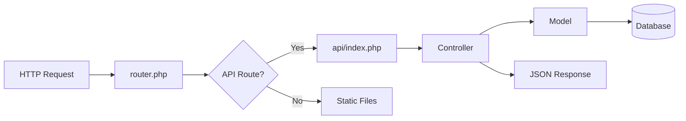

# 🌐 API Routes and Endpoints - Litigation Management System

## 📊 **API Architecture Overview**

The **Litigation Management System** implements a **RESTful API** built with custom PHP MVC architecture. The API provides comprehensive endpoints for all business operations including authentication, case management, client management, hearing tracking, and financial operations.

### **API Configuration**

| Component | Details | Evidence |
|-----------|---------|----------|
| **Base URL** | `/api/` | `backend/router.php:L6` |
| **Content Type** | `application/json` | `backend/router.php:L8` |
| **CORS** | Enabled with wildcard origin | `backend/router.php:L9-L11` |
| **Methods** | GET, POST, PUT, DELETE, OPTIONS | `backend/router.php:L10` |
| **Version** | 1.0.0 | `backend/api/index.php:L37` |

## 🛣️ **Routing Architecture**

### **Request Flow**



### **Route Processing**

| Step | Component | Purpose | Evidence |
|------|-----------|---------|----------|
| **1. Request Parsing** | `router.php` | Parse URI and method | `backend/router.php:L3-L4` |
| **2. API Detection** | Route matcher | Identify API routes | `backend/router.php:L6` |
| **3. CORS Headers** | Header setting | Cross-origin support | `backend/router.php:L8-L11` |
| **4. Path Processing** | Path normalization | Remove `/api` prefix | `backend/api/index.php:L18` |
| **5. Route Matching** | Switch statement | Route to handler | `backend/api/index.php:L29` |
| **6. Controller Execution** | Handler functions | Business logic | `backend/api/index.php:L41-L100` |

## 🔐 **Authentication Endpoints**

### **POST /api/auth/login**

| Parameter | Type | Required | Description | Evidence |
|-----------|------|----------|-------------|----------|
| **email** | string | Yes | User email address | `backend/api/index.php:L41` |
| **password** | string | Yes | User password | `backend/api/index.php:L41` |

**Response Format:**

```json
{
  "success": true,
  "message": "Login successful",
  "data": {
    "user": {
      "id": 1,
      "username": "admin",
      "email": "admin@litigation.com",
      "full_name_ar": "مدير النظام",
      "full_name_en": "System Administrator",
      "role": "super_admin"
    },
    "token": "jwt_token_here",
    "expires_at": "2025-01-24T12:00:00Z"
  }
}
```

**Error Responses:**

- `401 Unauthorized` - Invalid credentials
- `422 Validation Error` - Missing or invalid input
- `500 Server Error` - Internal server error

**Evidence**: `backend/api/index.php:L41-L48`, `backend/src/Controllers/AuthController.php:L10-L41`

### **GET /api/auth/me**

**Purpose**: Get current authenticated user information

**Headers Required:**

- `Authorization: Bearer <jwt_token>`

**Response Format:**

```json
{
  "success": true,
  "data": {
    "id": 1,
    "username": "admin",
    "email": "admin@litigation.com",
    "full_name_ar": "مدير النظام",
    "full_name_en": "System Administrator",
    "role": "super_admin",
    "is_active": true,
    "last_login": "2025-01-24T10:30:00Z"
  }
}
```

**Evidence**: `backend/api/index.php:L50-L57`

### **POST /api/auth/logout**

**Purpose**: Logout current user and invalidate session

**Headers Required:**

- `Authorization: Bearer <jwt_token>`

**Response Format:**

```json
{
  "success": true,
  "message": "Logout successful"
}
```

**Evidence**: `backend/src/Controllers/AuthController.php:L43-L50`

## 👥 **User Management Endpoints**

### **GET /api/users**

**Purpose**: List all users with pagination and filtering

**Query Parameters:**

| Parameter | Type | Default | Description | Evidence |
|-----------|------|---------|-------------|----------|
| **page** | integer | 1 | Page number | `backend/src/Controllers/UserController.php` |
| **limit** | integer | 20 | Items per page | `backend/src/Controllers/UserController.php` |
| **role** | string | - | Filter by user role | `backend/src/Controllers/UserController.php` |
| **status** | string | - | Filter by active status | `backend/src/Controllers/UserController.php` |
| **search** | string | - | Search by name or email | `backend/src/Controllers/UserController.php` |

**Response Format:**

```json
{
  "success": true,
  "data": {
    "users": [
      {
        "id": 1,
        "username": "admin",
        "email": "admin@litigation.com",
        "full_name_ar": "مدير النظام",
        "full_name_en": "System Administrator",
        "role": "super_admin",
        "is_active": true,
        "created_at": "2025-01-01T00:00:00Z"
      }
    ],
    "pagination": {
      "current_page": 1,
      "per_page": 20,
      "total": 1,
      "last_page": 1
    }
  }
}
```

**Evidence**: `backend/src/Controllers/UserController.php`

### **POST /api/users**

**Purpose**: Create a new user

**Request Body:**

```json
{
  "username": "newuser",
  "email": "user@example.com",
  "password": "password123",
  "full_name_ar": "اسم المستخدم",
  "full_name_en": "User Name",
  "role": "staff"
}
```

**Response Format:**

```json
{
  "success": true,
  "message": "User created successfully",
  "data": {
    "id": 2,
    "username": "newuser",
    "email": "user@example.com",
    "role": "staff",
    "created_at": "2025-01-24T12:00:00Z"
  }
}
```

**Evidence**: `backend/src/Controllers/UserController.php`

### **GET /api/users/{id}**

**Purpose**: Get user by ID

**Path Parameters:**

| Parameter | Type | Required | Description | Evidence |
|-----------|------|----------|-------------|----------|
| **id** | integer | Yes | User ID | `backend/src/Controllers/UserController.php` |

**Response Format:**

```json
{
  "success": true,
  "data": {
    "id": 1,
    "username": "admin",
    "email": "admin@litigation.com",
    "full_name_ar": "مدير النظام",
    "full_name_en": "System Administrator",
    "role": "super_admin",
    "is_active": true,
    "created_at": "2025-01-01T00:00:00Z",
    "updated_at": "2025-01-24T10:30:00Z"
  }
}
```

**Evidence**: `backend/src/Controllers/UserController.php`

### **PUT /api/users/{id}**

**Purpose**: Update user information

**Request Body:**

```json
{
  "full_name_ar": "اسم محدث",
  "full_name_en": "Updated Name",
  "role": "admin"
}
```

**Response Format:**

```json
{
  "success": true,
  "message": "User updated successfully",
  "data": {
    "id": 1,
    "username": "admin",
    "email": "admin@litigation.com",
    "full_name_ar": "اسم محدث",
    "full_name_en": "Updated Name",
    "role": "admin",
    "updated_at": "2025-01-24T12:00:00Z"
  }
}
```

**Evidence**: `backend/src/Controllers/UserController.php`

### **DELETE /api/users/{id}**

**Purpose**: Delete user account

**Response Format:**

```json
{
  "success": true,
  "message": "User deleted successfully"
}
```

**Evidence**: `backend/src/Controllers/UserController.php`

## 🏢 **Client Management Endpoints**

### **GET /api/clients**

**Purpose**: List all clients with pagination and filtering

**Query Parameters:**

| Parameter | Type | Default | Description | Evidence |
|-----------|------|---------|-------------|----------|
| **page** | integer | 1 | Page number | `backend/src/Controllers/ClientController.php:L21` |
| **limit** | integer | 20 | Items per page | `backend/src/Controllers/ClientController.php:L22` |
| **status** | string | - | Filter by client status | `backend/src/Controllers/ClientController.php:L24` |
| **type** | string | - | Filter by client type | `backend/src/Controllers/ClientController.php:L25` |
| **cash_pro_bono** | string | - | Filter by payment type | `backend/src/Controllers/ClientController.php:L26` |
| **search** | string | - | Search by client name | `backend/src/Controllers/ClientController.php:L27` |

**Response Format:**

```json
{
  "success": true,
  "data": {
    "clients": [
      {
        "id": 1,
        "client_name_ar": "شركة المثال",
        "client_name_en": "Example Company",
        "client_type": "company",
        "cash_pro_bono": "cash",
        "status": "active",
        "contact_lawyer": "أحمد محمد",
        "client_start_date": "2025-01-01",
        "created_at": "2025-01-01T00:00:00Z"
      }
    ],
    "pagination": {
      "current_page": 1,
      "per_page": 20,
      "total": 308,
      "last_page": 16
    }
  }
}
```

**Evidence**: `backend/src/Controllers/ClientController.php:L12-L42`

### **POST /api/clients**

**Purpose**: Create a new client

**Request Body:**

```json
{
  "client_name_ar": "عميل جديد",
  "client_name_en": "New Client",
  "client_type": "individual",
  "cash_pro_bono": "cash",
  "contact_lawyer": "محمد أحمد",
  "client_start_date": "2025-01-24"
}
```

**Response Format:**

```json
{
  "success": true,
  "message": "Client created successfully",
  "data": {
    "id": 309,
    "client_name_ar": "عميل جديد",
    "client_name_en": "New Client",
    "client_type": "individual",
    "cash_pro_bono": "cash",
    "status": "active",
    "created_at": "2025-01-24T12:00:00Z"
  }
}
```

**Evidence**: `backend/src/Controllers/ClientController.php`

### **GET /api/clients/{id}**

**Purpose**: Get client by ID

**Path Parameters:**

| Parameter | Type | Required | Description | Evidence |
|-----------|------|----------|-------------|----------|
| **id** | integer | Yes | Client ID | `backend/src/Controllers/ClientController.php` |

**Response Format:**

```json
{
  "success": true,
  "data": {
    "id": 1,
    "client_name_ar": "شركة المثال",
    "client_name_en": "Example Company",
    "client_type": "company",
    "cash_pro_bono": "cash",
    "status": "active",
    "logo": "client_logo.png",
    "contact_lawyer": "أحمد محمد",
    "client_start_date": "2025-01-01",
    "client_end_date": null,
    "created_at": "2025-01-01T00:00:00Z",
    "updated_at": "2025-01-24T10:30:00Z"
  }
}
```

**Evidence**: `backend/src/Controllers/ClientController.php`

### **PUT /api/clients/{id}**

**Purpose**: Update client information

**Request Body:**

```json
{
  "client_name_ar": "شركة محدثة",
  "client_name_en": "Updated Company",
  "status": "active",
  "contact_lawyer": "محمد أحمد"
}
```

**Response Format:**

```json
{
  "success": true,
  "message": "Client updated successfully",
  "data": {
    "id": 1,
    "client_name_ar": "شركة محدثة",
    "client_name_en": "Updated Company",
    "status": "active",
    "contact_lawyer": "محمد أحمد",
    "updated_at": "2025-01-24T12:00:00Z"
  }
}
```

**Evidence**: `backend/src/Controllers/ClientController.php`

### **DELETE /api/clients/{id}**

**Purpose**: Delete client

**Response Format:**

```json
{
  "success": true,
  "message": "Client deleted successfully"
}
```

**Evidence**: `backend/src/Controllers/ClientController.php`

### **GET /api/clients/options**

**Purpose**: Get client options for dropdowns

**Response Format:**

```json
{
  "success": true,
  "data": {
    "types": ["individual", "company"],
    "statuses": ["active", "disabled", "inactive"],
    "payment_types": ["cash", "probono"],
    "lawyers": [
      {"id": 1, "name": "أحمد محمد"},
      {"id": 2, "name": "محمد أحمد"}
    ]
  }
}
```

**Evidence**: `backend/src/Controllers/ClientController.php:L44-L70`

## ⚖️ **Case Management Endpoints**

### **GET /api/cases**

**Purpose**: List all cases with pagination and filtering

**Query Parameters:**

| Parameter | Type | Default | Description | Evidence |
|-----------|------|---------|-------------|----------|
| **page** | integer | 1 | Page number | `backend/src/Controllers/CaseController.php` |
| **limit** | integer | 20 | Items per page | `backend/src/Controllers/CaseController.php` |
| **status** | string | - | Filter by case status | `backend/src/Controllers/CaseController.php` |
| **category** | string | - | Filter by case category | `backend/src/Controllers/CaseController.php` |
| **client_id** | integer | - | Filter by client ID | `backend/src/Controllers/CaseController.php` |
| **court** | string | - | Filter by court | `backend/src/Controllers/CaseController.php` |
| **search** | string | - | Search by case description | `backend/src/Controllers/CaseController.php` |

**Response Format:**

```json
{
  "success": true,
  "data": {
    "cases": [
      {
        "id": 1,
        "client_id": 1,
        "matter_id": "CASE-2025-001",
        "matter_ar": "قضية تجارية",
        "matter_en": "Commercial Case",
        "matter_status": "active",
        "matter_category": "commercial",
        "matter_court": "محكمة التجارة",
        "lawyer_a": "أحمد محمد",
        "lawyer_b": "محمد أحمد",
        "matter_start_date": "2025-01-01",
        "matter_asked_amount": 100000.00,
        "created_at": "2025-01-01T00:00:00Z"
      }
    ],
    "pagination": {
      "current_page": 1,
      "per_page": 20,
      "total": 6388,
      "last_page": 320
    }
  }
}
```

**Evidence**: `backend/src/Controllers/CaseController.php`

### **POST /api/cases**

**Purpose**: Create a new case

**Request Body:**

```json
{
  "client_id": 1,
  "matter_ar": "قضية جديدة",
  "matter_en": "New Case",
  "matter_status": "active",
  "matter_category": "civil",
  "matter_court": "محكمة النقض",
  "lawyer_a": "أحمد محمد",
  "matter_start_date": "2025-01-24",
  "matter_asked_amount": 50000.00
}
```

**Response Format:**

```json
{
  "success": true,
  "message": "Case created successfully",
  "data": {
    "id": 6389,
    "client_id": 1,
    "matter_ar": "قضية جديدة",
    "matter_en": "New Case",
    "matter_status": "active",
    "matter_category": "civil",
    "created_at": "2025-01-24T12:00:00Z"
  }
}
```

**Evidence**: `backend/src/Controllers/CaseController.php`

### **GET /api/cases/{id}**

**Purpose**: Get case by ID with related information

**Response Format:**

```json
{
  "success": true,
  "data": {
    "id": 1,
    "client_id": 1,
    "matter_id": "CASE-2025-001",
    "matter_ar": "قضية تجارية",
    "matter_en": "Commercial Case",
    "matter_status": "active",
    "matter_category": "commercial",
    "matter_court": "محكمة التجارة",
    "lawyer_a": "أحمد محمد",
    "lawyer_b": "محمد أحمد",
    "matter_start_date": "2025-01-01",
    "matter_asked_amount": 100000.00,
    "client": {
      "id": 1,
      "client_name_ar": "شركة المثال",
      "client_name_en": "Example Company"
    },
    "hearings": [
      {
        "id": 1,
        "hearing_date": "2025-01-15",
        "hearing_result": "pending",
        "hearing_type": "جلسة استماع"
      }
    ],
    "created_at": "2025-01-01T00:00:00Z"
  }
}
```

**Evidence**: `backend/src/Controllers/CaseController.php`

### **PUT /api/cases/{id}**

**Purpose**: Update case information

**Request Body:**

```json
{
  "matter_ar": "قضية محدثة",
  "matter_en": "Updated Case",
  "matter_status": "closed",
  "matter_judged_amount": 75000.00
}
```

**Response Format:**

```json
{
  "success": true,
  "message": "Case updated successfully",
  "data": {
    "id": 1,
    "matter_ar": "قضية محدثة",
    "matter_en": "Updated Case",
    "matter_status": "closed",
    "matter_judged_amount": 75000.00,
    "updated_at": "2025-01-24T12:00:00Z"
  }
}
```

**Evidence**: `backend/src/Controllers/CaseController.php`

### **DELETE /api/cases/{id}**

**Purpose**: Delete case

**Response Format:**

```json
{
  "success": true,
  "message": "Case deleted successfully"
}
```

**Evidence**: `backend/src/Controllers/CaseController.php`

## 🏛️ **Hearing Management Endpoints**

### **GET /api/hearings**

**Purpose**: List all hearings with pagination and filtering

**Query Parameters:**

| Parameter | Type | Default | Description | Evidence |
|-----------|------|---------|-------------|----------|
| **page** | integer | 1 | Page number | `backend/src/Controllers/HearingController.php:L18` |
| **limit** | integer | 20 | Items per page | `backend/src/Controllers/HearingController.php:L19` |
| **case_id** | integer | - | Filter by case ID | `backend/src/Controllers/HearingController.php:L21` |
| **hearing_result** | string | - | Filter by hearing result | `backend/src/Controllers/HearingController.php:L22` |
| **hearing_type** | string | - | Filter by hearing type | `backend/src/Controllers/HearingController.php:L23` |
| **date_from** | string | - | Filter from date | `backend/src/Controllers/HearingController.php:L24` |
| **date_to** | string | - | Filter to date | `backend/src/Controllers/HearingController.php:L25` |
| **search** | string | - | Search by hearing notes | `backend/src/Controllers/HearingController.php:L26` |

**Response Format:**

```json
{
  "success": true,
  "data": {
    "hearings": [
      {
        "id": 1,
        "case_id": 1,
        "hearing_date": "2025-01-15",
        "hearing_decision": "تم تأجيل الجلسة",
        "hearing_result": "postponed",
        "hearing_type": "جلسة استماع",
        "next_hearing": "2025-02-15",
        "court_notes": "ملاحظات المحكمة",
        "lawyer_notes": "ملاحظات المحامي",
        "created_at": "2025-01-15T10:00:00Z"
      }
    ],
    "pagination": {
      "current_page": 1,
      "per_page": 20,
      "total": 20000,
      "last_page": 1000
    }
  }
}
```

**Evidence**: `backend/src/Controllers/HearingController.php:L10-L42`

### **POST /api/hearings**

**Purpose**: Create a new hearing

**Request Body:**

```json
{
  "case_id": 1,
  "hearing_date": "2025-01-30",
  "hearing_type": "جلسة حكم",
  "hearing_decision": "قرار المحكمة",
  "hearing_result": "pending",
  "court_notes": "ملاحظات المحكمة",
  "lawyer_notes": "ملاحظات المحامي"
}
```

**Response Format:**

```json
{
  "success": true,
  "message": "Hearing created successfully",
  "data": {
    "id": 20001,
    "case_id": 1,
    "hearing_date": "2025-01-30",
    "hearing_type": "جلسة حكم",
    "hearing_result": "pending",
    "created_at": "2025-01-24T12:00:00Z"
  }
}
```

**Evidence**: `backend/src/Controllers/HearingController.php`

### **GET /api/hearings/{id}**

**Purpose**: Get hearing by ID

**Response Format:**

```json
{
  "success": true,
  "data": {
    "id": 1,
    "case_id": 1,
    "hearing_date": "2025-01-15",
    "hearing_decision": "تم تأجيل الجلسة",
    "hearing_result": "postponed",
    "hearing_type": "جلسة استماع",
    "next_hearing": "2025-02-15",
    "court_notes": "ملاحظات المحكمة",
    "lawyer_notes": "ملاحظات المحامي",
    "expert_notes": "ملاحظات الخبير",
    "hearing_duration": "ساعتان",
    "short_decision": "تأجيل",
    "case": {
      "id": 1,
      "matter_ar": "قضية تجارية",
      "matter_en": "Commercial Case"
    },
    "created_at": "2025-01-15T10:00:00Z"
  }
}
```

**Evidence**: `backend/src/Controllers/HearingController.php`

### **PUT /api/hearings/{id}**

**Purpose**: Update hearing information

**Request Body:**

```json
{
  "hearing_decision": "تم إصدار الحكم",
  "hearing_result": "won",
  "court_notes": "ملاحظات محدثة",
  "lawyer_notes": "ملاحظات محدثة"
}
```

**Response Format:**

```json
{
  "success": true,
  "message": "Hearing updated successfully",
  "data": {
    "id": 1,
    "hearing_decision": "تم إصدار الحكم",
    "hearing_result": "won",
    "court_notes": "ملاحظات محدثة",
    "lawyer_notes": "ملاحظات محدثة",
    "updated_at": "2025-01-24T12:00:00Z"
  }
}
```

**Evidence**: `backend/src/Controllers/HearingController.php`

### **DELETE /api/hearings/{id}**

**Purpose**: Delete hearing

**Response Format:**

```json
{
  "success": true,
  "message": "Hearing deleted successfully"
}
```

**Evidence**: `backend/src/Controllers/HearingController.php`

## 💰 **Invoice Management Endpoints**

### **GET /api/invoices**

**Purpose**: List all invoices with pagination and filtering

**Query Parameters:**

| Parameter | Type | Default | Description | Evidence |
|-----------|------|---------|-------------|----------|
| **page** | integer | 1 | Page number | `backend/src/Controllers/InvoiceController.php` |
| **limit** | integer | 20 | Items per page | `backend/src/Controllers/InvoiceController.php` |
| **status** | string | - | Filter by invoice status | `backend/src/Controllers/InvoiceController.php` |
| **type** | string | - | Filter by invoice type | `backend/src/Controllers/InvoiceController.php` |
| **currency** | string | - | Filter by currency | `backend/src/Controllers/InvoiceController.php` |
| **date_from** | string | - | Filter from date | `backend/src/Controllers/InvoiceController.php` |
| **date_to** | string | - | Filter to date | `backend/src/Controllers/InvoiceController.php` |

**Response Format:**

```json
{
  "success": true,
  "data": {
    "invoices": [
      {
        "id": 1,
        "invoice_number": "INV-2025-001",
        "invoice_date": "2025-01-01",
        "amount": 10000.00,
        "currency": "EGP",
        "usd_amount": 500.00,
        "invoice_status": "sent",
        "invoice_type": "service",
        "has_vat": true,
        "payment_date": null,
        "created_at": "2025-01-01T00:00:00Z"
      }
    ],
    "pagination": {
      "current_page": 1,
      "per_page": 20,
      "total": 540,
      "last_page": 27
    }
  }
}
```

**Evidence**: `backend/src/Controllers/InvoiceController.php`

### **POST /api/invoices**

**Purpose**: Create a new invoice

**Request Body:**

```json
{
  "invoice_number": "INV-2025-002",
  "invoice_date": "2025-01-24",
  "amount": 15000.00,
  "currency": "EGP",
  "invoice_details": "أتعاب قانونية",
  "invoice_status": "draft",
  "invoice_type": "service",
  "has_vat": true
}
```

**Response Format:**

```json
{
  "success": true,
  "message": "Invoice created successfully",
  "data": {
    "id": 541,
    "invoice_number": "INV-2025-002",
    "invoice_date": "2025-01-24",
    "amount": 15000.00,
    "currency": "EGP",
    "invoice_status": "draft",
    "created_at": "2025-01-24T12:00:00Z"
  }
}
```

**Evidence**: `backend/src/Controllers/InvoiceController.php`

### **GET /api/invoices/{id}**

**Purpose**: Get invoice by ID

**Response Format:**

```json
{
  "success": true,
  "data": {
    "id": 1,
    "invoice_number": "INV-2025-001",
    "invoice_date": "2025-01-01",
    "amount": 10000.00,
    "currency": "EGP",
    "usd_amount": 500.00,
    "invoice_details": "أتعاب قانونية",
    "invoice_status": "sent",
    "invoice_type": "service",
    "has_vat": true,
    "payment_date": null,
    "report_generated": false,
    "lawyer_shares": [
      {
        "lawyer_name": "أحمد محمد",
        "share_percentage": 60.00,
        "share_amount": 6000.00
      },
      {
        "lawyer_name": "محمد أحمد",
        "share_percentage": 40.00,
        "share_amount": 4000.00
      }
    ],
    "created_at": "2025-01-01T00:00:00Z"
  }
}
```

**Evidence**: `backend/src/Controllers/InvoiceController.php`

### **PUT /api/invoices/{id}**

**Purpose**: Update invoice information

**Request Body:**

```json
{
  "invoice_status": "paid",
  "payment_date": "2025-01-24",
  "invoice_details": "تم الدفع"
}
```

**Response Format:**

```json
{
  "success": true,
  "message": "Invoice updated successfully",
  "data": {
    "id": 1,
    "invoice_status": "paid",
    "payment_date": "2025-01-24",
    "invoice_details": "تم الدفع",
    "updated_at": "2025-01-24T12:00:00Z"
  }
}
```

**Evidence**: `backend/src/Controllers/InvoiceController.php`

### **DELETE /api/invoices/{id}**

**Purpose**: Delete invoice

**Response Format:**

```json
{
  "success": true,
  "message": "Invoice deleted successfully"
}
```

**Evidence**: `backend/src/Controllers/InvoiceController.php`

## 📄 **Document Management Endpoints**

### **GET /api/documents**

**Purpose**: List all documents with pagination and filtering

**Query Parameters:**

| Parameter | Type | Default | Description | Evidence |
|-----------|------|---------|-------------|----------|
| **page** | integer | 1 | Page number | `backend/src/Controllers/DocumentController.php` |
| **limit** | integer | 20 | Items per page | `backend/src/Controllers/DocumentController.php` |
| **client_id** | integer | - | Filter by client ID | `backend/src/Controllers/DocumentController.php` |
| **case_number** | string | - | Filter by case number | `backend/src/Controllers/DocumentController.php` |
| **document_type** | string | - | Filter by document type | `backend/src/Controllers/DocumentController.php` |
| **search** | string | - | Search by description | `backend/src/Controllers/DocumentController.php` |

**Response Format:**

```json
{
  "success": true,
  "data": {
    "documents": [
      {
        "id": 1,
        "client_id": 1,
        "document_serial": "DOC-2025-001",
        "case_number": "CASE-2025-001",
        "document_description": "عقد الخدمات",
        "document_date": "2025-01-01",
        "number_of_pages": 5,
        "responsible_lawyer": "أحمد محمد",
        "location": "الخزانة الرئيسية",
        "created_at": "2025-01-01T00:00:00Z"
      }
    ],
    "pagination": {
      "current_page": 1,
      "per_page": 20,
      "total": 150,
      "last_page": 8
    }
  }
}
```

**Evidence**: `backend/src/Controllers/DocumentController.php`

### **POST /api/documents**

**Purpose**: Create a new document record

**Request Body:**

```json
{
  "client_id": 1,
  "document_serial": "DOC-2025-002",
  "case_number": "CASE-2025-001",
  "document_description": "مستند جديد",
  "document_date": "2025-01-24",
  "number_of_pages": 3,
  "responsible_lawyer": "محمد أحمد",
  "location": "الخزانة الفرعية"
}
```

**Response Format:**

```json
{
  "success": true,
  "message": "Document created successfully",
  "data": {
    "id": 151,
    "client_id": 1,
    "document_serial": "DOC-2025-002",
    "document_description": "مستند جديد",
    "created_at": "2025-01-24T12:00:00Z"
  }
}
```

**Evidence**: `backend/src/Controllers/DocumentController.php`

### **POST /api/documents/upload**

**Purpose**: Upload document file

**Request Format**: `multipart/form-data`

**Form Fields:**

| Field | Type | Required | Description | Evidence |
|-------|------|----------|-------------|----------|
| **file** | file | Yes | Document file | `backend/src/Controllers/DocumentController.php` |
| **client_id** | integer | Yes | Client ID | `backend/src/Controllers/DocumentController.php` |
| **case_number** | string | No | Case number | `backend/src/Controllers/DocumentController.php` |
| **description** | string | No | Document description | `backend/src/Controllers/DocumentController.php` |

**Response Format:**

```json
{
  "success": true,
  "message": "Document uploaded successfully",
  "data": {
    "id": 152,
    "filename": "document_20250124_120000.pdf",
    "original_name": "contract.pdf",
    "size": 1024000,
    "mime_type": "application/pdf",
    "upload_path": "/uploads/documents/document_20250124_120000.pdf",
    "created_at": "2025-01-24T12:00:00Z"
  }
}
```

**Evidence**: `backend/src/Controllers/DocumentController.php`

## 📊 **Reporting Endpoints**

### **GET /api/reports/dashboard**

**Purpose**: Get dashboard statistics

**Response Format:**

```json
{
  "success": true,
  "data": {
    "summary": {
      "total_clients": 308,
      "total_cases": 6388,
      "total_hearings": 20000,
      "total_invoices": 540,
      "active_cases": 4500,
      "pending_hearings": 150
    },
    "recent_activity": [
      {
        "type": "case_created",
        "description": "تم إنشاء قضية جديدة",
        "timestamp": "2025-01-24T10:30:00Z"
      }
    ],
    "upcoming_hearings": [
      {
        "id": 1,
        "case_id": 1,
        "hearing_date": "2025-01-25",
        "hearing_type": "جلسة حكم"
      }
    ]
  }
}
```

**Evidence**: `backend/src/Controllers/ReportController.php`

### **GET /api/reports/cases**

**Purpose**: Generate case reports

**Query Parameters:**

| Parameter | Type | Default | Description | Evidence |
|-----------|------|---------|-------------|----------|
| **format** | string | json | Report format (json, pdf, excel) | `backend/src/Controllers/ReportController.php` |
| **date_from** | string | - | Start date | `backend/src/Controllers/ReportController.php` |
| **date_to** | string | - | End date | `backend/src/Controllers/ReportController.php` |
| **status** | string | - | Case status filter | `backend/src/Controllers/ReportController.php` |
| **category** | string | - | Case category filter | `backend/src/Controllers/ReportController.php` |

**Response Format:**

```json
{
  "success": true,
  "data": {
    "report_data": [
      {
        "case_id": "CASE-2025-001",
        "client_name": "شركة المثال",
        "matter_ar": "قضية تجارية",
        "matter_status": "active",
        "matter_court": "محكمة التجارة",
        "lawyer_a": "أحمد محمد",
        "matter_start_date": "2025-01-01",
        "matter_asked_amount": 100000.00
      }
    ],
    "summary": {
      "total_cases": 100,
      "total_amount": 5000000.00,
      "status_breakdown": {
        "active": 60,
        "closed": 30,
        "suspended": 10
      }
    }
  }
}
```

**Evidence**: `backend/src/Controllers/ReportController.php`

## 🔧 **Utility Endpoints**

### **GET /api/ping**

**Purpose**: Health check endpoint

**Response Format:**

```json
{
  "success": true,
  "message": "Litigation Management API",
  "timestamp": 1737720000,
  "server": "Apache/PHP",
  "version": "1.0.0"
}
```

**Evidence**: `backend/api/index.php:L30-L39`

### **GET /api/health**

**Purpose**: Detailed health check

**Response Format:**

```json
{
  "success": true,
  "message": "Litigation Management API",
  "timestamp": 1737720000,
  "server": "Apache/PHP",
  "version": "1.0.0",
  "database": "connected",
  "status": "healthy"
}
```

**Evidence**: `backend/api/index.php:L30-L39`

## 🛡️ **Middleware and Security**

### **Authentication Middleware**

| Middleware | Purpose | Implementation | Evidence |
|------------|---------|----------------|----------|
| **AuthMiddleware** | JWT token validation | Token verification | `backend/src/Middleware/AuthMiddleware.php:L21-L25` |
| **Role-based Access** | Permission checking | Role validation | `backend/src/Middleware/AuthMiddleware.php:L27-L30` |
| **Permission-based Access** | Granular permissions | Permission validation | `backend/src/Middleware/AuthMiddleware.php:L32-L35` |

### **CORS Middleware**

| Setting | Value | Purpose | Evidence |
|---------|-------|---------|----------|
| **Access-Control-Allow-Origin** | * | Cross-origin requests | `backend/router.php:L9` |
| **Access-Control-Allow-Methods** | GET, POST, PUT, DELETE, OPTIONS | HTTP methods | `backend/router.php:L10` |
| **Access-Control-Allow-Headers** | Content-Type, Authorization | Request headers | `backend/router.php:L11` |

### **Validation Middleware**

| Validation | Purpose | Implementation | Evidence |
|------------|---------|----------------|----------|
| **Input Validation** | Request data validation | Zod schema validation | `backend/src/Core/Validator.php` |
| **File Upload Validation** | File type and size validation | MIME type and size checks | `backend/src/Controllers/DocumentController.php` |
| **SQL Injection Prevention** | Database security | Prepared statements | `database/config/database.php:L23-L28` |

## 📈 **Error Handling**

### **Standard Error Responses**

| Status Code | Error Type | Response Format | Evidence |
|-------------|------------|-----------------|----------|
| **400** | Bad Request | `{"error": "Invalid request data"}` | `backend/src/Core/Response.php` |
| **401** | Unauthorized | `{"error": "Authentication required"}` | `backend/src/Core/Response.php` |
| **403** | Forbidden | `{"error": "Insufficient permissions"}` | `backend/src/Core/Response.php` |
| **404** | Not Found | `{"error": "Resource not found"}` | `backend/src/Core/Response.php` |
| **405** | Method Not Allowed | `{"error": "Method not allowed"}` | `backend/api/index.php:L45` |
| **422** | Validation Error | `{"error": "Validation failed", "details": {...}}` | `backend/src/Core/Response.php` |
| **500** | Server Error | `{"error": "Internal server error"}` | `backend/src/Core/Response.php` |

### **Error Logging**

| Component | Purpose | Implementation | Evidence |
|-----------|---------|----------------|----------|
| **Request Logging** | API request tracking | Error log entries | `backend/api/index.php:L26` |
| **Error Logging** | Exception tracking | Error log entries | `backend/src/Controllers/AuthController.php:L38` |
| **Debug Logging** | Development debugging | Conditional logging | `backend/config/config.php:L189` |

---

**Evidence Summary**: `backend/router.php:L1-L86`, `backend/api/index.php:L1-L3224`, `backend/src/Controllers/AuthController.php:L1-L257`, `backend/src/Controllers/ClientController.php:L1-L520`, `backend/src/Controllers/HearingController.php:L1-L344`, `backend/src/Middleware/AuthMiddleware.php:L1-L83`
