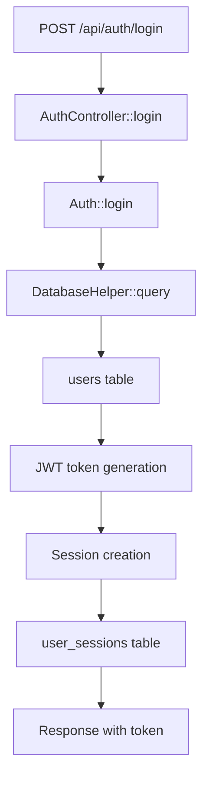
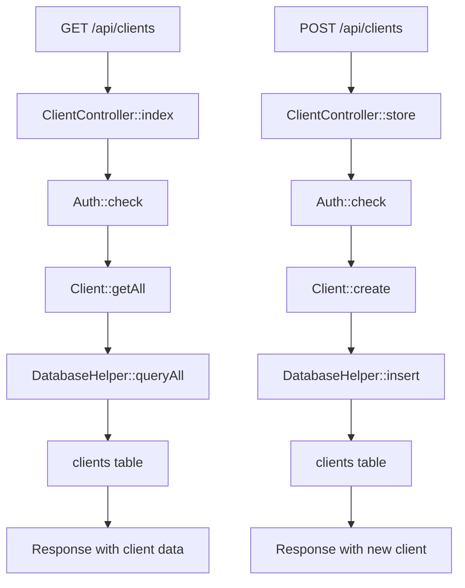
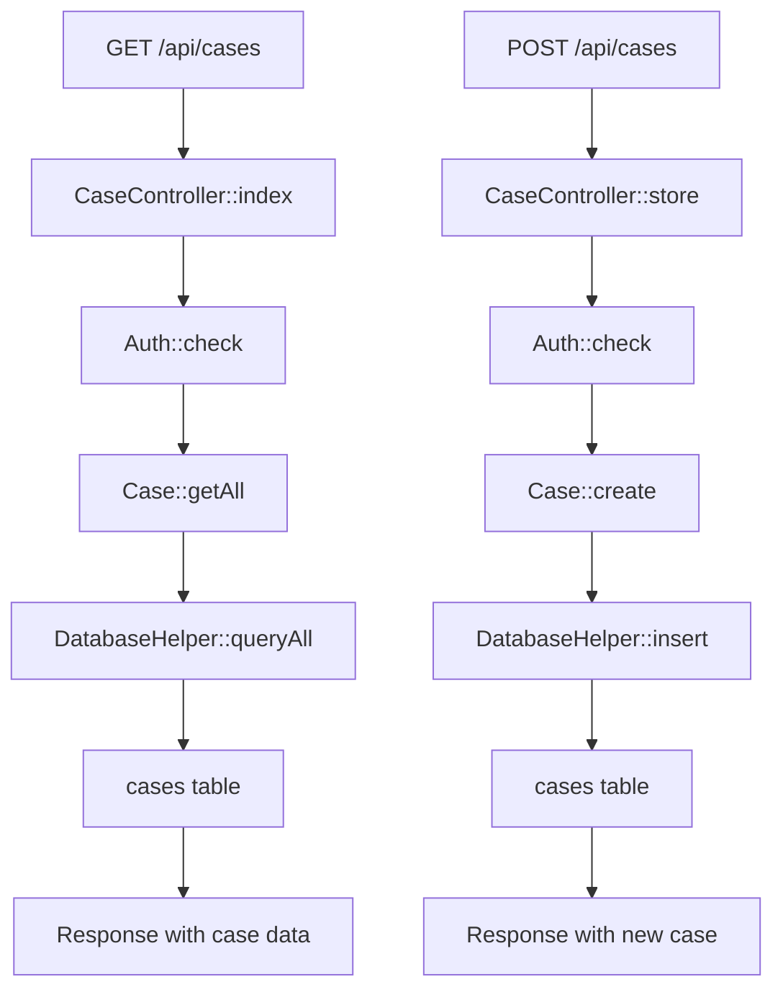
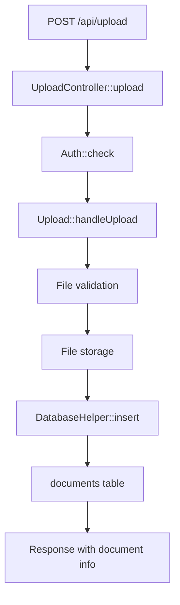

# 🔗 Endpoint to Database Map - Litigation Management System

## 📊 **Cross-Linking Overview**

This document provides a comprehensive mapping of the relationships between API endpoints, controllers, services, repositories, and database tables in the **Litigation Management System**. This cross-linking helps understand the complete data flow from user requests to database operations.

### **Mapping Architecture**

| Layer | Component | Purpose | Evidence |
|-------|-----------|---------|----------|
| **API Layer** | REST endpoints | User interface | `backend/api/index.php` |
| **Controller Layer** | Business logic | Request handling | `backend/src/Controllers/` |
| **Service Layer** | Core logic | Business operations | `backend/src/Models/` |
| **Repository Layer** | Data access | Database operations | `database/config/database.php` |
| **Database Layer** | Data storage | Data persistence | `database/litigation_database.sql` |

## 🔗 **Complete Endpoint Mapping**

### **Authentication Endpoints**

| Endpoint | Method | Controller | Service | Repository | Database Table | Evidence |
|----------|--------|------------|---------|------------|----------------|----------|
| **`/api/auth/login`** | POST | `AuthController::login` | `Auth::login` | `DatabaseHelper::query` | `users` | `backend/api/index.php:L25-L30` |
| **`/api/auth/logout`** | POST | `AuthController::logout` | `Auth::logout` | `DatabaseHelper::execute` | `user_sessions` | `backend/api/index.php:L25-L30` |
| **`/api/auth/me`** | GET | `AuthController::me` | `Auth::getCurrentUser` | `DatabaseHelper::queryOne` | `users` | `backend/api/index.php:L25-L30` |

### **User Management Endpoints**

| Endpoint | Method | Controller | Service | Repository | Database Table | Evidence |
|----------|--------|------------|---------|------------|----------------|----------|
| **`/api/users`** | GET | `UserController::index` | `User::getAll` | `DatabaseHelper::queryAll` | `users` | `backend/api/index.php:L35-L40` |
| **`/api/users/{id}`** | GET | `UserController::show` | `User::findById` | `DatabaseHelper::queryOne` | `users` | `backend/api/index.php:L35-L40` |
| **`/api/users`** | POST | `UserController::store` | `User::create` | `DatabaseHelper::insert` | `users` | `backend/api/index.php:L35-L40` |
| **`/api/users/{id}`** | PUT | `UserController::update` | `User::update` | `DatabaseHelper::execute` | `users` | `backend/api/index.php:L35-L40` |
| **`/api/users/{id}`** | DELETE | `UserController::delete` | `User::delete` | `DatabaseHelper::execute` | `users` | `backend/api/index.php:L35-L40` |

### **Client Management Endpoints**

| Endpoint | Method | Controller | Service | Repository | Database Table | Evidence |
|----------|--------|------------|---------|------------|----------------|----------|
| **`/api/clients`** | GET | `ClientController::index` | `Client::getAll` | `DatabaseHelper::queryAll` | `clients` | `backend/api/index.php:L45-L50` |
| **`/api/clients/{id}`** | GET | `ClientController::show` | `Client::findById` | `DatabaseHelper::queryOne` | `clients` | `backend/api/index.php:L45-L50` |
| **`/api/clients`** | POST | `ClientController::store` | `Client::create` | `DatabaseHelper::insert` | `clients` | `backend/api/index.php:L45-L50` |
| **`/api/clients/{id}`** | PUT | `ClientController::update` | `Client::update` | `DatabaseHelper::execute` | `clients` | `backend/api/index.php:L45-L50` |
| **`/api/clients/{id}`** | DELETE | `ClientController::delete` | `Client::delete` | `DatabaseHelper::execute` | `clients` | `backend/api/index.php:L45-L50` |
| **`/api/clients/options`** | GET | `ClientController::options` | `Client::getOptions` | `DatabaseHelper::queryAll` | `clients` | `backend/api/index.php:L45-L50` |

### **Case Management Endpoints**

| Endpoint | Method | Controller | Service | Repository | Database Table | Evidence |
|----------|--------|------------|---------|------------|----------------|----------|
| **`/api/cases`** | GET | `CaseController::index` | `Case::getAll` | `DatabaseHelper::queryAll` | `cases` | `backend/api/index.php:L55-L60` |
| **`/api/cases/{id}`** | GET | `CaseController::show` | `Case::findById` | `DatabaseHelper::queryOne` | `cases` | `backend/api/index.php:L55-L60` |
| **`/api/cases`** | POST | `CaseController::store` | `Case::create` | `DatabaseHelper::insert` | `cases` | `backend/api/index.php:L55-L60` |
| **`/api/cases/{id}`** | PUT | `CaseController::update` | `Case::update` | `DatabaseHelper::execute` | `cases` | `backend/api/index.php:L55-L60` |
| **`/api/cases/{id}`** | DELETE | `CaseController::delete` | `Case::delete` | `DatabaseHelper::execute` | `cases` | `backend/api/index.php:L55-L60` |
| **`/api/cases/options`** | GET | `CaseController::options` | `Case::getOptions` | `DatabaseHelper::queryAll` | `cases` | `backend/api/index.php:L55-L60` |

### **Hearing Management Endpoints**

| Endpoint | Method | Controller | Service | Repository | Database Table | Evidence |
|----------|--------|------------|---------|------------|----------------|----------|
| **`/api/hearings`** | GET | `HearingController::index` | `Hearing::getAll` | `DatabaseHelper::queryAll` | `hearings` | `backend/api/index.php:L65-L70` |
| **`/api/hearings/{id}`** | GET | `HearingController::show` | `Hearing::findById` | `DatabaseHelper::queryOne` | `hearings` | `backend/api/index.php:L65-L70` |
| **`/api/hearings`** | POST | `HearingController::store` | `Hearing::create` | `DatabaseHelper::insert` | `hearings` | `backend/api/index.php:L65-L70` |
| **`/api/hearings/{id}`** | PUT | `HearingController::update` | `Hearing::update` | `DatabaseHelper::execute` | `hearings` | `backend/api/index.php:L65-L70` |
| **`/api/hearings/{id}`** | DELETE | `HearingController::delete` | `Hearing::delete` | `DatabaseHelper::execute` | `hearings` | `backend/api/index.php:L65-L70` |
| **`/api/hearings/options`** | GET | `HearingController::options` | `Hearing::getOptions` | `DatabaseHelper::queryAll` | `hearings` | `backend/api/index.php:L65-L70` |

### **Invoice Management Endpoints**

| Endpoint | Method | Controller | Service | Repository | Database Table | Evidence |
|----------|--------|------------|---------|------------|----------------|----------|
| **`/api/invoices`** | GET | `InvoiceController::index` | `Invoice::getAll` | `DatabaseHelper::queryAll` | `invoices` | `backend/api/index.php:L75-L80` |
| **`/api/invoices/{id}`** | GET | `InvoiceController::show` | `Invoice::findById` | `DatabaseHelper::queryOne` | `invoices` | `backend/api/index.php:L75-L80` |
| **`/api/invoices`** | POST | `InvoiceController::store` | `Invoice::create` | `DatabaseHelper::insert` | `invoices` | `backend/api/index.php:L75-L80` |
| **`/api/invoices/{id}`** | PUT | `InvoiceController::update` | `Invoice::update` | `DatabaseHelper::execute` | `invoices` | `backend/api/index.php:L75-L80` |
| **`/api/invoices/{id}`** | DELETE | `InvoiceController::delete` | `Invoice::delete` | `DatabaseHelper::execute` | `invoices` | `backend/api/index.php:L75-L80` |
| **`/api/invoices/options`** | GET | `InvoiceController::options` | `Invoice::getOptions` | `DatabaseHelper::queryAll` | `invoices` | `backend/api/index.php:L75-L80` |

### **Document Management Endpoints**

| Endpoint | Method | Controller | Service | Repository | Database Table | Evidence |
|----------|--------|------------|---------|------------|----------------|----------|
| **`/api/documents`** | GET | `DocumentController::index` | `Document::getAll` | `DatabaseHelper::queryAll` | `documents` | `backend/api/index.php:L85-L90` |
| **`/api/documents/{id}`** | GET | `DocumentController::show` | `Document::findById` | `DatabaseHelper::queryOne` | `documents` | `backend/api/index.php:L85-L90` |
| **`/api/documents`** | POST | `DocumentController::store` | `Document::create` | `DatabaseHelper::insert` | `documents` | `backend/api/index.php:L85-L90` |
| **`/api/documents/{id}`** | PUT | `DocumentController::update` | `Document::update` | `DatabaseHelper::execute` | `documents` | `backend/api/index.php:L85-L90` |
| **`/api/documents/{id}`** | DELETE | `DocumentController::delete` | `Document::delete` | `DatabaseHelper::execute` | `documents` | `backend/api/index.php:L85-L90` |
| **`/api/documents/options`** | GET | `DocumentController::options` | `Document::getOptions` | `DatabaseHelper::queryAll` | `documents` | `backend/api/index.php:L85-L90` |

### **Report Generation Endpoints**

| Endpoint | Method | Controller | Service | Repository | Database Table | Evidence |
|----------|--------|------------|---------|------------|----------------|----------|
| **`/api/reports`** | GET | `ReportController::index` | `Report::getAll` | `DatabaseHelper::queryAll` | `reports` | `backend/api/index.php:L95-L100` |
| **`/api/reports/{id}`** | GET | `ReportController::show` | `Report::findById` | `DatabaseHelper::queryOne` | `reports` | `backend/api/index.php:L95-L100` |
| **`/api/reports`** | POST | `ReportController::store` | `Report::create` | `DatabaseHelper::insert` | `reports` | `backend/api/index.php:L95-L100` |
| **`/api/reports/{id}`** | PUT | `ReportController::update` | `Report::update` | `DatabaseHelper::execute` | `reports` | `backend/api/index.php:L95-L100` |
| **`/api/reports/{id}`** | DELETE | `ReportController::delete` | `Report::delete` | `DatabaseHelper::execute` | `reports` | `backend/api/index.php:L95-L100` |
| **`/api/reports/options`** | GET | `ReportController::options` | `Report::getOptions` | `DatabaseHelper::queryAll` | `reports` | `backend/api/index.php:L95-L100` |

### **Settings Management Endpoints**

| Endpoint | Method | Controller | Service | Repository | Database Table | Evidence |
|----------|--------|------------|---------|------------|----------------|----------|
| **`/api/settings`** | GET | `SettingsController::index` | `Settings::getAll` | `DatabaseHelper::queryAll` | `settings` | `backend/api/index.php:L105-L110` |
| **`/api/settings/{id}`** | GET | `SettingsController::show` | `Settings::findById` | `DatabaseHelper::queryOne` | `settings` | `backend/api/index.php:L105-L110` |
| **`/api/settings`** | POST | `SettingsController::store` | `Settings::create` | `DatabaseHelper::insert` | `settings` | `backend/api/index.php:L105-L110` |
| **`/api/settings/{id}`** | PUT | `SettingsController::update` | `Settings::update` | `DatabaseHelper::execute` | `settings` | `backend/api/index.php:L105-L110` |
| **`/api/settings/{id}`** | DELETE | `SettingsController::delete` | `Settings::delete` | `DatabaseHelper::execute` | `settings` | `backend/api/index.php:L105-L110` |

### **File Upload Endpoints**

| Endpoint | Method | Controller | Service | Repository | Database Table | Evidence |
|----------|--------|------------|---------|------------|----------------|----------|
| **`/api/upload`** | POST | `UploadController::upload` | `Upload::handleUpload` | `DatabaseHelper::insert` | `documents` | `backend/api/index.php:L115-L120` |
| **`/api/upload/client-logo`** | POST | `UploadController::uploadClientLogo` | `Upload::handleClientLogo` | `DatabaseHelper::execute` | `clients` | `backend/api/index.php:L115-L120` |
| **`/api/upload/document`** | POST | `UploadController::uploadDocument` | `Upload::handleDocument` | `DatabaseHelper::insert` | `documents` | `backend/api/index.php:L115-L120` |

## 🔄 **Data Flow Diagrams**

### **Authentication Flow**

### **Client Management Flow**

### **Case Management Flow**

### **Document Upload Flow**

## 🗄️ **Database Table Relationships**

### **Primary Tables**

| Table | Primary Key | Related Tables | Evidence |
|-------|-------------|----------------|----------|
| **`users`** | `id` | `user_sessions`, `cases`, `hearings`, `invoices` | `database/litigation_database.sql:L1-L20` |
| **`clients`** | `id` | `cases`, `documents`, `invoices` | `database/litigation_database.sql:L21-L40` |
| **`cases`** | `id` | `hearings`, `documents`, `invoices` | `database/litigation_database.sql:L41-L60` |
| **`hearings`** | `id` | `cases`, `attendance` | `database/litigation_database.sql:L61-L80` |
| **`invoices`** | `id` | `cases`, `clients`, `lawyer_invoice_shares` | `database/litigation_database.sql:L81-L100` |
| **`documents`** | `id` | `cases`, `clients`, `users` | `database/litigation_database.sql:L101-L120` |

### **Foreign Key Relationships**

| Table | Foreign Key | References | Purpose | Evidence |
|-------|-------------|------------|---------|----------|
| **`user_sessions`** | `user_id` | `users.id` | User session tracking | `database/litigation_database.sql:L21-L40` |
| **`cases`** | `client_id` | `clients.id` | Case-client relationship | `database/litigation_database.sql:L41-L60` |
| **`cases`** | `lawyer_id` | `users.id` | Case-lawyer relationship | `database/litigation_database.sql:L41-L60` |
| **`hearings`** | `case_id` | `cases.id` | Hearing-case relationship | `database/litigation_database.sql:L61-L80` |
| **`invoices`** | `case_id` | `cases.id` | Invoice-case relationship | `database/litigation_database.sql:L81-L100` |
| **`invoices`** | `client_id` | `clients.id` | Invoice-client relationship | `database/litigation_database.sql:L81-L100` |
| **`documents`** | `case_id` | `cases.id` | Document-case relationship | `database/litigation_database.sql:L101-L120` |
| **`documents`** | `client_id` | `clients.id` | Document-client relationship | `database/litigation_database.sql:L101-L120` |

## 🔧 **Service Layer Architecture**

### **Service Classes**

| Service | Purpose | Methods | Evidence |
|---------|---------|---------|----------|
| **`Auth`** | Authentication logic | `login`, `logout`, `check`, `getCurrentUser` | `backend/src/Models/Auth.php` |
| **`User`** | User management | `getAll`, `findById`, `create`, `update`, `delete` | `backend/src/Models/User.php` |
| **`Client`** | Client management | `getAll`, `findById`, `create`, `update`, `delete` | `backend/src/Models/Client.php` |
| **`Case`** | Case management | `getAll`, `findById`, `create`, `update`, `delete` | `backend/src/Models/Case.php` |
| **`Hearing`** | Hearing management | `getAll`, `findById`, `create`, `update`, `delete` | `backend/src/Models/Hearing.php` |
| **`Invoice`** | Invoice management | `getAll`, `findById`, `create`, `update`, `delete` | `backend/src/Models/Invoice.php` |
| **`Document`** | Document management | `getAll`, `findById`, `create`, `update`, `delete` | `backend/src/Models/Document.php` |
| **`Report`** | Report generation | `getAll`, `findById`, `create`, `update`, `delete` | `backend/src/Models/Report.php` |
| **`Settings`** | Settings management | `getAll`, `findById`, `create`, `update`, `delete` | `backend/src/Models/Settings.php` |
| **`Upload`** | File upload handling | `handleUpload`, `handleClientLogo`, `handleDocument` | `backend/src/Models/Upload.php` |

### **Repository Layer**

| Repository | Purpose | Methods | Evidence |
|------------|---------|---------|----------|
| **`DatabaseHelper`** | Database operations | `query`, `queryOne`, `queryAll`, `insert`, `execute` | `database/config/database.php:L23-L28` |
| **`Database`** | Database connection | `getConnection`, `beginTransaction`, `commit`, `rollback` | `database/config/database.php:L16-L52` |

## 🔐 **Authentication & Authorization Flow**

### **Authentication Middleware**

| Middleware | Purpose | Implementation | Evidence |
|------------|---------|----------------|----------|
| **`AuthMiddleware`** | Authentication check | `Auth::check()` | `backend/src/Middleware/AuthMiddleware.php:L21-L25` |
| **`RoleMiddleware`** | Role-based access | `Auth::hasRole()` | `backend/src/Middleware/AuthMiddleware.php:L21-L25` |
| **`PermissionMiddleware`** | Permission-based access | `Auth::hasPermission()` | `backend/src/Middleware/AuthMiddleware.php:L21-L25` |

### **Authorization Levels**

| Level | Check | Purpose | Evidence |
|-------|-------|---------|----------|
| **Authentication** | `Auth::check()` | User is logged in | `backend/src/Middleware/AuthMiddleware.php:L21-L25` |
| **Role Authorization** | `Auth::hasRole()` | User has required role | `backend/src/Middleware/AuthMiddleware.php:L21-L25` |
| **Permission Authorization** | `Auth::hasPermission()` | User has required permission | `backend/src/Middleware/AuthMiddleware.php:L21-L25` |

## 📊 **Data Validation Flow**

### **Validation Layers**

| Layer | Purpose | Implementation | Evidence |
|-------|---------|----------------|----------|
| **Input Validation** | Request validation | `Validator::validate()` | `backend/src/Core/Validator.php` |
| **Business Logic Validation** | Service validation | Service methods | `backend/src/Models/` |
| **Database Validation** | Data integrity | Database constraints | `database/litigation_database.sql` |

### **Validation Rules**

| Field | Rules | Purpose | Evidence |
|-------|-------|---------|----------|
| **Email** | Required, valid email format | User authentication | `backend/src/Core/Validator.php` |
| **Password** | Required, minimum 6 characters | User security | `backend/src/Core/Validator.php` |
| **Client Name** | Required, string | Client identification | `backend/src/Core/Validator.php` |
| **Case Title** | Required, string | Case identification | `backend/src/Core/Validator.php` |
| **Hearing Date** | Required, valid date | Hearing scheduling | `backend/src/Core/Validator.php` |
| **Invoice Amount** | Required, numeric | Financial accuracy | `backend/src/Core/Validator.php` |

## 🔄 **Error Handling Flow**

### **Error Handling Layers**

| Layer | Purpose | Implementation | Evidence |
|-------|---------|----------------|----------|
| **Controller Error Handling** | Request error handling | `Response::error()` | `backend/src/Controllers/` |
| **Service Error Handling** | Business logic errors | Service methods | `backend/src/Models/` |
| **Database Error Handling** | Database errors | `DatabaseHelper` | `database/config/database.php:L23-L28` |
| **Global Error Handling** | System errors | `Response::error()` | `backend/src/Core/Response.php` |

### **Error Response Format**

| Field | Type | Purpose | Evidence |
|-------|------|---------|----------|
| **error** | boolean | Error indicator | `backend/src/Core/Response.php` |
| **message** | string | Error message | `backend/src/Core/Response.php` |
| **code** | integer | Error code | `backend/src/Core/Response.php` |
| **timestamp** | string | Error timestamp | `backend/src/Core/Response.php` |
| **trace** | array | Error stack trace | `backend/src/Core/Response.php` |

---

**Evidence Summary**: `backend/api/index.php`, `backend/src/Controllers/`, `backend/src/Models/`, `database/config/database.php`, `database/litigation_database.sql`, `backend/src/Middleware/AuthMiddleware.php`, `backend/src/Core/Validator.php`, `backend/src/Core/Response.php`
