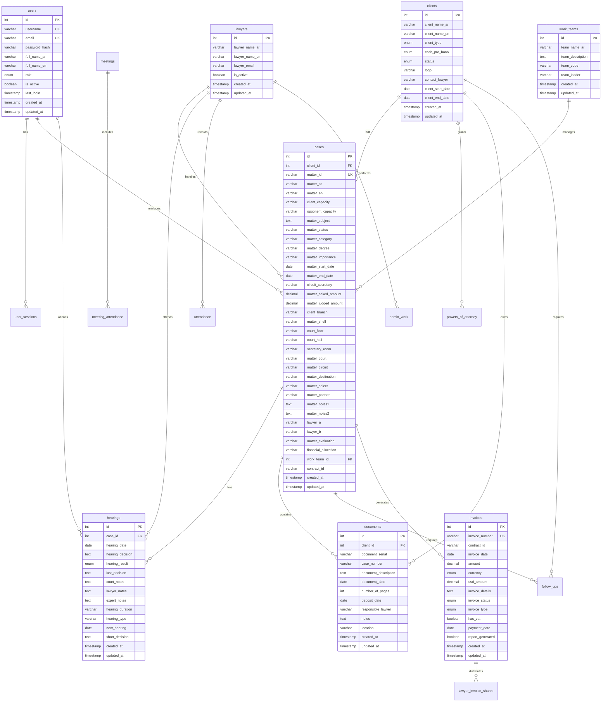

# 🗄️ Database Schema Map - Litigation Management System

## 📊 **Database Schema Overview**

The **Litigation Management System** uses a comprehensive MySQL database with **26 tables** designed to support complete legal practice management. The schema supports Arabic/English bilingual content with UTF-8 encoding and includes all aspects of legal practice from client management to financial tracking.

### **Database Statistics**

| Metric | Value | Evidence |
|--------|-------|----------|
| **Total Tables** | 26 | `database/litigation_database.sql` |
| **Primary Entities** | 8 core business tables | `database/litigation_database.sql:L55-L566` |
| **Supporting Tables** | 18 auxiliary tables | `database/litigation_database.sql:L55-L566` |
| **Character Set** | UTF-8 (utf8mb4) | `database/litigation_database.sql:L7-L9` |
| **Storage Engine** | InnoDB | `database/litigation_database.sql:L38` |

## 🏗️ **Entity Relationship Diagram**

## 📋 **Complete Table Schema**

### **1. User Management Tables**

#### **users** - System Users

| Column | Type | Nullable | Default | Indexes/FK | Evidence |
|--------|------|----------|---------|------------|----------|
| id | INT | NO | AUTO_INCREMENT | PRIMARY KEY | `database/litigation_database.sql:L24` |
| username | VARCHAR(50) | NO | - | UNIQUE, INDEX | `database/litigation_database.sql:L25` |
| email | VARCHAR(100) | NO | - | UNIQUE, INDEX | `database/litigation_database.sql:L26` |
| password_hash | VARCHAR(255) | NO | - | - | `database/litigation_database.sql:L27` |
| full_name_ar | VARCHAR(100) | NO | - | - | `database/litigation_database.sql:L28` |
| full_name_en | VARCHAR(100) | NO | - | - | `database/litigation_database.sql:L29` |
| role | ENUM | NO | 'staff' | INDEX | `database/litigation_database.sql:L30` |
| is_active | BOOLEAN | YES | TRUE | - | `database/litigation_database.sql:L31` |
| last_login | TIMESTAMP | YES | NULL | - | `database/litigation_database.sql:L32` |
| created_at | TIMESTAMP | YES | CURRENT_TIMESTAMP | - | `database/litigation_database.sql:L33` |
| updated_at | TIMESTAMP | YES | CURRENT_TIMESTAMP ON UPDATE | - | `database/litigation_database.sql:L34` |

#### **user_sessions** - User Sessions

| Column | Type | Nullable | Default | Indexes/FK | Evidence |
|--------|------|----------|---------|------------|----------|
| id | VARCHAR(128) | NO | - | PRIMARY KEY | `database/litigation_database.sql:L41` |
| user_id | INT | NO | - | FK to users(id), INDEX | `database/litigation_database.sql:L42-L46` |
| expires_at | TIMESTAMP | NO | - | INDEX | `database/litigation_database.sql:L44` |
| created_at | TIMESTAMP | YES | CURRENT_TIMESTAMP | - | `database/litigation_database.sql:L45` |

### **2. Core Business Tables**

#### **clients** - Client Management

| Column | Type | Nullable | Default | Indexes/FK | Evidence |
|--------|------|----------|---------|------------|----------|
| id | INT | NO | AUTO_INCREMENT | PRIMARY KEY | `database/litigation_database.sql:L57` |
| client_name_ar | VARCHAR(200) | NO | - | - | `database/litigation_database.sql:L58` |
| client_name_en | VARCHAR(200) | YES | - | - | `database/litigation_database.sql:L59` |
| client_type | ENUM | YES | 'company' | - | `database/litigation_database.sql:L60` |
| cash_pro_bono | ENUM | YES | 'cash' | INDEX | `database/litigation_database.sql:L61` |
| status | ENUM | YES | 'active' | INDEX | `database/litigation_database.sql:L62` |
| logo | VARCHAR(255) | YES | - | - | `database/litigation_database.sql:L63` |
| contact_lawyer | VARCHAR(100) | YES | - | INDEX | `database/litigation_database.sql:L64` |
| client_start_date | DATE | YES | - | - | `database/litigation_database.sql:L65` |
| client_end_date | DATE | YES | - | - | `database/litigation_database.sql:L66` |
| created_at | TIMESTAMP | YES | CURRENT_TIMESTAMP | - | `database/litigation_database.sql:L67` |
| updated_at | TIMESTAMP | YES | CURRENT_TIMESTAMP ON UPDATE | - | `database/litigation_database.sql:L68` |

#### **lawyers** - Lawyer Management

| Column | Type | Nullable | Default | Indexes/FK | Evidence |
|--------|------|----------|---------|------------|----------|
| id | INT | NO | AUTO_INCREMENT | PRIMARY KEY | `database/litigation_database.sql:L76` |
| lawyer_name_ar | VARCHAR(100) | NO | - | - | `database/litigation_database.sql:L77` |
| lawyer_name_en | VARCHAR(100) | YES | - | - | `database/litigation_database.sql:L78` |
| lawyer_email | VARCHAR(100) | YES | - | INDEX | `database/litigation_database.sql:L79` |
| is_active | BOOLEAN | YES | TRUE | INDEX | `database/litigation_database.sql:L80` |
| created_at | TIMESTAMP | YES | CURRENT_TIMESTAMP | - | `database/litigation_database.sql:L81` |
| updated_at | TIMESTAMP | YES | CURRENT_TIMESTAMP ON UPDATE | - | `database/litigation_database.sql:L82` |

#### **work_teams** - Work Team Management

| Column | Type | Nullable | Default | Indexes/FK | Evidence |
|--------|------|----------|---------|------------|----------|
| id | INT | NO | AUTO_INCREMENT | PRIMARY KEY | `database/litigation_database.sql:L89` |
| team_name_ar | VARCHAR(200) | NO | - | - | `database/litigation_database.sql:L90` |
| team_description | TEXT | YES | - | - | `database/litigation_database.sql:L91` |
| team_code | VARCHAR(10) | YES | - | INDEX | `database/litigation_database.sql:L92` |
| team_leader | VARCHAR(100) | YES | - | - | `database/litigation_database.sql:L93` |
| created_at | TIMESTAMP | YES | CURRENT_TIMESTAMP | - | `database/litigation_database.sql:L94` |
| updated_at | TIMESTAMP | YES | CURRENT_TIMESTAMP ON UPDATE | - | `database/litigation_database.sql:L95` |

### **3. Case Management Tables**

#### **cases** - Legal Cases/Matters

| Column | Type | Nullable | Default | Indexes/FK | Evidence |
|--------|------|----------|---------|------------|----------|
| id | INT | NO | AUTO_INCREMENT | PRIMARY KEY | `database/litigation_database.sql:L101` |
| client_id | INT | NO | - | FK to clients(id), INDEX | `database/litigation_database.sql:L102-L138` |
| matter_id | VARCHAR(50) | YES | - | UNIQUE, INDEX | `database/litigation_database.sql:L103` |
| matter_ar | VARCHAR(500) | YES | - | - | `database/litigation_database.sql:L104` |
| matter_en | VARCHAR(500) | YES | - | - | `database/litigation_database.sql:L105` |
| client_capacity | VARCHAR(200) | YES | - | - | `database/litigation_database.sql:L106` |
| opponent_capacity | VARCHAR(200) | YES | - | - | `database/litigation_database.sql:L107` |
| matter_subject | TEXT | YES | - | - | `database/litigation_database.sql:L108` |
| matter_status | VARCHAR(100) | YES | - | INDEX | `database/litigation_database.sql:L109` |
| matter_category | VARCHAR(100) | YES | - | INDEX | `database/litigation_database.sql:L110` |
| matter_degree | VARCHAR(100) | YES | - | - | `database/litigation_database.sql:L111` |
| matter_importance | VARCHAR(100) | YES | - | - | `database/litigation_database.sql:L112` |
| matter_start_date | DATE | YES | - | - | `database/litigation_database.sql:L113` |
| matter_end_date | DATE | YES | - | - | `database/litigation_database.sql:L114` |
| circuit_secretary | VARCHAR(100) | YES | - | - | `database/litigation_database.sql:L115` |
| matter_asked_amount | DECIMAL(15,2) | YES | - | - | `database/litigation_database.sql:L116` |
| matter_judged_amount | DECIMAL(15,2) | YES | - | - | `database/litigation_database.sql:L117` |
| client_branch | VARCHAR(100) | YES | - | - | `database/litigation_database.sql:L118` |
| matter_shelf | VARCHAR(100) | YES | - | - | `database/litigation_database.sql:L119` |
| court_floor | VARCHAR(100) | YES | - | - | `database/litigation_database.sql:L120` |
| court_hall | VARCHAR(100) | YES | - | - | `database/litigation_database.sql:L121` |
| secretary_room | VARCHAR(100) | YES | - | - | `database/litigation_database.sql:L122` |
| matter_court | VARCHAR(200) | YES | - | INDEX | `database/litigation_database.sql:L123` |
| matter_circuit | VARCHAR(200) | YES | - | - | `database/litigation_database.sql:L124` |
| matter_destination | VARCHAR(200) | YES | - | - | `database/litigation_database.sql:L125` |
| matter_select | VARCHAR(100) | YES | - | - | `database/litigation_database.sql:L126` |
| matter_partner | VARCHAR(100) | YES | - | - | `database/litigation_database.sql:L127` |
| matter_notes1 | TEXT | YES | - | - | `database/litigation_database.sql:L128` |
| matter_notes2 | TEXT | YES | - | - | `database/litigation_database.sql:L129` |
| lawyer_a | VARCHAR(100) | YES | - | INDEX | `database/litigation_database.sql:L130` |
| lawyer_b | VARCHAR(100) | YES | - | INDEX | `database/litigation_database.sql:L131` |
| matter_evaluation | VARCHAR(100) | YES | - | - | `database/litigation_database.sql:L132` |
| financial_allocation | VARCHAR(100) | YES | - | - | `database/litigation_database.sql:L133` |
| work_team_id | INT | YES | - | FK to work_teams(id), INDEX | `database/litigation_database.sql:L134-L139` |
| contract_id | VARCHAR(50) | YES | - | - | `database/litigation_database.sql:L135` |
| created_at | TIMESTAMP | YES | CURRENT_TIMESTAMP | - | `database/litigation_database.sql:L136` |
| updated_at | TIMESTAMP | YES | CURRENT_TIMESTAMP ON UPDATE | - | `database/litigation_database.sql:L137` |

#### **hearings** - Court Hearings

| Column | Type | Nullable | Default | Indexes/FK | Evidence |
|--------|------|----------|---------|------------|----------|
| id | INT | NO | AUTO_INCREMENT | PRIMARY KEY | `database/litigation_database.sql:L152` |
| case_id | INT | NO | - | FK to cases(id), INDEX | `database/litigation_database.sql:L153-L167` |
| hearing_date | DATE | NO | - | INDEX | `database/litigation_database.sql:L154` |
| hearing_decision | TEXT | YES | - | - | `database/litigation_database.sql:L155` |
| hearing_result | ENUM | YES | 'pending' | INDEX | `database/litigation_database.sql:L156` |
| last_decision | TEXT | YES | - | - | `database/litigation_database.sql:L157` |
| court_notes | TEXT | YES | - | - | `database/litigation_database.sql:L158` |
| lawyer_notes | TEXT | YES | - | - | `database/litigation_database.sql:L159` |
| expert_notes | TEXT | YES | - | - | `database/litigation_database.sql:L160` |
| hearing_duration | VARCHAR(50) | YES | - | - | `database/litigation_database.sql:L161` |
| hearing_type | VARCHAR(100) | YES | - | - | `database/litigation_database.sql:L162` |
| next_hearing | DATE | YES | - | INDEX | `database/litigation_database.sql:L163` |
| short_decision | TEXT | YES | - | - | `database/litigation_database.sql:L164` |
| created_at | TIMESTAMP | YES | CURRENT_TIMESTAMP | - | `database/litigation_database.sql:L165` |
| updated_at | TIMESTAMP | YES | CURRENT_TIMESTAMP ON UPDATE | - | `database/litigation_database.sql:L166` |

### **4. Document Management Tables**

#### **documents** - Document Storage

| Column | Type | Nullable | Default | Indexes/FK | Evidence |
|--------|------|----------|---------|------------|----------|
| id | INT | NO | AUTO_INCREMENT | PRIMARY KEY | `database/litigation_database.sql:L201` |
| client_id | INT | NO | - | FK to clients(id), INDEX | `database/litigation_database.sql:L202-L214` |
| document_serial | VARCHAR(50) | YES | - | INDEX | `database/litigation_database.sql:L203` |
| case_number | VARCHAR(100) | YES | - | INDEX | `database/litigation_database.sql:L204` |
| document_description | TEXT | YES | - | - | `database/litigation_database.sql:L205` |
| document_date | DATE | YES | - | INDEX | `database/litigation_database.sql:L206` |
| number_of_pages | INT | YES | - | - | `database/litigation_database.sql:L207` |
| deposit_date | DATE | YES | - | - | `database/litigation_database.sql:L208` |
| responsible_lawyer | VARCHAR(100) | YES | - | - | `database/litigation_database.sql:L209` |
| notes | TEXT | YES | - | - | `database/litigation_database.sql:L210` |
| location | VARCHAR(200) | YES | - | INDEX | `database/litigation_database.sql:L211` |
| created_at | TIMESTAMP | YES | CURRENT_TIMESTAMP | - | `database/litigation_database.sql:L212` |
| updated_at | TIMESTAMP | YES | CURRENT_TIMESTAMP ON UPDATE | - | `database/litigation_database.sql:L213` |

#### **powers_of_attorney** - Power of Attorney

| Column | Type | Nullable | Default | Indexes/FK | Evidence |
|--------|------|----------|---------|------------|----------|
| id | INT | NO | AUTO_INCREMENT | PRIMARY KEY | `database/litigation_database.sql:L176` |
| client_id | INT | NO | - | FK to clients(id), INDEX | `database/litigation_database.sql:L177-L192` |
| serial_number | VARCHAR(50) | YES | - | - | `database/litigation_database.sql:L178` |
| client_name | VARCHAR(200) | YES | - | - | `database/litigation_database.sql:L179` |
| client_capacity | VARCHAR(100) | YES | - | - | `database/litigation_database.sql:L180` |
| power_number | VARCHAR(50) | YES | - | INDEX | `database/litigation_database.sql:L181` |
| power_letter | VARCHAR(10) | YES | - | - | `database/litigation_database.sql:L182` |
| power_year | YEAR | YES | - | - | `database/litigation_database.sql:L183` |
| issuing_authority | VARCHAR(200) | YES | - | - | `database/litigation_database.sql:L184` |
| issue_date | DATE | YES | - | INDEX | `database/litigation_database.sql:L185` |
| assigned_lawyers | VARCHAR(300) | YES | - | - | `database/litigation_database.sql:L186` |
| number_of_copies | INT | YES | 1 | - | `database/litigation_database.sql:L187` |
| notes | TEXT | YES | - | - | `database/litigation_database.sql:L188` |
| location | VARCHAR(200) | YES | - | INDEX | `database/litigation_database.sql:L189` |
| created_at | TIMESTAMP | YES | CURRENT_TIMESTAMP | - | `database/litigation_database.sql:L190` |
| updated_at | TIMESTAMP | YES | CURRENT_TIMESTAMP ON UPDATE | - | `database/litigation_database.sql:L191` |

### **5. Financial Management Tables**

#### **invoices** - Invoice Management

| Column | Type | Nullable | Default | Indexes/FK | Evidence |
|--------|------|----------|---------|------------|----------|
| id | INT | NO | AUTO_INCREMENT | PRIMARY KEY | `database/litigation_database.sql:L224` |
| invoice_number | VARCHAR(50) | YES | - | UNIQUE, INDEX | `database/litigation_database.sql:L225` |
| contract_id | VARCHAR(50) | YES | - | INDEX | `database/litigation_database.sql:L226` |
| invoice_date | DATE | NO | - | INDEX | `database/litigation_database.sql:L227` |
| amount | DECIMAL(15,2) | NO | - | - | `database/litigation_database.sql:L228` |
| currency | ENUM | YES | 'EGP' | - | `database/litigation_database.sql:L229` |
| usd_amount | DECIMAL(15,2) | YES | - | - | `database/litigation_database.sql:L230` |
| invoice_details | TEXT | YES | - | - | `database/litigation_database.sql:L231` |
| invoice_status | ENUM | YES | 'draft' | INDEX | `database/litigation_database.sql:L232` |
| invoice_type | ENUM | YES | 'service' | - | `database/litigation_database.sql:L233` |
| has_vat | BOOLEAN | YES | FALSE | - | `database/litigation_database.sql:L234` |
| payment_date | DATE | YES | - | - | `database/litigation_database.sql:L235` |
| report_generated | BOOLEAN | YES | FALSE | - | `database/litigation_database.sql:L236` |
| created_at | TIMESTAMP | YES | CURRENT_TIMESTAMP | - | `database/litigation_database.sql:L237` |
| updated_at | TIMESTAMP | YES | CURRENT_TIMESTAMP ON UPDATE | - | `database/litigation_database.sql:L238` |

#### **lawyer_invoice_shares** - Lawyer Fee Distribution

| Column | Type | Nullable | Default | Indexes/FK | Evidence |
|--------|------|----------|---------|------------|----------|
| id | INT | NO | AUTO_INCREMENT | PRIMARY KEY | `database/litigation_database.sql:L247` |
| invoice_id | INT | NO | - | FK to invoices(id), INDEX | `database/litigation_database.sql:L248-L253` |
| lawyer_name | VARCHAR(100) | NO | - | INDEX | `database/litigation_database.sql:L249` |
| share_percentage | DECIMAL(5,2) | NO | - | - | `database/litigation_database.sql:L250` |
| share_amount | DECIMAL(15,2) | NO | - | - | `database/litigation_database.sql:L251` |
| created_at | TIMESTAMP | YES | CURRENT_TIMESTAMP | - | `database/litigation_database.sql:L252` |

### **6. Operational Tables**

#### **attendance** - Lawyer Attendance

| Column | Type | Nullable | Default | Indexes/FK | Evidence |
|--------|------|----------|---------|------------|----------|
| id | INT | NO | AUTO_INCREMENT | PRIMARY KEY | `database/litigation_database.sql:L261` |
| lawyer_name | VARCHAR(100) | NO | - | INDEX | `database/litigation_database.sql:L262` |
| attendance_date | DATE | NO | - | INDEX | `database/litigation_database.sql:L263` |
| attendance_situation | TEXT | YES | - | - | `database/litigation_database.sql:L264` |
| created_at | TIMESTAMP | YES | CURRENT_TIMESTAMP | - | `database/litigation_database.sql:L265` |
| updated_at | TIMESTAMP | YES | CURRENT_TIMESTAMP ON UPDATE | - | `database/litigation_database.sql:L266` |

#### **admin_work** - Administrative Work

| Column | Type | Nullable | Default | Indexes/FK | Evidence |
|--------|------|----------|---------|------------|----------|
| id | INT | NO | AUTO_INCREMENT | PRIMARY KEY | `database/litigation_database.sql:L272` |
| lawyer_name | VARCHAR(100) | NO | - | INDEX | `database/litigation_database.sql:L273` |
| work_date | DATE | NO | - | INDEX | `database/litigation_database.sql:L274` |
| work_description | TEXT | YES | - | - | `database/litigation_database.sql:L275` |
| work_location | VARCHAR(200) | YES | - | - | `database/litigation_database.sql:L276` |
| work_status | ENUM | YES | 'pending' | INDEX | `database/litigation_database.sql:L277` |
| priority | ENUM | YES | 'medium' | INDEX | `database/litigation_database.sql:L278` |
| due_date | DATE | YES | - | INDEX | `database/litigation_database.sql:L279` |
| notes | TEXT | YES | - | - | `database/litigation_database.sql:L280` |
| created_at | TIMESTAMP | YES | CURRENT_TIMESTAMP | - | `database/litigation_database.sql:L281` |
| updated_at | TIMESTAMP | YES | CURRENT_TIMESTAMP ON UPDATE | - | `database/litigation_database.sql:L282` |

### **7. Communication Tables**

#### **contacts** - Contact Management

| Column | Type | Nullable | Default | Indexes/FK | Evidence |
|--------|------|----------|---------|------------|----------|
| id | INT | NO | AUTO_INCREMENT | PRIMARY KEY | `database/litigation_database.sql:L292` |
| full_name | VARCHAR(200) | NO | - | INDEX | `database/litigation_database.sql:L293` |
| contact1 | VARCHAR(100) | YES | - | - | `database/litigation_database.sql:L294` |
| email_address | VARCHAR(200) | YES | - | INDEX | `database/litigation_database.sql:L295` |
| job_title | VARCHAR(200) | YES | - | INDEX | `database/litigation_database.sql:L296` |
| business_phone | VARCHAR(50) | YES | - | - | `database/litigation_database.sql:L297` |
| home_phone | VARCHAR(50) | YES | - | - | `database/litigation_database.sql:L298` |
| mobile_phone | VARCHAR(50) | YES | - | - | `database/litigation_database.sql:L299` |
| fax | VARCHAR(50) | YES | - | - | `database/litigation_database.sql:L300` |
| address | TEXT | YES | - | - | `database/litigation_database.sql:L301` |
| city | VARCHAR(100) | YES | - | - | `database/litigation_database.sql:L302` |
| country | VARCHAR(100) | YES | - | - | `database/litigation_database.sql:L303` |
| postal_code | VARCHAR(20) | YES | - | - | `database/litigation_database.sql:L304` |
| notes | TEXT | YES | - | - | `database/litigation_database.sql:L305` |
| created_at | TIMESTAMP | YES | CURRENT_TIMESTAMP | - | `database/litigation_database.sql:L306` |
| updated_at | TIMESTAMP | YES | CURRENT_TIMESTAMP ON UPDATE | - | `database/litigation_database.sql:L307` |

#### **meetings** - Meeting Management

| Column | Type | Nullable | Default | Indexes/FK | Evidence |
|--------|------|----------|---------|------------|----------|
| id | INT | NO | AUTO_INCREMENT | PRIMARY KEY | `database/litigation_database.sql:L315` |
| meeting_date | DATE | NO | - | INDEX | `database/litigation_database.sql:L316` |
| meeting_time | TIME | YES | - | - | `database/litigation_database.sql:L317` |
| meeting_subject | VARCHAR(300) | YES | - | - | `database/litigation_database.sql:L318` |
| meeting_location | VARCHAR(200) | YES | - | - | `database/litigation_database.sql:L319` |
| meeting_notes | TEXT | YES | - | - | `database/litigation_database.sql:L320` |
| meeting_status | ENUM | YES | 'scheduled' | INDEX | `database/litigation_database.sql:L321` |
| created_at | TIMESTAMP | YES | CURRENT_TIMESTAMP | - | `database/litigation_database.sql:L322` |
| updated_at | TIMESTAMP | YES | CURRENT_TIMESTAMP ON UPDATE | - | `database/litigation_database.sql:L323` |

#### **meeting_attendance** - Meeting Attendance

| Column | Type | Nullable | Default | Indexes/FK | Evidence |
|--------|------|----------|---------|------------|----------|
| id | INT | NO | AUTO_INCREMENT | PRIMARY KEY | `database/litigation_database.sql:L330` |
| meeting_id | INT | NO | - | FK to meetings(id), INDEX | `database/litigation_database.sql:L331-L337` |
| attendee_name | VARCHAR(100) | NO | - | INDEX | `database/litigation_database.sql:L332` |
| attendee_role | VARCHAR(100) | YES | - | - | `database/litigation_database.sql:L333` |
| attendance_status | ENUM | YES | 'present' | - | `database/litigation_database.sql:L334` |
| notes | TEXT | YES | - | - | `database/litigation_database.sql:L335` |
| created_at | TIMESTAMP | YES | CURRENT_TIMESTAMP | - | `database/litigation_database.sql:L336` |

### **8. Follow-up Tables**

#### **follow_ups** - Follow-up Management

| Column | Type | Nullable | Default | Indexes/FK | Evidence |
|--------|------|----------|---------|------------|----------|
| id | INT | NO | AUTO_INCREMENT | PRIMARY KEY | `database/litigation_database.sql:L344` |
| case_id | INT | YES | - | FK to cases(id), INDEX | `database/litigation_database.sql:L345` |
| client_id | INT | YES | - | FK to clients(id), INDEX | `database/litigation_database.sql:L346` |
| follow_up_type | ENUM | NO | - | - | `database/litigation_database.sql:L347` |
| follow_up_date | DATE | NO | - | INDEX | `database/litigation_database.sql:L348` |
| follow_up_description | TEXT | YES | - | - | `database/litigation_database.sql:L349` |
| follow_up_status | ENUM | YES | 'pending' | INDEX | `database/litigation_database.sql:L350` |
| assigned_to | VARCHAR(100) | YES | - | - | `database/litigation_database.sql:L351` |
| priority | ENUM | YES | 'medium' | INDEX | `database/litigation_database.sql:L352` |
| due_date | DATE | YES | - | INDEX | `database/litigation_database.sql:L353` |
| completion_date | DATE | YES | - | - | `database/litigation_database.sql:L354` |
| notes | TEXT | YES | - | - | `database/litigation_database.sql:L355` |
| created_at | TIMESTAMP | YES | CURRENT_TIMESTAMP | - | `database/litigation_database.sql:L356` |
| updated_at | TIMESTAMP | YES | CURRENT_TIMESTAMP ON UPDATE | - | `database/litigation_database.sql:L357` |

## 🔗 **Foreign Key Relationships**

### **Primary Relationships**

| Child Table | Parent Table | Relationship | Constraint | Evidence |
|-------------|--------------|--------------|------------|----------|
| user_sessions | users | One-to-Many | CASCADE DELETE | `database/litigation_database.sql:L46` |
| cases | clients | Many-to-One | CASCADE DELETE | `database/litigation_database.sql:L138` |
| cases | work_teams | Many-to-One | SET NULL | `database/litigation_database.sql:L139` |
| hearings | cases | Many-to-One | CASCADE DELETE | `database/litigation_database.sql:L167` |
| documents | clients | Many-to-One | CASCADE DELETE | `database/litigation_database.sql:L214` |
| powers_of_attorney | clients | Many-to-One | CASCADE DELETE | `database/litigation_database.sql:L192` |
| lawyer_invoice_shares | invoices | Many-to-One | CASCADE DELETE | `database/litigation_database.sql:L253` |
| meeting_attendance | meetings | Many-to-One | CASCADE DELETE | `database/litigation_database.sql:L337` |
| follow_ups | cases | Many-to-One | SET NULL | `database/litigation_database.sql:L345` |
| follow_ups | clients | Many-to-One | SET NULL | `database/litigation_database.sql:L346` |

## 📊 **Index Strategy**

### **Performance Indexes**

| Table | Index | Columns | Purpose | Evidence |
|-------|-------|---------|---------|----------|
| users | idx_username | username | Authentication lookup | `database/litigation_database.sql:L35` |
| users | idx_email | email | Email lookup | `database/litigation_database.sql:L36` |
| users | idx_role | role | Role-based queries | `database/litigation_database.sql:L37` |
| clients | idx_status | status | Active client filtering | `database/litigation_database.sql:L69` |
| clients | idx_cash_pro_bono | cash_pro_bono | Payment type filtering | `database/litigation_database.sql:L70` |
| cases | idx_client_id | client_id | Client case lookup | `database/litigation_database.sql:L140` |
| cases | idx_matter_id | matter_id | Matter ID lookup | `database/litigation_database.sql:L141` |
| cases | idx_matter_status | matter_status | Status filtering | `database/litigation_database.sql:L142` |
| hearings | idx_case_id | case_id | Case hearing lookup | `database/litigation_database.sql:L168` |
| hearings | idx_hearing_date | hearing_date | Date-based queries | `database/litigation_database.sql:L169` |
| invoices | idx_invoice_number | invoice_number | Invoice lookup | `database/litigation_database.sql:L239` |
| invoices | idx_invoice_status | invoice_status | Status filtering | `database/litigation_database.sql:L241` |

## 🌐 **Multilingual Support**

### **Arabic/English Fields**

| Table | Arabic Field | English Field | Purpose | Evidence |
|-------|--------------|---------------|---------|----------|
| users | full_name_ar | full_name_en | User names | `database/litigation_database.sql:L28-L29` |
| clients | client_name_ar | client_name_en | Client names | `database/litigation_database.sql:L58-L59` |
| lawyers | lawyer_name_ar | lawyer_name_en | Lawyer names | `database/litigation_database.sql:L77-L78` |
| work_teams | team_name_ar | - | Team names | `database/litigation_database.sql:L90` |
| cases | matter_ar | matter_en | Case descriptions | `database/litigation_database.sql:L104-L105` |

### **Character Set Configuration**

| Setting | Value | Purpose | Evidence |
|---------|-------|---------|----------|
| **Database Charset** | utf8mb4 | Full UTF-8 support | `database/litigation_database.sql:L7` |
| **Database Collation** | utf8mb4_unicode_ci | Unicode case-insensitive | `database/litigation_database.sql:L7` |
| **Table Charset** | utf8mb4 | Arabic text support | `database/litigation_database.sql:L38` |
| **Table Collation** | utf8mb4_unicode_ci | Proper Arabic sorting | `database/litigation_database.sql:L38` |

---

**Evidence Summary**: `database/litigation_database.sql:L1-L566`, `database/migrations/step_by_step_migration.sql:L1-L164`, `database/config/database.php:L1-L194`
