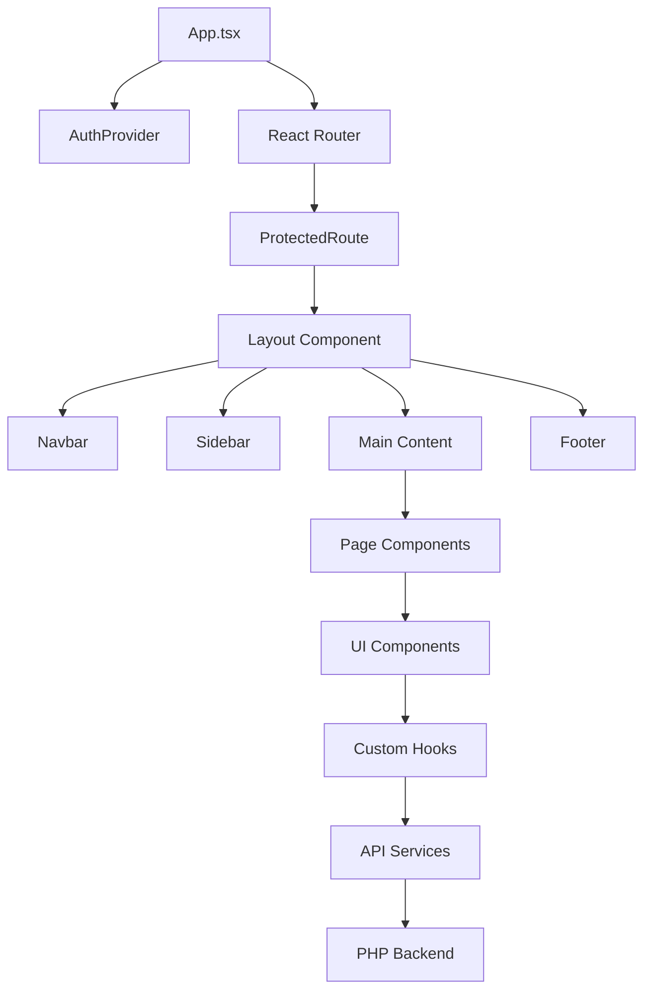

# 🎨 Frontend Overview - Litigation Management System

## 📊 **Frontend Architecture Overview**

The **Litigation Management System** frontend is a **modern React Single Page Application (SPA)** built with TypeScript, featuring comprehensive Arabic/English bilingual support with RTL layout capabilities. The application uses a component-based architecture with state management, routing, and internationalization.

### **Frontend Technology Stack**

| Component | Technology | Version | Purpose | Evidence |
|-----------|------------|---------|---------|----------|
| **Framework** | React | 18.2.0 | UI framework | `package.json:L116` |
| **Language** | TypeScript | 5.3.3 | Type safety | `package.json:L101` |
| **Build Tool** | Vite | 5.0.10 | Development and build | `package.json:L102` |
| **Routing** | React Router | 6.20.1 | Client-side routing | `package.json:L126` |
| **State Management** | React Query | 3.39.3 | Server state | `package.json:L125` |
| **UI Framework** | Bootstrap | 5.3.2 | CSS framework | `package.json:L110` |
| **Styling** | SCSS | 1.69.7 | CSS preprocessing | `package.json:L99` |
| **Internationalization** | i18next | 23.7.16 | Multi-language support | `package.json:L114` |

## 🏗️ **Application Architecture**

### **Application Structure**

### **Component Hierarchy**

| Level | Components | Purpose | Evidence |
|-------|------------|---------|----------|
| **App Level** | App.tsx, main.tsx | Application root and providers | `src/App.tsx:L1-L95`, `src/main.tsx:L1-L40` |
| **Layout Level** | Layout, Navbar, Sidebar, Footer | Application shell | `src/components/layout/Layout.tsx:L1-L40` |
| **Page Level** | Dashboard, Clients, Cases, Hearings | Business logic pages | `src/pages/` |
| **Component Level** | Forms, Tables, Modals | Reusable UI components | `src/components/` |
| **Hook Level** | useLanguage, useRTL, usePermissions | Custom business logic | `src/hooks/` |

## 🛣️ **Routing Architecture**

### **Route Structure**

| Route Pattern | Component | Purpose | Evidence |
|---------------|-----------|---------|----------|
| `/login` | Login | Authentication page | `src/App.tsx:L45` |
| `/dashboard` | Dashboard | Main dashboard | `src/App.tsx:L57` |
| `/clients` | ClientsPage | Client management | `src/App.tsx:L58` |
| `/clients/new` | ClientsPage | New client form | `src/App.tsx:L59` |
| `/clients/:id` | ClientsPage | Client details | `src/App.tsx:L60` |
| `/clients/:id/edit` | ClientsPage | Edit client | `src/App.tsx:L61` |
| `/cases` | CasesPage | Case management | `src/App.tsx:L62` |
| `/cases/new` | CasesPage | New case form | `src/App.tsx:L63` |
| `/cases/:id` | CasesPage | Case details | `src/App.tsx:L64` |
| `/cases/:id/edit` | CasesPage | Edit case | `src/App.tsx:L65` |
| `/hearings` | HearingsPage | Hearing management | `src/App.tsx:L66` |
| `/hearings/new` | HearingsPage | New hearing form | `src/App.tsx:L67` |
| `/hearings/:id` | HearingsPage | Hearing details | `src/App.tsx:L68` |
| `/hearings/:id/edit` | HearingsPage | Edit hearing | `src/App.tsx:L69` |
| `/invoices` | Invoices | Invoice management | `src/App.tsx:L70` |
| `/invoices/new` | Invoices | New invoice form | `src/App.tsx:L71` |
| `/invoices/:id` | Invoices | Invoice details | `src/App.tsx:L72` |
| `/invoices/:id/edit` | Invoices | Edit invoice | `src/App.tsx:L73` |
| `/lawyers` | LawyersPage | Lawyer management | `src/App.tsx:L74` |
| `/documents` | Documents | Document management | `src/App.tsx:L78` |
| `/reports` | ReportsPage | Report generation | `src/App.tsx:L81` |
| `/settings` | Settings | Application settings | `src/App.tsx:L82` |
| `/users` | Users | User management | `src/App.tsx:L83` |

### **Route Protection**

| Route Type | Protection | Implementation | Evidence |
|------------|------------|----------------|----------|
| **Public Routes** | None | Direct access | `src/App.tsx:L44-L45` |
| **Protected Routes** | Authentication required | ProtectedRoute wrapper | `src/App.tsx:L47-L54` |
| **Admin Routes** | Role-based access | Permission checking | `src/components/auth/PermissionGate.tsx` |

## 🎨 **UI Framework & Styling**

### **Bootstrap Integration**

| Component | Implementation | Purpose | Evidence |
|-----------|----------------|---------|----------|
| **Bootstrap 5** | Full framework integration | CSS framework | `package.json:L110` |
| **React Bootstrap** | Component library | React components | `package.json:L117` |
| **Custom SCSS** | Extended styling | RTL and custom styles | `src/styles/main.scss:L1-L301` |
| **RTL Support** | Direction-aware styling | Arabic layout support | `src/styles/rtl.scss` |

### **Styling Architecture**

| Layer | Technology | Purpose | Evidence |
|-------|------------|---------|----------|
| **Base Styles** | SCSS variables | Design system foundation | `src/styles/variables.scss` |
| **Component Styles** | SCSS modules | Component-specific styling | `src/styles/` |
| **RTL Styles** | Direction-aware CSS | Arabic layout support | `src/styles/rtl.scss` |
| **Responsive Design** | Bootstrap grid | Mobile-first responsive | `src/styles/main.scss` |

### **RTL (Right-to-Left) Support**

| Feature | Implementation | Purpose | Evidence |
|---------|----------------|---------|----------|
| **Direction Detection** | useRTL hook | Language-based direction | `src/hooks/useRTL.ts` |
| **CSS Overrides** | RTL-specific styles | Arabic layout | `src/styles/rtl.scss` |
| **Bootstrap RTL** | Custom RTL classes | Framework RTL support | `src/styles/main.scss:L30-L48` |
| **Mixed Content** | Per-field direction | Arabic/English mixed content | `src/components/forms/MixedContentInput.tsx` |

## 🌐 **Internationalization (i18n)**

### **i18next Configuration**

| Setting | Value | Purpose | Evidence |
|---------|-------|---------|----------|
| **Default Language** | Arabic (ar) | Primary language | `src/i18n/index.ts:L18` |
| **Fallback Language** | Arabic (ar) | Fallback for missing translations | `src/i18n/index.ts:L19` |
| **Supported Languages** | Arabic, English | Bilingual support | `src/i18n/locales/` |
| **Storage** | localStorage | Language preference persistence | `src/i18n/index.ts:L18` |

### **Translation Structure**

| Namespace | Content | Evidence |
|-----------|---------|----------|
| **Navigation** | Menu items and navigation | `src/i18n/locales/ar.ts:L3-L15` |
| **Authentication** | Login/logout messages | `src/i18n/locales/ar.ts:L17-L28` |
| **Dashboard** | Dashboard content | `src/i18n/locales/ar.ts:L30-L40` |
| **Clients** | Client management | `src/i18n/locales/ar.ts:L42-L50` |
| **Cases** | Case management | `src/i18n/locales/ar.ts:L52-L60` |
| **Hearings** | Hearing management | `src/i18n/locales/ar.ts:L62-L70` |
| **Invoices** | Invoice management | `src/i18n/locales/ar.ts:L72-L80` |
| **Common** | Shared UI elements | `src/i18n/locales/ar.ts:L82-L90` |

### **Language Switching**

| Component | Purpose | Evidence |
|-----------|---------|----------|
| **LanguageSwitcher** | UI component for language toggle | `src/components/LanguageSwitcher.tsx` |
| **useLanguage Hook** | Language state management | `src/hooks/useLanguage.ts` |
| **Direction Update** | Automatic RTL/LTR switching | `src/App.tsx:L28-L38` |

## 🔐 **Authentication & Authorization**

### **Authentication Flow**

| Component | Purpose | Evidence |
|-----------|---------|----------|
| **AuthProvider** | Authentication context | `src/components/auth/AuthProvider.tsx` |
| **ProtectedRoute** | Route protection | `src/components/auth/ProtectedRoute.tsx` |
| **PermissionGate** | Role-based access control | `src/components/auth/PermissionGate.tsx` |
| **LoginForm** | Authentication form | `src/components/LoginForm.tsx` |

### **State Management**

| Technology | Purpose | Evidence |
|------------|---------|----------|
| **React Context** | Authentication state | `src/contexts/AuthContext.tsx` |
| **React Query** | Server state management | `src/main.tsx:L4-L19` |
| **Local Storage** | Token persistence | `src/services/api.ts` |
| **Custom Hooks** | Business logic abstraction | `src/hooks/` |

## 📱 **Responsive Design**

### **Breakpoint Strategy**

| Breakpoint | Bootstrap Class | Purpose | Evidence |
|------------|-----------------|---------|----------|
| **Mobile** | xs (<576px) | Mobile devices | `src/styles/main.scss` |
| **Tablet** | sm (≥576px) | Small tablets | `src/styles/main.scss` |
| **Desktop** | md (≥768px) | Desktop screens | `src/styles/main.scss` |
| **Large** | lg (≥992px) | Large screens | `src/styles/main.scss` |
| **XL** | xl (≥1200px) | Extra large screens | `src/styles/main.scss` |

### **Mobile Optimization**

| Feature | Implementation | Evidence |
|---------|----------------|----------|
| **Responsive Navigation** | Collapsible sidebar | `src/components/layout/Sidebar.tsx` |
| **Touch-friendly UI** | Bootstrap touch classes | `src/styles/main.scss` |
| **Mobile Forms** | Responsive form layouts | `src/components/forms/` |
| **Mobile Tables** | Horizontal scrolling tables | `src/components/tables/ServerPaginatedTable.tsx` |

## 🎯 **Component Architecture**

### **Component Categories**

| Category | Components | Purpose | Evidence |
|----------|------------|---------|----------|
| **Layout** | Layout, Navbar, Sidebar, Footer | Application shell | `src/components/layout/` |
| **Forms** | FormInput, MixedContentInput | Form components | `src/components/forms/` |
| **Tables** | ServerPaginatedTable | Data display | `src/components/tables/` |
| **Modals** | ClientModal | Overlay components | `src/components/modals/` |
| **UI** | LanguageSwitcher, UserMenu | Utility components | `src/components/ui/` |
| **Auth** | AuthProvider, ProtectedRoute | Authentication | `src/components/auth/` |

### **Component Patterns**

| Pattern | Implementation | Purpose | Evidence |
|---------|----------------|---------|----------|
| **Functional Components** | React hooks | Modern React patterns | `src/components/` |
| **Custom Hooks** | Business logic abstraction | Reusable logic | `src/hooks/` |
| **TypeScript Interfaces** | Type definitions | Type safety | `src/types/` |
| **Prop Validation** | TypeScript types | Runtime safety | `src/components/` |

## 🔧 **Development Tools**

### **Build Configuration**

| Tool | Configuration | Purpose | Evidence |
|------|---------------|---------|----------|
| **Vite** | vite.config.ts | Build and dev server | `vite.config.ts:L1-L67` |
| **TypeScript** | tsconfig.json | Type checking | `tsconfig.json:L1-L44` |
| **ESLint** | .eslintrc.cjs | Code linting | `.eslintrc.cjs:L1-L107` |
| **Prettier** | .prettierrc | Code formatting | `.prettierrc:L1-L14` |

### **Development Features**

| Feature | Implementation | Purpose | Evidence |
|---------|----------------|---------|----------|
| **Hot Reload** | Vite HMR | Development efficiency | `vite.config.ts:L10` |
| **Type Checking** | TypeScript | Development safety | `tsconfig.json:L18-L22` |
| **Path Aliases** | Vite aliases | Clean imports | `vite.config.ts:L18-L30` |
| **Source Maps** | Vite source maps | Debugging support | `vite.config.ts:L47` |

## 📊 **Performance Optimization**

### **Bundle Optimization**

| Strategy | Implementation | Purpose | Evidence |
|----------|----------------|---------|----------|
| **Code Splitting** | Manual chunks | Load optimization | `vite.config.ts:L50-L57` |
| **Tree Shaking** | ES modules | Bundle size reduction | `vite.config.ts:L1-L67` |
| **Asset Optimization** | Vite optimization | Performance | `vite.config.ts:L43-L59` |
| **Lazy Loading** | React.lazy | Route-based splitting | `src/App.tsx` |

### **Runtime Performance**

| Feature | Implementation | Purpose | Evidence |
|---------|----------------|---------|----------|
| **React Query** | Server state caching | API optimization | `src/main.tsx:L11-L19` |
| **Memoization** | React.memo | Re-render optimization | `src/components/` |
| **Virtual Scrolling** | Table virtualization | Large dataset handling | `src/components/tables/` |
| **Debounced Search** | Input debouncing | Search optimization | `src/components/forms/` |

## 🧪 **Testing Strategy**

### **Testing Framework**

| Tool | Purpose | Evidence |
|------|---------|----------|
| **Vitest** | Unit testing | `package.json:L103` |
| **React Testing Library** | Component testing | `package.json:L76` |
| **Playwright** | E2E testing | `package.json:L65` |
| **Storybook** | Component development | `package.json:L100` |

### **Test Coverage**

| Type | Coverage | Evidence |
|------|----------|----------|
| **Unit Tests** | Component logic | `src/test/setup.ts` |
| **Integration Tests** | Component interactions | `tests/` |
| **E2E Tests** | User workflows | `playwright.config.mjs` |
| **Visual Tests** | Component appearance | `tests/visual-regression.spec.ts` |

## 🚀 **Deployment Configuration**

### **Build Output**

| Setting | Value | Purpose | Evidence |
|---------|-------|---------|----------|
| **Output Directory** | `./backend/public` | Production build location | `vite.config.ts:L44` |
| **Asset Directory** | `assets/` | Static asset organization | `vite.config.ts:L46` |
| **Source Maps** | Enabled | Debugging support | `vite.config.ts:L47` |
| **Minification** | Enabled | Production optimization | `vite.config.ts:L43-L59` |

### **Environment Configuration**

| Environment | URL | Purpose | Evidence |
|-------------|-----|---------|----------|
| **Development** | `lit.local:3001` | Local development | `vite.config.ts:L12-L16` |
| **Production** | `lit.sarieldin.com` | Live application | `package.json:L148` |
| **API Endpoint** | `lit.local:8080` | Backend API | `src/services/api.ts` |

---

**Evidence Summary**: `src/App.tsx:L1-L95`, `src/main.tsx:L1-L40`, `src/components/layout/Layout.tsx:L1-L40`, `src/i18n/index.ts:L1-L52`, `src/styles/main.scss:L1-L301`, `vite.config.ts:L1-L67`, `package.json:L105-L130`
