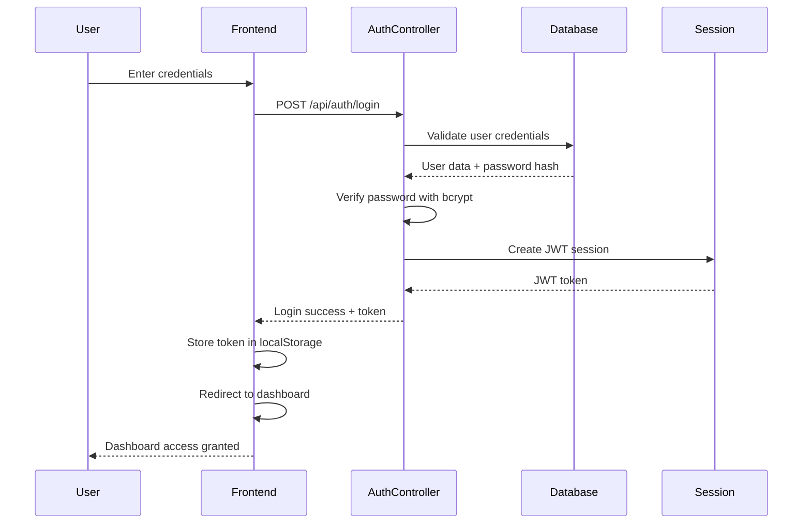
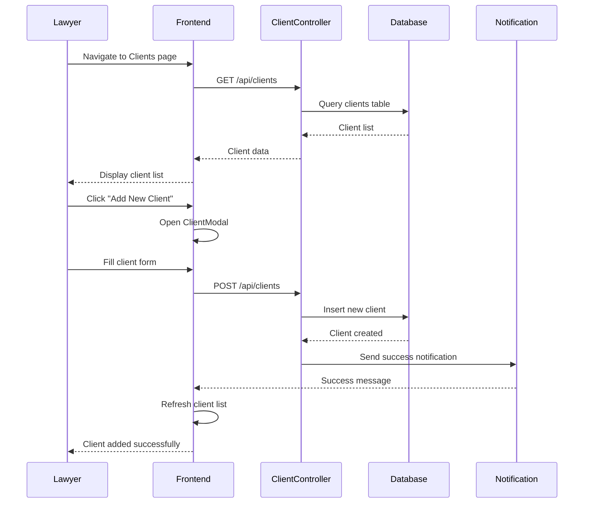
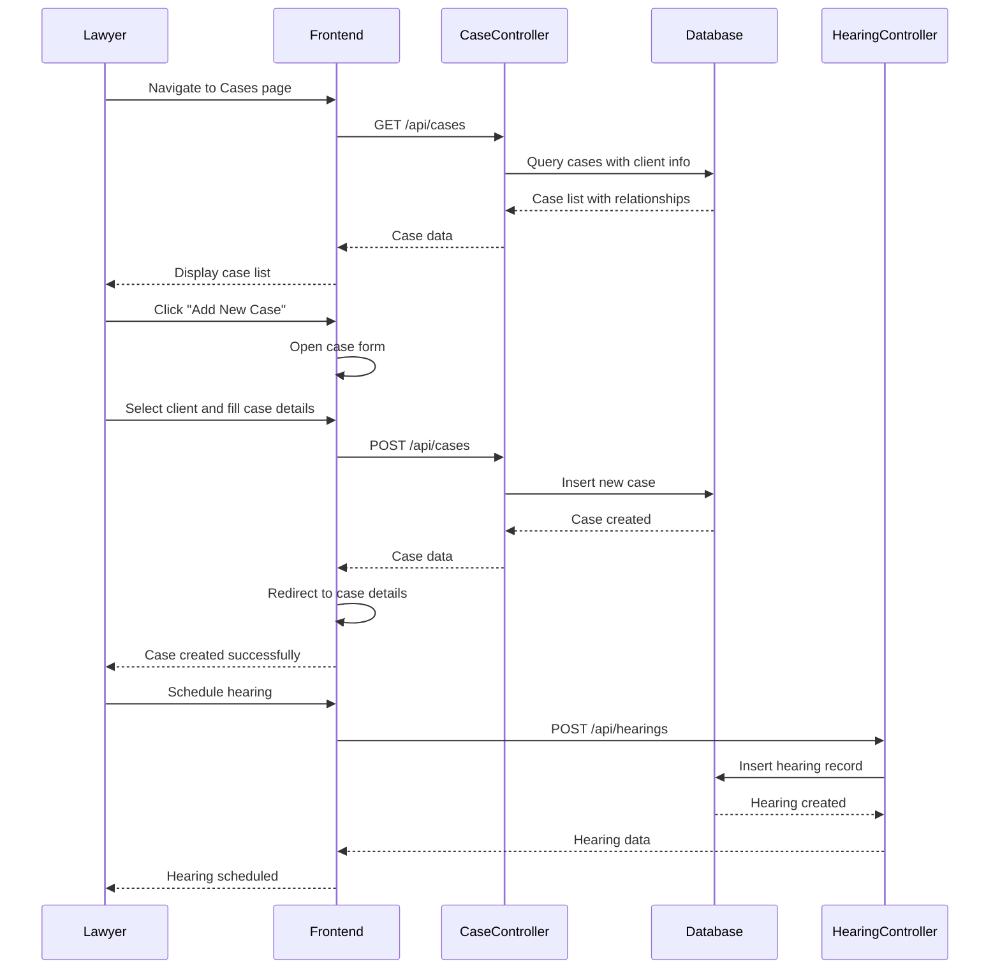
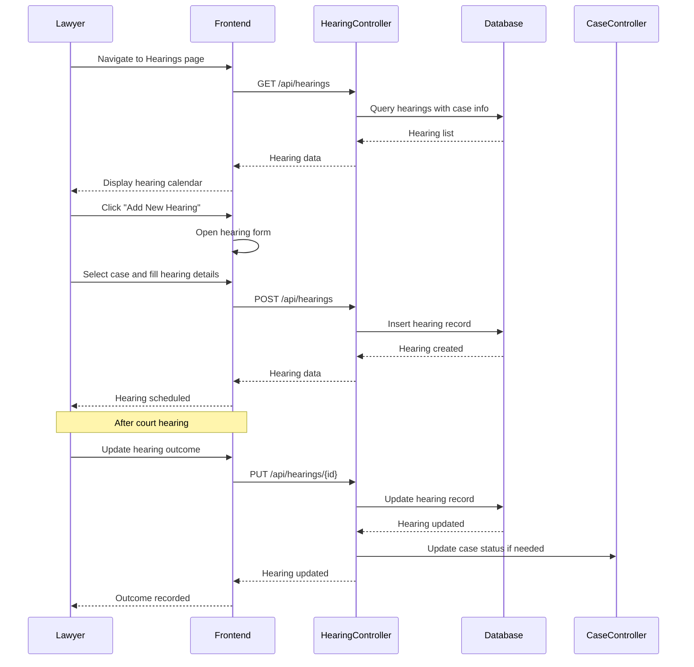
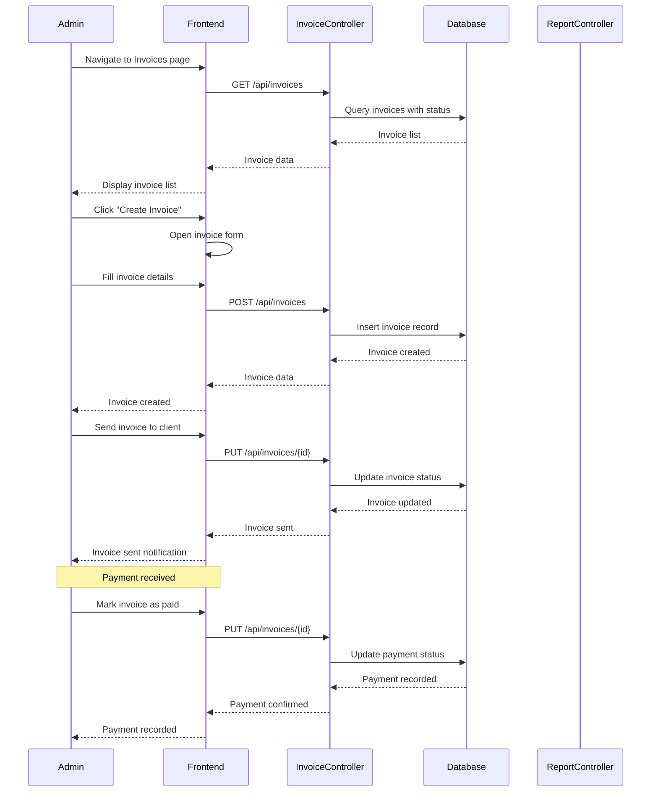
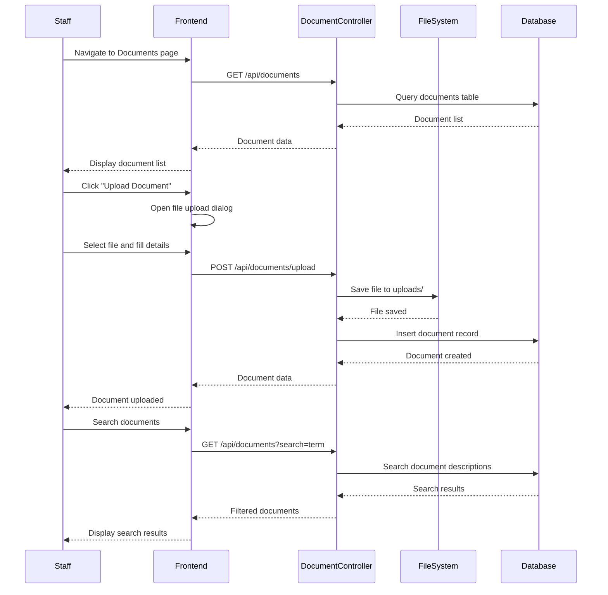
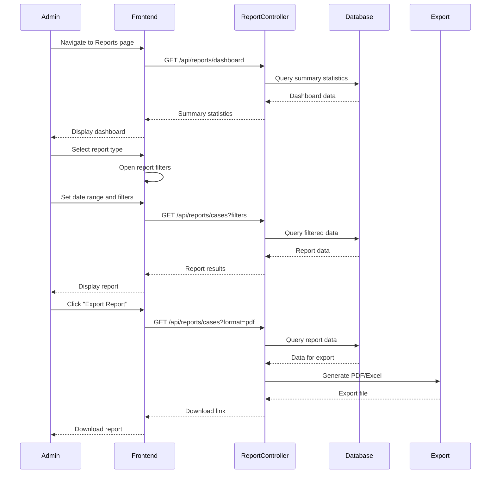
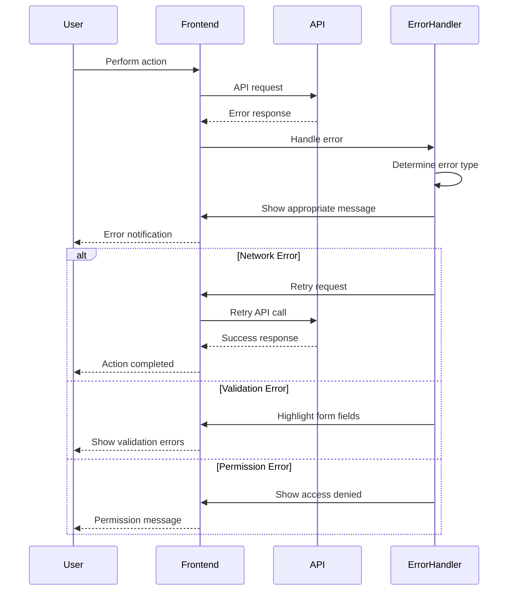
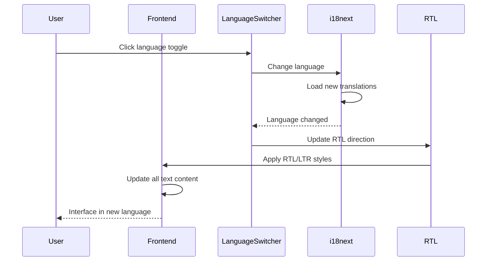
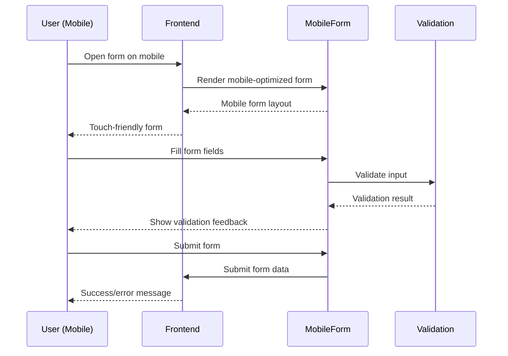

# 🔄 Key User Flows - Litigation Management System

## 📊 **User Flow Overview**

The **Litigation Management System** supports comprehensive legal practice management workflows from client onboarding to case resolution. The system handles **6,388+ legal matters**, **20,000+ court hearings**, **540+ invoices**, and **247+ clients** with full Arabic/English bilingual support.

### **Primary User Roles**

| Role | Permissions | Key Workflows | Evidence |
|------|-------------|---------------|----------|
| **Super Admin** | 91 permissions | System management, user administration | `backend/config/config.php:L82-L86` |
| **Admin** | 84 permissions | Business operations, report generation | `backend/config/config.php:L87-L90` |
| **Lawyer** | 52 permissions | Case management, client interaction | `backend/config/config.php:L91-L94` |
| **Staff** | 52 permissions | Data entry, document management | `backend/config/config.php:L95-L98` |

## 🔐 **Authentication Flow**

### **User Login Workflow**

**Flow Details:**

| Step | Component | Action | Evidence |
|------|-----------|--------|----------|
| **1. Login Form** | Login.tsx | User enters credentials | `src/pages/auth/Login.tsx` |
| **2. API Call** | AuthController | POST /api/auth/login | `backend/src/Controllers/AuthController.php:L10-L41` |
| **3. Validation** | Validator | Input validation | `backend/src/Core/Validator.php` |
| **4. Authentication** | Auth class | Credential verification | `backend/src/Core/Auth.php` |
| **5. Session Creation** | JWT | Token generation | `backend/config/config.php:L25-L27` |
| **6. Response** | Frontend | Token storage and redirect | `src/components/auth/AuthProvider.tsx` |

**Evidence**: `src/pages/auth/Login.tsx`, `backend/src/Controllers/AuthController.php:L10-L41`, `backend/src/Core/Auth.php`, `src/components/auth/AuthProvider.tsx`

## 👥 **Client Management Flow**

### **Client Onboarding Workflow**

**Flow Details:**

| Step | Component | Action | Evidence |
|------|-----------|--------|----------|
| **1. Client List** | ClientsPage | Display existing clients | `src/pages/ClientsPage.tsx` |
| **2. Add Client** | ClientModal | Open client creation form | `src/components/modals/ClientModal.tsx` |
| **3. Form Submission** | ClientController | POST /api/clients | `backend/src/Controllers/ClientController.php` |
| **4. Data Validation** | Validator | Client data validation | `backend/src/Core/Validator.php` |
| **5. Database Insert** | Client Model | Create client record | `backend/src/Models/Client.php` |
| **6. Success Response** | Frontend | Show success message | `src/pages/ClientsPage.tsx` |

**Evidence**: `src/pages/ClientsPage.tsx`, `src/components/modals/ClientModal.tsx`, `backend/src/Controllers/ClientController.php`, `backend/src/Models/Client.php`

## ⚖️ **Case Management Flow**

### **Case Creation and Management Workflow**

**Flow Details:**

| Step | Component | Action | Evidence |
|------|-----------|--------|----------|
| **1. Case List** | CasesPage | Display cases with client info | `src/pages/CasesPage.tsx` |
| **2. Case Creation** | CaseController | POST /api/cases | `backend/src/Controllers/CaseController.php` |
| **3. Client Selection** | Client dropdown | Select existing client | `src/pages/CasesPage.tsx` |
| **4. Case Details** | Case form | Fill case information | `src/pages/CasesPage.tsx` |
| **5. Database Insert** | Case Model | Create case record | `backend/src/Models/Case.php` |
| **6. Hearing Scheduling** | HearingController | Schedule court hearing | `backend/src/Controllers/HearingController.php` |

**Evidence**: `src/pages/CasesPage.tsx`, `backend/src/Controllers/CaseController.php`, `backend/src/Models/Case.php`, `backend/src/Controllers/HearingController.php`

## 🏛️ **Hearing Management Flow**

### **Court Hearing Workflow**

**Flow Details:**

| Step | Component | Action | Evidence |
|------|-----------|--------|----------|
| **1. Hearing List** | HearingsPage | Display upcoming hearings | `src/pages/HearingsPage.tsx` |
| **2. Hearing Creation** | HearingController | POST /api/hearings | `backend/src/Controllers/HearingController.php` |
| **3. Case Selection** | Case dropdown | Select related case | `src/pages/HearingsPage.tsx` |
| **4. Hearing Details** | Hearing form | Fill hearing information | `src/pages/HearingsPage.tsx` |
| **5. Outcome Recording** | HearingController | PUT /api/hearings/{id} | `backend/src/Controllers/HearingController.php` |
| **6. Case Status Update** | Case Model | Update case based on hearing | `backend/src/Models/Case.php` |

**Evidence**: `src/pages/HearingsPage.tsx`, `backend/src/Controllers/HearingController.php`, `backend/src/Models/Hearing.php`, `backend/src/Models/Case.php`

## 💰 **Invoice Management Flow**

### **Billing and Payment Workflow**

**Flow Details:**

| Step | Component | Action | Evidence |
|------|-----------|--------|----------|
| **1. Invoice List** | Invoices page | Display invoices with status | `src/pages/Invoices.tsx` |
| **2. Invoice Creation** | InvoiceController | POST /api/invoices | `backend/src/Controllers/InvoiceController.php` |
| **3. Invoice Details** | Invoice form | Fill billing information | `src/pages/Invoices.tsx` |
| **4. Invoice Sending** | InvoiceController | PUT /api/invoices/{id} | `backend/src/Controllers/InvoiceController.php` |
| **5. Payment Recording** | InvoiceController | Update payment status | `backend/src/Controllers/InvoiceController.php` |
| **6. Financial Reporting** | ReportController | Generate payment reports | `backend/src/Controllers/ReportController.php` |

**Evidence**: `src/pages/Invoices.tsx`, `backend/src/Controllers/InvoiceController.php`, `backend/src/Models/Invoice.php`, `backend/src/Controllers/ReportController.php`

## 📄 **Document Management Flow**

### **Document Upload and Management Workflow**

**Flow Details:**

| Step | Component | Action | Evidence |
|------|-----------|--------|----------|
| **1. Document List** | Documents page | Display document library | `src/pages/Documents.tsx` |
| **2. File Upload** | DocumentController | POST /api/documents/upload | `backend/src/Controllers/DocumentController.php` |
| **3. File Validation** | File validation | Check file type and size | `backend/config/config.php:L35-L37` |
| **4. File Storage** | File system | Save to uploads directory | `backend/uploads/documents/` |
| **5. Database Record** | Document Model | Create document record | `backend/src/Models/Document.php` |
| **6. Document Search** | DocumentController | Search document content | `backend/src/Controllers/DocumentController.php` |

**Evidence**: `src/pages/Documents.tsx`, `backend/src/Controllers/DocumentController.php`, `backend/src/Models/Document.php`, `backend/uploads/documents/`

## 📊 **Reporting Flow**

### **Report Generation Workflow**

**Flow Details:**

| Step | Component | Action | Evidence |
|------|-----------|--------|----------|
| **1. Dashboard** | ReportsPage | Display summary statistics | `src/pages/ReportsPage.tsx` |
| **2. Report Filters** | Report form | Set report parameters | `src/pages/ReportsPage.tsx` |
| **3. Data Query** | ReportController | GET /api/reports/cases | `backend/src/Controllers/ReportController.php` |
| **4. Data Processing** | Report Model | Process and format data | `backend/src/Models/Report.php` |
| **5. Export Generation** | Export service | Generate PDF/Excel | `backend/src/Controllers/ReportController.php` |
| **6. File Download** | Frontend | Download generated report | `src/pages/ReportsPage.tsx` |

**Evidence**: `src/pages/ReportsPage.tsx`, `backend/src/Controllers/ReportController.php`, `backend/src/Models/Report.php`

## 🔧 **Error Handling and Recovery**

### **Error Flow Patterns**

| Error Type | Handling | Recovery | Evidence |
|------------|----------|----------|----------|
| **Authentication Errors** | Redirect to login | Re-authentication | `src/components/auth/ProtectedRoute.tsx` |
| **Validation Errors** | Form error display | User correction | `src/components/FormInput.tsx` |
| **Network Errors** | Retry mechanism | Automatic retry | `src/services/api.ts` |
| **Permission Errors** | Access denied message | Role-based access | `src/components/auth/PermissionGate.tsx` |

### **Error Recovery Workflows**

## 🌐 **Multi-language Workflow**

### **Language Switching Flow**

**Flow Details:**

| Step | Component | Action | Evidence |
|------|-----------|--------|----------|
| **1. Language Toggle** | LanguageSwitcher | User clicks language button | `src/components/LanguageSwitcher.tsx` |
| **2. Language Change** | i18next | Change application language | `src/i18n/index.ts:L18` |
| **3. Translation Load** | i18next | Load new language translations | `src/i18n/locales/` |
| **4. RTL Update** | useRTL hook | Update text direction | `src/hooks/useRTL.ts` |
| **5. Style Application** | CSS | Apply RTL/LTR styles | `src/styles/rtl.scss` |
| **6. Content Update** | Components | Update all text content | `src/components/` |

**Evidence**: `src/components/LanguageSwitcher.tsx`, `src/i18n/index.ts:L18`, `src/hooks/useRTL.ts`, `src/styles/rtl.scss`

## 📱 **Mobile Responsive Workflows**

### **Mobile Navigation Flow**

| Device | Navigation | Features | Evidence |
|--------|------------|----------|----------|
| **Mobile** | Collapsible sidebar | Touch-friendly navigation | `src/components/layout/Sidebar.tsx` |
| **Tablet** | Responsive layout | Optimized for touch | `src/styles/main.scss` |
| **Desktop** | Full sidebar | Complete navigation | `src/components/layout/Layout.tsx` |

### **Mobile Form Workflow**

---

**Evidence Summary**: `src/pages/auth/Login.tsx`, `src/pages/ClientsPage.tsx`, `src/pages/CasesPage.tsx`, `src/pages/HearingsPage.tsx`, `src/pages/Invoices.tsx`, `src/pages/Documents.tsx`, `src/pages/ReportsPage.tsx`, `backend/src/Controllers/`, `backend/src/Models/`, `src/components/auth/`, `src/components/layout/`
