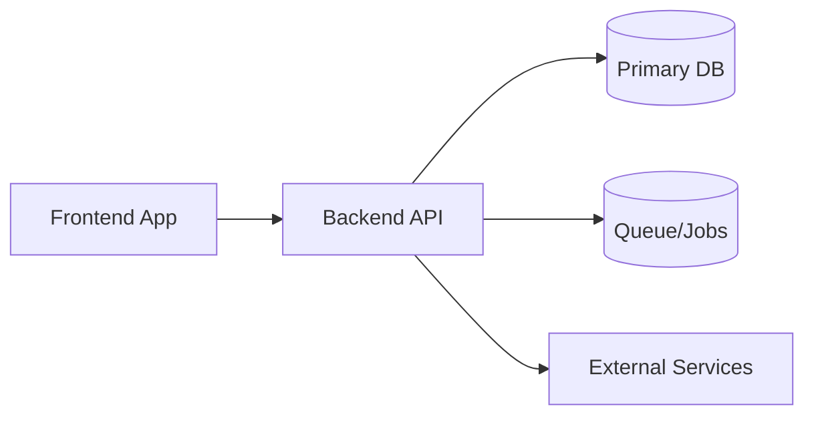

# 🔍 Universal Codebase Audit & Mapping Prompt (for Codex, with Shell Mode Variant)
>
> **Copy–paste this entire prompt to Codex.** It is **project-agnostic** and produces a complete, cross‑linked audit bundle in a single folder named **`Codex_Output/`** without touching your repo files.

---

## ROLE

You are a **senior software architect, reverse‑engineer, and technical writer**. You will fully audit the codebase in this workspace and produce an exhaustive, human‑readable knowledge pack.

## OBJECTIVE

Perform a **complete static analysis** of the repository and generate a comprehensive documentation bundle inside **`Codex_Output/`**. Assume **monorepo** unless proven otherwise. Detect **all languages**, **frameworks**, **build tools**, **package managers**, **databases**, **APIs**, **frontends**, **services**, **infrastructure**, and **testing/operations** patterns. Where runtime evidence is missing, state assumptions as **clearly marked hypotheses** with confidence levels and ways to verify.

---

## GLOBAL RULES

1. **All outputs must live only under:** `Codex_Output/` (create subfolders as needed).  
2. **Read‑only:** do **not** modify project files.  
3. **Deterministic & exhaustive:** If something can’t be proven, mark as **Assumption** with **Evidence** and **How to verify**.  
4. **Cite evidence** for every important claim using file path + line ranges, e.g. `src/auth/jwt.ts:L42-L98`.  
5. **Cross‑link** documents with relative links.  
6. Prefer **tables**, **bullet lists**, and **Mermaid** diagrams (fenced ```mermaid blocks```).  
7. If any single file would exceed ~5–7k lines, split into `part-1`, `part-2`, … and provide an index.  
8. **No outbound web calls.** Base all findings on repository contents.  
9. If multiple apps/packages exist, produce: (a) a **top‑level overview**, then (b) **per‑package deep dives**.  
10. **Mask secrets** when quoting `.env`, keys, or URIs (show pattern, not values).

---

## DETECTION STRATEGY (at a glance)

- **Inventory** the tree; identify apps/services/packages and shared libraries.  
- **Tech stack** from lockfiles/manifests/build scripts/Dockerfiles/CI files.  
- **Databases** via migrations/ORM models/raw SQL/connection strings.  
- **APIs & routes** via router definitions and framework conventions.  
- **Frontends** via router/state/i18n/build configs and component structure.  
- **Security** (authN/Z, validation, secrets), **Testing**, **CI/CD**, **Infra/IaC**.  
- **Gaps**: missing docs, dead code, TODOs, brittle areas.

---

## REQUIRED OUTPUTS (WRITE ALL UNDER `Codex_Output/`)

Create the following files and populate them as specified. If an item is not present in the repo, still create the file and mark **Not detected** with rationale and a plan to add it.

### 1) `README.md`

**Purpose:** Explain what this bundle is and how to navigate it.  
**Must include:**

- Overview of contents and links to each major file.  
- How to read evidence citations.  
- Glossary pointer.

---

### 2) `SUMMARY.md`

**One‑page executive summary.**  
**Must include:**

- Systems/apps detected, languages, frameworks, package managers.  
- Databases and data stores.  
- Architectural style(s).  
- High‑level data flow diagram (**Mermaid** context diagram).  
- Deployment style (assumption allowed if evidence partial).  
- 5–10 key findings + 5 quick wins.

**Example Mermaid (adapt to repo):**



---

### 3) `TECH_STACK.md`

**Must include:**

- Languages/runtimes (with versions from lockfiles or headers).  
- Frameworks & libraries with roles (e.g., `express` – HTTP server, `typeorm` – ORM).  
- Build systems & scripts, package managers, lint/format/type‑check tools.  
- Notable plugins/addons (Babel/TS config, ESLint rules, Prettier, Husky, Commitlint).  
- Any polyfills, runtime flags, or TS compiler options that affect behavior.  
- Evidence per item (`path:lines`).

---

### 4) `REPO_STRUCTURE.md`

**Must include:**

- **Collapsed tree** of the repository with commentary for major folders (exclude bulky dirs like `node_modules`, `vendor`, `dist`, `.next`, `build`, `coverage`, `tmp`).  
- Identify packages/modules/apps in monorepos (e.g., `apps/*`, `packages/*`).  
- Generated vs source directories, “hot paths”, and code ownership if detectable.  
- Mention large binaries or generated artifacts committed to VCS (if any).

**Table template:**

| Path | Purpose | Notes | Evidence |
| --- | --- | --- | --- |

---

### 5) `ARCHITECTURE.md`

**Must include:**

- **C4**-style narrative: System → Container → Component.  
- **Mermaid** diagrams: Context, Container, Component (as applicable).  
- Data‑flow for: auth, config, errors, logging, and background jobs.  
- Boundaries, coupling notes, anti‑patterns, and refactor suggestions.  
- Mapping between services and their data stores/queues/external deps.

---

### 6) `RUNTIMES_AND_PROCESSES.md`

**Must include:**

- Entry points / binaries / scripts / `main()` or `server.ts|js|py|go` files.  
- Long‑running processes, schedulers (cron), workers, message consumers.  
- Environment variables used, where loaded/validated, defaults & fallbacks.  
- Port bindings, protocol usage (HTTP/gRPC/WebSocket), health/readiness endpoints.

---

### 7) `DATABASE/DB_OVERVIEW.md`

**Must include:**

- All detected databases (SQL/NoSQL/embedded).  
- Client drivers, ORMs, migration tools, seeding strategy.  
- Connection URIs (masked), pool settings, retry/backoff.  
- Per‑environment notes if present (dev/test/stage/prod).

---

### 8) `DATABASE/DB_SCHEMA_MAP.md`

**Must include (per DB):**

- Schemas, tables/collections, columns/fields, data types, defaults, constraints.  
- Indexes (type, columns), foreign keys, unique constraints.  
- **Mermaid ER diagram** with cardinalities.  
- Source provenance for each structure (migration file, ORM model, `.sql`).

**Table template:**

| Table | Column | Type | Nullable | Default | Indexes/FK | Evidence |
| --- | --- | --- | --- | --- | --- | --- |

---

### 9) `DATABASE/QUERIES_AND_ACCESS.md`

**Must include:**

- Catalog of raw SQL queries, repository methods, ORM model methods.  
- Places where transactions are used and their isolation assumptions.  
- Potential N+1 issues, missing indexes, slow query risks.  
- Data‑validation & serialization logic around DB I/O.  
- File path + line evidence per query/method.

---

### 10) `APIS/ROUTES_AND_ENDPOINTS.md`

**Must include for each API surface (REST/gRPC/GraphQL/WebSocket/RPC):**

- **REST**: HTTP method, path, path params, query/body schema, auth, middlewares, validators, response shape, error codes, handler file path.  
- **GraphQL**: schema (types, queries, mutations, subscriptions), directives, resolvers, auth, N+1 protections.  
- **gRPC/RPC**: services, methods, protobuf/IDL, timeouts, retries.  
- **WebSocket**: event names, payload shapes, auth/handshake.

**Also:**

- If OpenAPI/Swagger exists, export/copy to `APIS/openapi.json|yaml` and link.  
- If GraphQL schema exists, export to `APIS/schema.graphql`.  
- Map endpoints ↔ controllers ↔ services ↔ repositories ↔ DB tables.

**Table template (REST):**

| Method | Path | Auth | Validation | Handler | Response | Errors | Evidence |
| --- | --- | --- | --- | --- | --- | --- | --- |

---

### 11) `FRONTEND/OVERVIEW.md`

**Must include:**

- Framework(s) (React/Vue/Angular/Svelte/etc.), SSR/SSG/CSR mode.  
- Router config and layout hierarchy; code‑splitting and prefetching.  
- State management (Redux/Zustand/MobX/Signals/RTK Query/etc.).  
- Theming/design tokens, styling approach (CSS Modules, Tailwind, CSS‑in‑JS).  
- i18n and RTL/LTR support, accessibility notes (a11y).  
- Build setup (Vite/Webpack/Next/Nuxt), dev/prod differences.

---

### 12) `FRONTEND/COMPONENT_INDEX.md`

**Must include:**

- Catalog of components: name, path, purpose, props (if typed), dependencies, usage frequency, where imported.  
- Identify dead/unused or duplicate components; propose consolidation.

**Table template:**

| Component | Path | Props (summary) | Used By | Notes | Evidence |
| --- | --- | --- | --- | --- | --- |

---

### 13) `FRONTEND/STORYBOOK.md`

**Must include (if present):**

- Storybook version, config files, addons, story coverage by component.  
- Visual testing setup (Chromatic/Playwright/Cypress).  
- Gaps and recommendations.

**If Storybook not detected:**  

- Provide a minimal, stack‑appropriate **enablement plan** with steps, scripts, and example story for 1–2 critical components.

---

### 14) `WORKFLOWS/KEY_USER_FLOWS.md`

**Must include:**

- End‑to‑end flows (e.g., Sign‑Up → Verify → Login; Quote → Order → Invoice).  
- **Mermaid sequence diagrams**.  
- For each step: files/handlers involved with links and evidence.  
- Error/edge cases and recovery behavior.

---

### 15) `SECURITY_AND_PRIVACY.md`

**Must include:**

- AuthN (local/JWT/OAuth/SAML), roles/permissions matrix; password hashing.  
- Input validation & output encoding; CSRF/XSS/SQLi protections; rate limiting.  
- Secret handling strategy (.env); logging of PII; data retention & export.  
- Supply‑chain risks: vulnerable libs, pinning, SBOM hints if present.  
- Notable CWE/OWASP areas relevant to the stack.

---

### 16) `TESTING/TEST_STRATEGY.md`

**Must include:**

- Test frameworks and configs (unit/integration/e2e), coverage hints.  
- Fixtures & factories, DB test strategy, hermeticity and flake risks.  
- E2E setup (Playwright/Cypress), selectors, idempotent seeds.  
- Minimum **safety‑net** test list you recommend (priority‑ordered).

---

### 17) `BUILD_DEPLOY/CI_CD.md`

**Must include:**

- CI providers & pipelines, jobs, quality gates (lint/type/test).  
- Cache strategy, artifacts, containerization details (Dockerfiles).  
- IaC (Terraform/Pulumi/Helm/K8s YAML), hosting model.  
- Environments (dev/test/stage/prod), config per env, deployment triggers.  
- Rollback/feature flags, migration gates, smoke tests.

---

### 18) `OPERATIONS/OBSERVABILITY.md`

**Must include:**

- Logging libs & format, correlation IDs, log redaction.  
- Metrics & tracing (OpenTelemetry, APM), dashboards.  
- Health/readiness endpoints; SLOs/SLIs if present.  
- Maintenance tasks, backups, data lifecycle.

---

### 19) `INTEGRATIONS/EXTERNAL_SERVICES.md`

**Must include:**

- Third‑party services (email/SMS/payment/search/storage/auth/etc.).  
- Client libs, endpoints, retry/backoff, circuit breaker patterns.  
- Webhooks: topics, signatures, replay handling.  
- Rate limits and quota considerations where evident.

---

### 20) `CODEMAP/FUNCTIONS_INDEX.json`

**JSON catalog** of functions/methods/classes. Split by package if large.  
**Each entry (object) should contain at minimum:**

```json
{
  "name": "functionOrClassName",
  "kind": "function|class|method",
  "path": "src/feature/file.ts",
  "loc": {"start": 10, "end": 72},
  "description": "One-line summary of purpose",
  "params": [{"name":"id","type":"string","optional":false}],
  "returns": {"type":"Promise<User>", "nullable": false},
  "references": {
    "routes": ["/api/users/:id"],
    "models": ["User"],
    "calls": ["hashPassword", "db.user.findUnique"],
    "calledBy": ["getUserController"]
  },
  "evidence": ["src/feature/file.ts:L10-L72"]
}
```

---

### 21) `CODEMAP/SEARCH_QUERIES.md`

**Must include reproducible queries** you used to discover evidence. Prefer `ripgrep (rg)`; add PowerShell/Windows alternatives as needed.

Examples:

```sh
# List files excluding common bulky dirs
rg --files --glob '!node_modules' --glob '!vendor' --glob '!dist' --glob '!.next' --glob '!build' --glob '!coverage'

# DB connection strings
rg -i "mongodb://|postgres(ql)?://|mysql://|mariadb://|sqlsrv:|oracle" -g '!node_modules/*' -g '!vendor/*'

# Express/Nest routes
rg -n "app\.(get|post|put|delete|patch)|@Controller\(|@Get\(|@Post\(|@Put\(|@Delete\(" -g '**/*.{ts,js}'

# Prisma/TypeORM/Sequelize models
rg -n "model\s+\w+\s+\{|@Entity\(|sequelize\.define\("

# Storybook
rg -n -i "storybook" package.json .storybook
```

Provide Windows fallbacks using `Get-ChildItem`, `Select-String`, and `findstr` where appropriate.

---

### 22) `RISKS_AND_GAPS.md`

**Must include:**

- Top 10 risks with likelihood/impact and mitigation.  
- Unknowns & assumptions, each with “How to verify”.  
- Tech debt & refactor opportunities (quick wins vs strategic).

---

### 23) `GLOSSARY.md`

Define key domain terms, acronyms, and system‑specific jargon with concise definitions and links to where they appear in code or docs.

---

## EVIDENCE & CITATION FORMAT

For any non‑obvious statement, append **Evidence** with file path and line range(s).  
*Example:*  
`Evidence: src/auth/jwt.ts:L41-L92 (RS256 signing, 1‑hour expiry).`

If multiple files support a claim, bullet each reference. If generated code obscures logic, cite the generator and template.

---

## REPORTING GAPS & ASSUMPTIONS

For anything uncertain, mark it like this:

- **Assumption (Medium confidence):** *statement*  
  **Why:** *what hints you saw*  
  **How to verify:** *commands/paths/tests to run*

If production behavior is implied but not proven, clearly label it.

---

## OPTIONAL ARTIFACTS (only if readily derivable)

- `APIS/openapi.json|yaml` assembled from annotations/schemas.  
- `APIS/schema.graphql` from type defs.  
- `SBOM.md` if SBOM present or trivially generated.  
- `LICENSE_AUDIT.md` summarizing top dependencies and licenses.

---

## SHELL MODE VARIANT (INTEGRATE WHERE HELPFUL)

Alongside your written analysis, embed **non‑executed** verification snippets suited for **Windows/WAMP** and cross‑platform use. Include them mainly in `CODEMAP/SEARCH_QUERIES.md`, but you may reference them elsewhere.

**Cross‑platform (`rg` preferred):**

```sh
# Collapsed tree (paths only)
rg --files --hidden -g '!.git' -g '!node_modules' -g '!vendor' -g '!.next' -g '!dist' -g '!build' | sort

# Find entry points
rg -n "main\(|if __name__ == .__main__|package main|@SpringBootApplication|createRoot\(|ReactDOM\.render" -S

# Env var usage
rg -n -i "process\.env\.|dotenv|env\(|os\.getenv|System\.getenv" -g '!node_modules/*' -g '!vendor/*'

# CI pipelines
rg -n -g '.github/workflows/*' -g 'azure-pipelines.yml' -g 'gitlab-ci.yml' -g 'circleci/*' .
```

**Windows PowerShell fallbacks:**

```powershell
# List files (exclude bulky dirs)
Get-ChildItem -Recurse -File | Where-Object { $_.FullName -notmatch "node_modules|vendor|dist|build|\.next|coverage" } | Select-Object -ExpandProperty FullName

# Grep‑like search
Get-ChildItem -Recurse -File -Include *.ts,*.js,*.py,*.go,*.php | Select-String -Pattern "process.env|dotenv|GetEnvironmentVariable"
```

**CMD fallbacks:**

```bat
REM Quick tree excluding node_modules (coarse)
for /R %i in (*) do @echo %i | findstr /V /I "node_modules vendor dist build .next coverage"
```

Provide these and any others you used.

---

## METHOD (FOLLOW THESE STEPS)

1. **Scan & Index** the repo; list top‑level packages/apps and shared libs. Collect manifests: `package.json`, `pyproject.toml`, `pom.xml`, `requirements.txt`, `composer.json`, `Gemfile`, `go.mod`, `Cargo.toml`, `mix.exs`, `*.csproj`, `Dockerfile*`, `docker-compose*`, `Makefile*`, `Procfile`, `build.gradle*`, `pnpm-lock.yaml`, `yarn.lock`, `package-lock.json`. Detect CI: `.github/workflows/*`, `gitlab-ci.yml`, `azure-pipelines.yml`, `circleci/*`. Detect infra: `terraform/*`, `pulumi/*`, `helm/*`, `k8s/*.yaml`.
2. **Identify Tech Stack** with versions; list lint/format/type tools and strictness levels.
3. **Discover Databases** (migrations, ORM models, SQL, seeders). Build ER and schema maps from sources.
4. **Enumerate APIs & Routes** for each server app; extract middlewares/validators/auth and response DTOs.
5. **Frontend Deep Dive**: router tree, layout, SSR/SSG/CSR, state, styles, i18n, accessibility, bundling.
6. **Security + Testing + Ops**: auth flow; secrets; test pyramid and gaps; observability; CI/CD.
7. **Cross‑link** endpoints ↔ controllers ↔ services ↔ repositories ↔ DB tables; FE routes ↔ API calls ↔ stores/components.
8. **Produce all deliverables** under `Codex_Output/` with diagrams, tables, citations, and clear recommendations.
9. If any section is empty/non‑applicable, still create the file with **Not detected** and explain why.

---

## OUTPUT QUALITY BAR

- **No placeholders**; if unknown, say “Not detected” + reason.  
- **No vague wording**; prefer precise, verifiable statements.  
- **Strong cross‑references** to speed onboarding.  
- **Actionable recommendations** (quick wins first, then strategic).

---

## FINAL STEP (PRINT THIS MESSAGE)

After generating all files, print a completion message listing:

- Count of files produced under `Codex_Output/`.  
- Critical **Blockers** or **Must‑verify** items.  
- **Next actions** in priority order.

---

### (End of Prompt)
