# System Architecture

## 📐 Architectural Overview

The Litigation Management System implements a **traditional 3-tier MVC architecture** with a modern Single Page Application (SPA) frontend. The system separates presentation (React), business logic (PHP MVC), and data (MySQL) into distinct layers with well-defined interfaces.

**Architectural Style:** Layered Architecture (3-Tier)  
**Communication Pattern:** RESTful HTTP/JSON  
**State Management:** Client-side (React Context + React Query) + Server-side (PHP Sessions + JWT)

---

## 🏛️ C4 Model: System Context

### Level 1: System Context Diagram

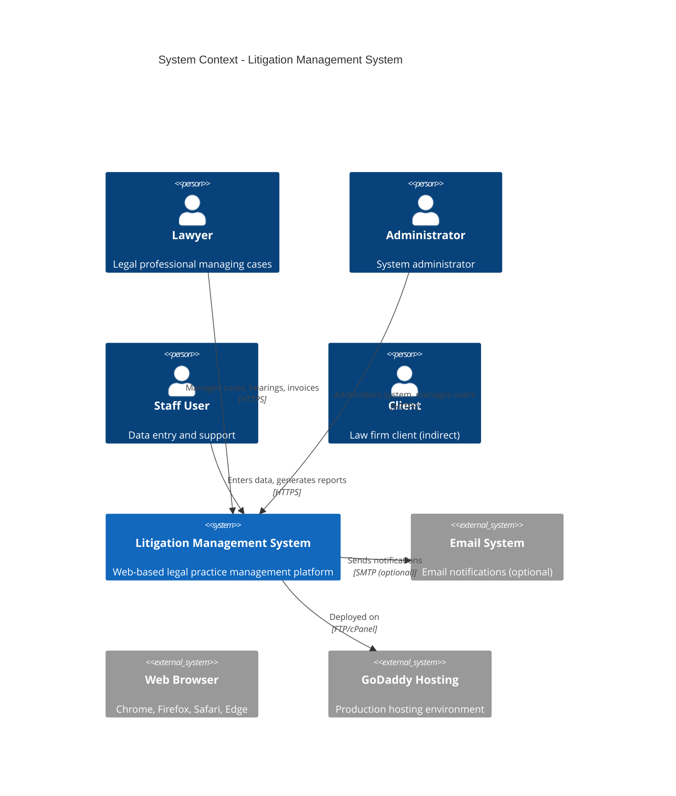

**Key Users:**
- **Lawyers** (52 permissions): Case and hearing management
- **Administrators** (84 permissions): User and system management
- **Staff** (52 permissions): Data entry and reporting
- **Super Admin** (91 permissions): Full system control

**Evidence:** 
- User roles: `backend/config/config.php:L82-L98`
- System description: `README.md:L1-L5`

---

## 🔧 Level 2: Container Diagram

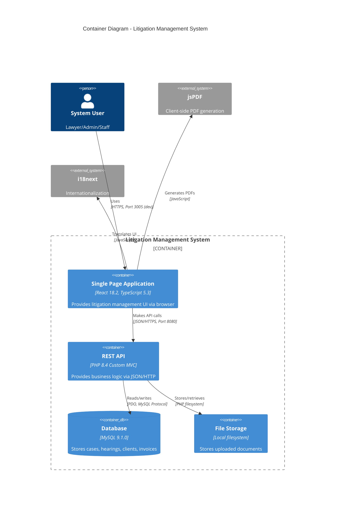

**Containers:**

1. **Single Page Application (SPA)**
   - **Technology:** React 18.2, TypeScript 5.3, Vite 7.1
   - **Port (Dev):** 3005 (configurable)
   - **Deployment:** Static files served from `backend/public/`
   - **Evidence:** `vite.config.ts:L14`, `package.json:L119-L120`

2. **REST API**
   - **Technology:** PHP 8.4, Custom MVC framework
   - **Port:** 8080 (dev), 80/443 (production)
   - **Authentication:** JWT (HS256) + PHP Sessions
   - **Evidence:** `backend/api/index.php:L1-L3646`, `backend/config/config.php:L25-L27`

3. **Database**
   - **Technology:** MySQL 9.1.0, UTF-8mb4
   - **Tables:** 21 tables (users, clients, cases, hearings, etc.)
   - **Connection:** PDO with persistent connections
   - **Evidence:** `database/litigation_database.sql:L1-L616`, `backend/config/database.php:L14-L24`

4. **File Storage**
   - **Location:** `backend/uploads/`
   - **Types:** Documents (PDF, DOC, images), Client logos
   - **Max Size:** 50MB per file
   - **Evidence:** `backend/config/config.php:L35-L37`

---

## ⚙️ Level 3: Component Diagram (Backend API)

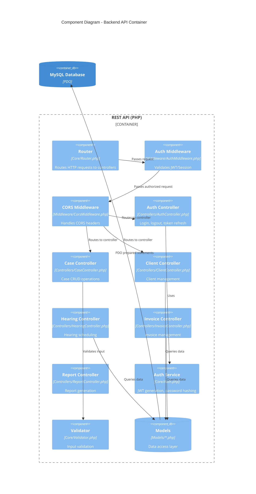

**Key Components:**

| Component | File | Responsibility | Evidence |
|-----------|------|----------------|----------|
| **Router** | `backend/src/Core/Router.php` | HTTP routing, middleware chain | Lines 1-165 |
| **Auth Middleware** | `backend/src/Middleware/AuthMiddleware.php` | JWT/Session validation | Directory observation |
| **Auth Service** | `backend/src/Core/Auth.php` | Token generation, password verification | Lines 1-371 |
| **Controllers** | `backend/src/Controllers/*.php` | Business logic orchestration | 9 controller files |
| **Models** | `backend/src/Models/*.php` | Database abstraction | 7 model files |
| **Validator** | `backend/src/Core/Validator.php` | Input sanitization | Directory observation |

---

## 🔄 Data Flow Diagrams

### Authentication Flow

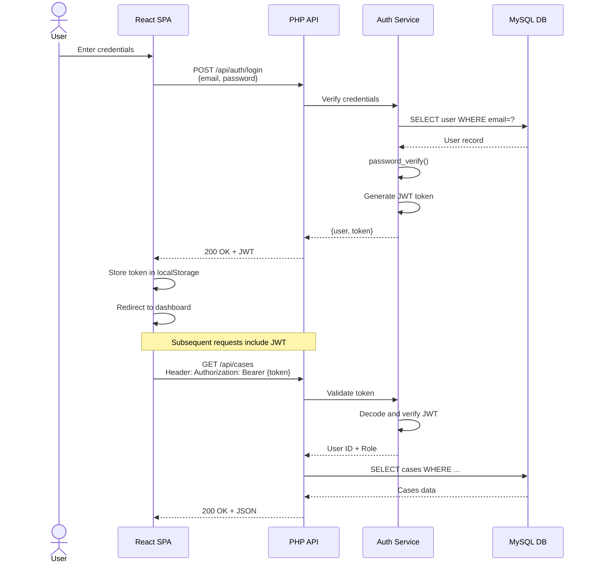

**Evidence:**
- Login handler: `backend/api/index.php:L42-L48`
- Auth logic: `backend/src/Core/Auth.php:L11-L41`
- JWT validation: `backend/src/Core/Auth.php:L267-L319`

### CRUD Data Flow (Case Management Example)

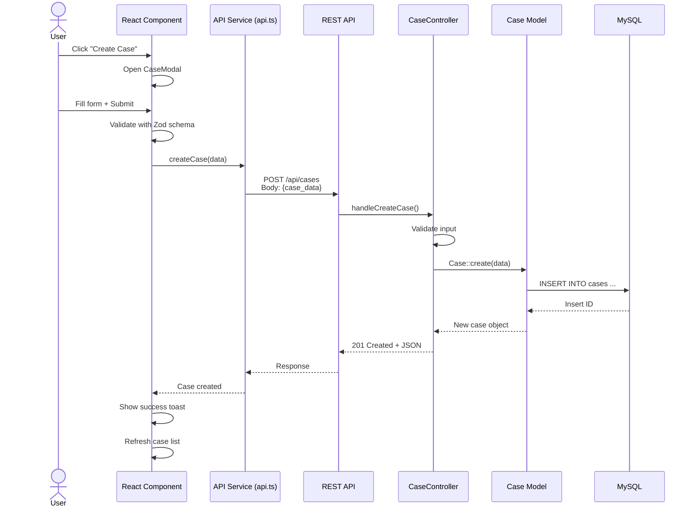

**Evidence:**
- React component: `src/components/modals/CaseModal.tsx`
- API service: `src/services/api.ts:L1-L624`
- Controller: `backend/src/Controllers/CaseController.php`
- Model: `backend/src/Models/Case.php`

### Report Generation & PDF Export Flow

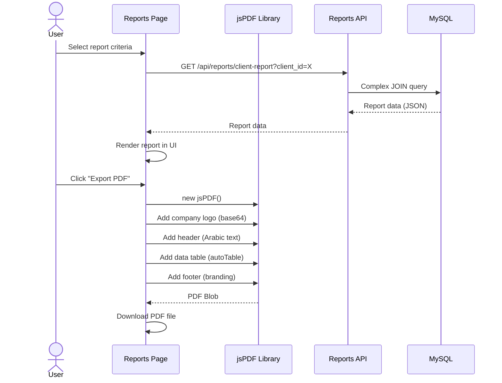

**Evidence:**
- Reports page: `src/pages/ReportsPage.tsx`
- PDF export: `src/utils/exportUtils.ts`
- jsPDF: `package.json:L116-L117`
- Reports API: `backend/api/index.php:L113-L147`, `backend/src/Controllers/ReportController.php`

---

## 🔐 Security Architecture

### Authentication & Authorization Layers

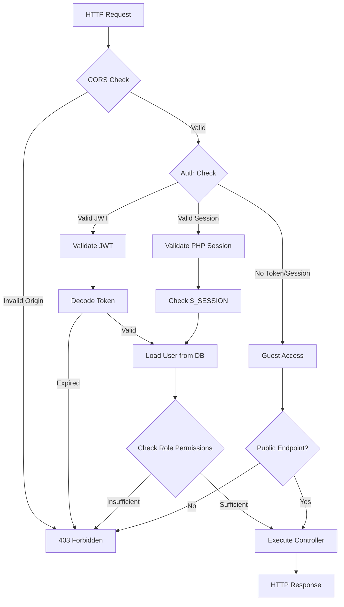

**Security Layers:**

1. **CORS Middleware**
   - Origin validation
   - Evidence: `backend/src/Middleware/CorsMiddleware.php`

2. **Authentication Middleware**
   - JWT validation
   - Session validation
   - Evidence: `backend/src/Middleware/AuthMiddleware.php`

3. **Role-Based Access Control (RBAC)**
   - 4 roles: Super Admin, Admin, Lawyer, Staff
   - Permission matrix per role
   - Evidence: `backend/config/config.php:L82-L98`

4. **Input Validation**
   - Frontend: Zod schemas
   - Backend: Validator class
   - Evidence: `backend/src/Core/Validator.php`, `package.json:L133` (Zod)

---

## 🌍 Internationalization Architecture

```mermaid
flowchart LR
    User[User Action] --> Detect{Language<br/>Preference}
    Detect -->|localStorage| LoadLang[Load Language]
    Detect -->|Default| Arabic[Arabic RTL]
    
    LoadLang --> i18next[i18next Library]
    Arabic --> i18next
    
    i18next --> Translations[Translation Files]
    Translations --> ar[ar.ts]
    Translations --> en[en.ts]
    
    ar --> Render[Render UI]
    en --> Render
    
    Render --> RTL{RTL Language?}
    RTL -->|Yes| ApplyRTL[Apply RTL Styles]
    RTL -->|No| ApplyLTR[Apply LTR Styles]
    
    ApplyRTL --> Display[Display to User]
    ApplyLTR --> Display
    
    User --> ToggleLang[Toggle Language]
    ToggleLang --> UpdateStorage[Update localStorage]
    UpdateStorage --> Detect
```

**i18n Implementation:**
- **Library:** i18next + react-i18next
- **Default Language:** Arabic (ar-SA)
- **Fallback:** Arabic
- **Persistence:** localStorage
- **RTL Detection:** Automatic per language
- **Evidence:** `src/i18n/index.ts:L1-L52`, `src/styles/rtl.scss`

---

## 🗄️ Database Architecture

### Entity Relationship Overview

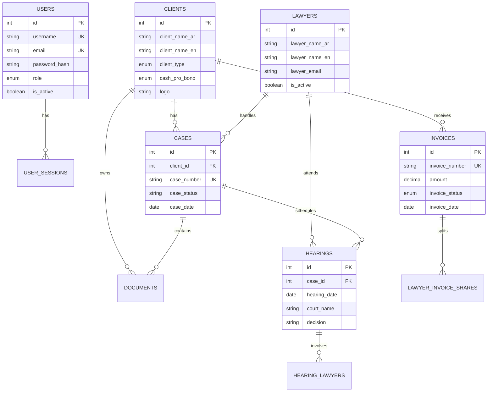

**Key Relationships:**
- **1:N** - Client → Cases (one client has many cases)
- **1:N** - Case → Hearings (one case has many hearings)
- **M:N** - Hearings ↔ Lawyers (via `hearing_lawyers` junction table)
- **1:N** - Invoice → Lawyer Shares (invoice amount split among lawyers)

**Evidence:** `database/litigation_database.sql:L23-L443`

---

## 📦 Deployment Architecture

### Development Environment

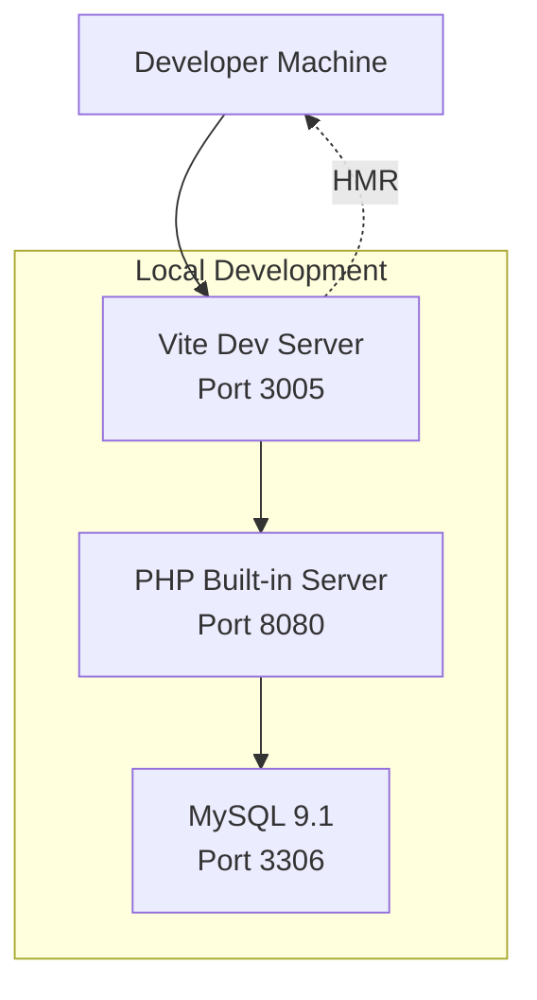

**Configuration:**
- **Frontend:** `npm run dev` (Vite port 3005)
- **Backend:** `php -S localhost:8080 -t backend`
- **Database:** MySQL on localhost:3306
- **Evidence:** `package.json:L7`, `vite.config.ts:L12-L16`

### Production Environment (GoDaddy)

```mermaid
flowchart TB
    Internet[Internet] --> GoDaddy[GoDaddy Shared Hosting]
    
    subgraph "GoDaddy Server"
        Apache[Apache/LiteSpeed<br/>Port 80/443]
        PHP_Prod[PHP 8.4 FastCGI]
        MySQL_Prod[MySQL 9.1]
        Files[File Storage<br/>/uploads/]
    end
    
    GoDaddy --> Apache
    Apache --> SSL[SSL Certificate<br/>lit.sarieldin.com]
    SSL --> PHP_Prod
    PHP_Prod --> MySQL_Prod
    PHP_Prod --> Files
    
    Apache -.->|Static Files| PublicDir[/backend/public/<br/>React SPA]
```

**Production Stack:**
- **Web Server:** Apache/LiteSpeed (GoDaddy default)
- **PHP:** 8.4+ with FastCGI
- **Database:** MySQL 9.1 (shared hosting)
- **SSL:** HTTPS enforced
- **Domain:** lit.sarieldin.com
- **Evidence:** `backend/config/config.production.php:L1-L220`, `README.md:L360-L362`

---

## 🔄 State Management Architecture

### Frontend State Layers

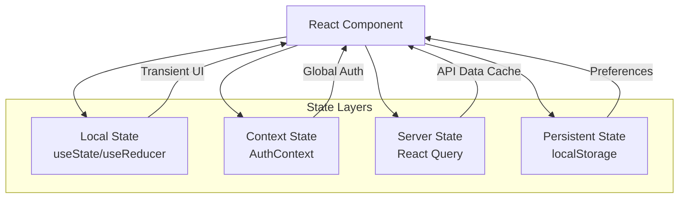

**State Management:**

1. **Local Component State**
   - Form state (react-hook-form)
   - Modal visibility
   - Evidence: `src/components/modals/*.tsx`

2. **Global Context State**
   - Authentication state (user, token, permissions)
   - Evidence: `src/contexts/AuthContext.tsx`

3. **Server State**
   - API data caching with React Query
   - Evidence: `package.json:L128` (react-query)

4. **Persistent State**
   - Language preference (localStorage)
   - JWT token (localStorage)
   - Evidence: `src/i18n/index.ts:L18`

---

## 🧩 Integration Points

### External Dependencies

| Service | Purpose | Integration Type | Evidence |
|---------|---------|------------------|----------|
| **jsPDF** | PDF generation | Client-side library | `package.json:L116-L117` |
| **i18next** | Internationalization | Client-side library | `package.json:L115`, `src/i18n/` |
| **Bootstrap** | UI framework | Client-side library | `package.json:L111` |
| **Chart.js** | Data visualization | Client-side library | `package.json:L112` |
| **React Select** | Advanced dropdowns | Client-side library | `package.json:L130` |

**No External API Integrations Detected**  
(Email/SMS would be via SMTP - currently disabled)

---

## 🎯 Architectural Decisions & Rationale

### 1. Why Custom PHP MVC vs Framework?

**Decision:** Custom lightweight MVC instead of Laravel/Symfony

**Rationale:**
- ✅ **Simplicity:** Smaller learning curve for team
- ✅ **Performance:** No framework overhead
- ✅ **Control:** Full control over routing and middleware
- ⚠️ **Maintenance:** Requires custom documentation and testing

**Evidence:** `backend/src/Core/` (custom Router, Auth, Request, Response classes)

### 2. Why React Query for Server State?

**Decision:** React Query over Redux for API data

**Rationale:**
- ✅ **Caching:** Automatic request deduplication and caching
- ✅ **Simplicity:** Less boilerplate than Redux
- ✅ **Optimistic Updates:** Built-in support for mutations
- ✅ **Background Sync:** Automatic refetching

**Evidence:** `package.json:L128`, `src/services/api.ts`

### 3. Why Vite over Webpack?

**Decision:** Vite for build tooling

**Rationale:**
- ✅ **Speed:** Lightning-fast HMR
- ✅ **Modern:** ES modules, native TypeScript
- ✅ **Simplicity:** Minimal configuration
- ✅ **Optimized:** Better tree-shaking and code splitting

**Evidence:** `vite.config.ts`, `package.json:L103`

### 4. Why JWT + Sessions (Hybrid Auth)?

**Decision:** JWT tokens alongside PHP sessions

**Rationale:**
- ✅ **API-Friendly:** JWT for stateless API requests
- ✅ **Web-Friendly:** PHP sessions for web browser requests
- ✅ **Security:** Dual validation provides defense-in-depth
- ⚠️ **Complexity:** More complex auth logic

**Evidence:** `backend/src/Core/Auth.php:L53-L78` (hybrid check)

---

## 📏 Architectural Constraints & Assumptions

### Constraints

1. **GoDaddy Shared Hosting**
   - Limited to Apache/LiteSpeed
   - No Docker/containerization
   - No custom server configurations
   - Evidence: `README.md:L360-L362`

2. **No Microservices**
   - Monolithic architecture required for shared hosting
   - All services must run on single PHP runtime

3. **File-Based Storage**
   - No cloud storage (S3, Azure Blob)
   - Local filesystem only
   - Evidence: `backend/config/config.php:L37`

### Assumptions

**Assumption (High Confidence):** MySQL supports 50+ concurrent connections  
**Evidence:** Shared hosting typical limits  
**How to Verify:** Check GoDaddy MySQL connection pool limits

**Assumption (Medium Confidence):** Apache handles 100+ req/sec  
**Evidence:** Typical shared hosting performance  
**How to Verify:** Load testing with Apache Bench or similar

---

## 🔮 Scalability Considerations

### Current Limitations

| Aspect | Current Limit | Bottleneck | Evidence |
|--------|---------------|------------|----------|
| **Concurrent Users** | ~50 users | MySQL connection pool | Shared hosting limit |
| **File Storage** | ~10GB | Disk space quota | GoDaddy plan limit |
| **Database Size** | ~2GB | MySQL storage | GoDaddy plan limit |
| **Request Rate** | ~100 req/sec | Apache workers | Shared hosting limit |

### Future Scaling Paths

1. **Vertical Scaling:**
   - Upgrade to VPS/dedicated hosting
   - Increase MySQL connection pool
   - Add Redis for caching

2. **Horizontal Scaling:**
   - Migrate to cloud (AWS, Azure, GCP)
   - Implement load balancing
   - Separate API servers from web servers

3. **Database Scaling:**
   - Read replicas for reporting
   - Partition large tables (hearings, cases)
   - Implement connection pooling (PgBouncer-equivalent)

---

**End of Architecture Documentation**

