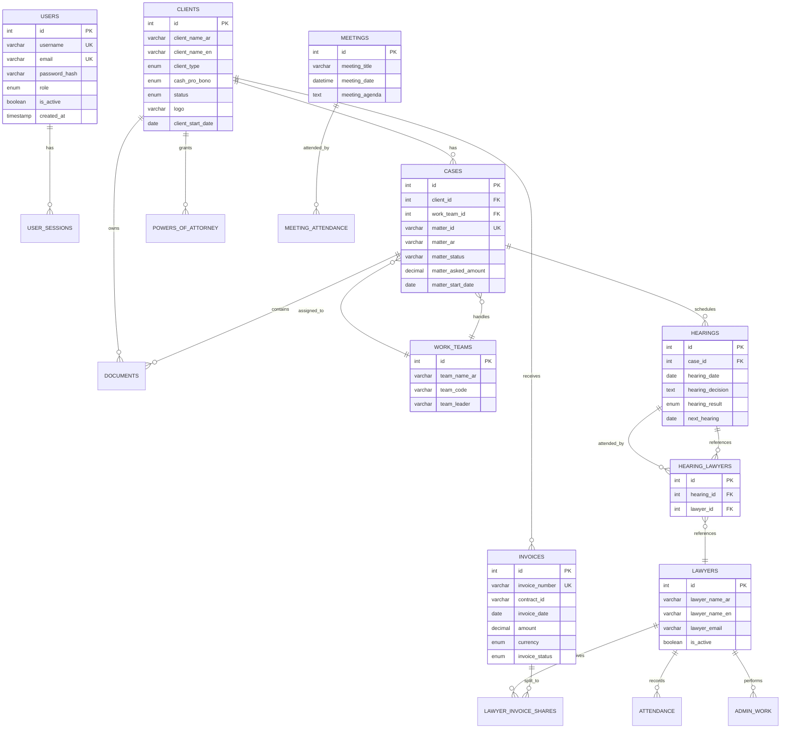

# Database Schema Map

## 📊 Overview

Complete database schema mapping with entity relationships, constraints, and field specifications for the Litigation Management System.

**Database:** MySQL 9.1.0 `litigation_db`  
**Tables:** 21 tables  
**Character Set:** UTF-8mb4  
**Storage Engine:** InnoDB

---

## 🗺️ Entity Relationship Diagram

**Evidence:** `database/litigation_database.sql:L1-L616`

---

## 📋 Complete Table Specifications

### Table 1: users

**Purpose:** System user authentication and authorization

| Column | Type | Nullable | Default | Constraints | Evidence |
|--------|------|----------|---------|-------------|----------|
| `id` | INT | NO | AUTO_INCREMENT | PRIMARY KEY | L24 |
| `username` | VARCHAR(50) | NO | - | UNIQUE | L25 |
| `email` | VARCHAR(100) | NO | - | UNIQUE | L26 |
| `password_hash` | VARCHAR(255) | NO | - | - | L27 |
| `full_name_ar` | VARCHAR(100) | NO | - | - | L28 |
| `full_name_en` | VARCHAR(100) | NO | - | - | L29 |
| `role` | ENUM | NO | 'staff' | super_admin,admin,lawyer,staff | L30 |
| `is_active` | BOOLEAN | YES | TRUE | - | L31 |
| `last_login` | TIMESTAMP | YES | NULL | - | L32 |
| `created_at` | TIMESTAMP | NO | CURRENT_TIMESTAMP | - | L33 |
| `updated_at` | TIMESTAMP | NO | CURRENT_TIMESTAMP | ON UPDATE | L34 |

**Indexes:**
- `idx_username` (username)
- `idx_email` (email)
- `idx_role` (role)

**Evidence:** `database/litigation_database.sql:L23-L38`

---

### Table 2: clients

**Purpose:** Law firm clients (companies and individuals)

| Column | Type | Nullable | Default | Constraints | Evidence |
|--------|------|----------|---------|-------------|----------|
| `id` | INT | NO | AUTO_INCREMENT | PRIMARY KEY | L57 |
| `client_name_ar` | VARCHAR(200) | NO | - | - | L58 |
| `client_name_en` | VARCHAR(200) | YES | NULL | - | L59 |
| `client_type` | ENUM | YES | 'company' | individual, company | L60 |
| `cash_pro_bono` | ENUM | YES | 'cash' | cash, probono | L61 |
| `status` | ENUM | YES | 'active' | active, disabled, inactive | L62 |
| `logo` | VARCHAR(255) | YES | NULL | - | L63 |
| `contact_lawyer` | VARCHAR(100) | YES | NULL | - | L64 |
| `client_start_date` | DATE | YES | NULL | - | L65 |
| `client_end_date` | DATE | YES | NULL | - | L66 |

**Indexes:**
- `idx_status` (status)
- `idx_cash_pro_bono` (cash_pro_bono)
- `idx_contact_lawyer` (contact_lawyer)

**Evidence:** `database/litigation_database.sql:L56-L72`

---

### Table 3: cases

**Purpose:** Legal matters/lawsuits

| Column | Type | Nullable | Default | Key Constraints | Evidence |
|--------|------|----------|---------|-----------------|----------|
| `id` | INT | NO | AUTO_INCREMENT | PRIMARY KEY | L101 |
| `client_id` | INT | NO | - | FOREIGN KEY → clients(id) CASCADE | L102, L138 |
| `matter_id` | VARCHAR(50) | YES | NULL | UNIQUE | L103 |
| `matter_ar` | VARCHAR(500) | YES | NULL | - | L104 |
| `matter_en` | VARCHAR(500) | YES | NULL | - | L105 |
| `matter_status` | VARCHAR(100) | YES | NULL | - | L109 |
| `matter_category` | VARCHAR(100) | YES | NULL | - | L110 |
| `matter_asked_amount` | DECIMAL(15,2) | YES | NULL | - | L116 |
| `matter_judged_amount` | DECIMAL(15,2) | YES | NULL | - | L117 |
| `matter_court` | VARCHAR(200) | YES | NULL | - | L123 |
| `work_team_id` | INT | YES | NULL | FOREIGN KEY → work_teams(id) SET NULL | L134, L139 |

**(35+ columns total, showing key fields)**

**Indexes:** 8 indexes on frequently queried fields

**Evidence:** `database/litigation_database.sql:L100-L148`

---

### Table 4: hearings

**Purpose:** Court sessions and proceedings

| Column | Type | Nullable | Default | Constraints | Evidence |
|--------|------|----------|---------|-------------|----------|
| `id` | INT | NO | AUTO_INCREMENT | PRIMARY KEY | L152 |
| `case_id` | INT | NO | - | FOREIGN KEY → cases(id) CASCADE | L153, L167 |
| `hearing_date` | DATE | NO | - | - | L154 |
| `hearing_decision` | TEXT | YES | NULL | - | L155 |
| `hearing_result` | ENUM | YES | 'pending' | won, lost, postponed, pending | L156 |
| `last_decision` | TEXT | YES | NULL | - | L157 |
| `next_hearing` | DATE | YES | NULL | - | L163 |

**Indexes:**
- `idx_case_id` (case_id)
- `idx_hearing_date` (hearing_date)
- `idx_next_hearing` (next_hearing)
- `idx_hearing_result` (hearing_result)

**Evidence:** `database/litigation_database.sql:L151-L172`

---

### Table 5: invoices

**Purpose:** Financial invoicing

| Column | Type | Nullable | Default | Constraints | Evidence |
|--------|------|----------|---------|-------------|----------|
| `id` | INT | NO | AUTO_INCREMENT | PRIMARY KEY | L224 |
| `invoice_number` | VARCHAR(50) | YES | NULL | UNIQUE | L225 |
| `contract_id` | VARCHAR(50) | YES | NULL | - | L226 |
| `invoice_date` | DATE | NO | - | - | L227 |
| `amount` | DECIMAL(15,2) | NO | - | - | L228 |
| `currency` | ENUM | YES | 'EGP' | EGP, USD, EUR | L229 |
| `usd_amount` | DECIMAL(15,2) | YES | NULL | - | L230 |
| `invoice_status` | ENUM | YES | 'draft' | draft, sent, paid, overdue, cancelled | L232 |
| `invoice_type` | ENUM | YES | 'service' | service, expenses, advance | L233 |
| `has_vat` | BOOLEAN | YES | FALSE | - | L234 |
| `payment_date` | DATE | YES | NULL | - | L235 |

**Indexes:**
- `idx_invoice_number` (invoice_number)
- `idx_invoice_date` (invoice_date)
- `idx_invoice_status` (invoice_status)
- `idx_contract_id` (contract_id)

**Evidence:** `database/litigation_database.sql:L223-L243`

---

## 🔗 Relationships Summary

### One-to-Many (1:N)

| Parent | Child | Relationship | Delete Behavior | Evidence |
|--------|-------|--------------|-----------------|----------|
| users | user_sessions | User has sessions | CASCADE | L46 |
| clients | cases | Client has cases | CASCADE | L138 |
| clients | documents | Client has documents | CASCADE | L214 |
| clients | powers_of_attorney | Client has POAs | CASCADE | L192 |
| cases | hearings | Case has hearings | CASCADE | L167 |
| work_teams | cases | Team handles cases | SET NULL | L139 |
| invoices | lawyer_invoice_shares | Invoice split to lawyers | CASCADE | L253 |

### Many-to-Many (M:N)

| Entity A | Entity B | Junction Table | Evidence |
|----------|----------|----------------|----------|
| hearings | lawyers | hearing_lawyers | Backend migrations |
| meetings | contacts | meeting_attendance | L329 |

**Evidence:** Foreign key definitions in schema

---

## 📊 Additional Tables (Summary)

### Supporting Tables

| Table | Purpose | Key Columns | Evidence |
|-------|---------|-------------|----------|
| **documents** | Legal documents | client_id FK, document_serial, case_number | L200-L220 |
| **powers_of_attorney** | Legal authorizations | client_id FK, power_number, issue_date | L175-L197 |
| **lawyer_invoice_shares** | Invoice distribution | invoice_id FK, lawyer_name, share_percentage | L246-L256 |
| **attendance** | Lawyer attendance | lawyer_name, attendance_date, situation | L259-L268 |
| **admin_work** | Administrative tasks | lawyer_name, work_date, work_status, priority | L271-L288 |
| **contacts** | Contact information | full_name, email, phones | L291-L312 |
| **meetings** | Meeting records | meeting_title, meeting_date, agenda | L314-L327 |
| **meeting_attendance** | Meeting participants | meeting_id FK, contact_id FK | L329-L341 |
| **follow_ups** | Follow-up tasks | client_id, matter_id, follow_up_date, status | L343-L365 |
| **payments** | Payment tracking | invoice_id, payment_date, amount, currency | L367-L389 |
| **system_settings** | App configuration | setting_key UK, setting_value | L391-L402 |
| **audit_log** | Audit trail | user_id, action, table_name, old/new_values | L404-L423 |
| **file_attachments** | File metadata | entity_type, entity_id, file_path, file_size | L424-L443 |

---

## 🔑 Constraints & Cardinality

### Cascade Rules

**ON DELETE CASCADE:**
- Deleting client → Deletes all cases, documents, POAs
- Deleting case → Deletes all hearings
- Deleting invoice → Deletes all lawyer shares

**ON DELETE SET NULL:**
- Deleting work team → Cases remain but team_id nullified

**Evidence:** Foreign key definitions throughout schema

---

## 📈 Data Volume Estimates

| Table | Current Rows | Target Rows | Growth Rate | Evidence |
|-------|--------------|-------------|-------------|----------|
| **hearings** | Partial | 20,000+ | High | `README.md:L164` |
| **cases** | Partial | 6,388+ | Medium | `README.md:L163` |
| **invoices** | Partial | 540+ | Medium | `README.md:L165` |
| **clients** | 247+ | 308+ | Low | `README.md:L162` |
| **lawyers** | 38+ | 40+ | Very Low | `README.md:L162` |
| **users** | 10-20 | 50 | Low | Estimated |

---

## 🎯 Schema Quality

**Strengths:**
- ✅ Full UTF-8mb4 support (Arabic)
- ✅ Comprehensive indexes
- ✅ Foreign key constraints
- ✅ Timestamps (created_at, updated_at)
- ✅ Cascading deletes

**Recommendations:**
- Add soft deletes (deleted_at column)
- Add version columns for optimistic locking
- Consider partitioning large tables (hearings)

---

**Evidence Base:** `database/litigation_database.sql:L1-L616`

