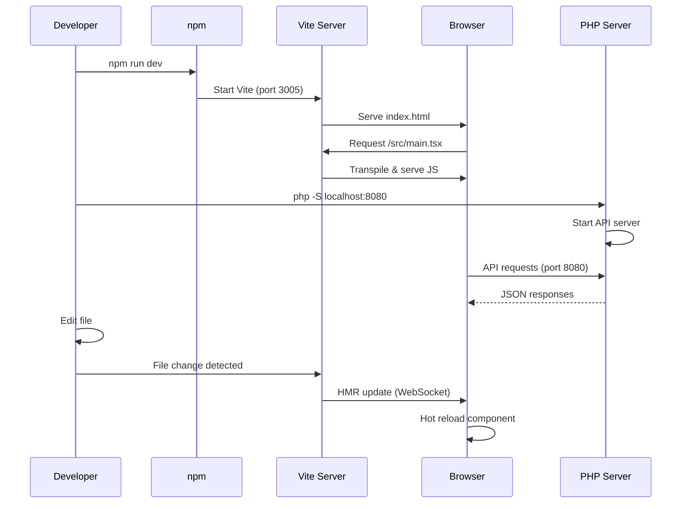
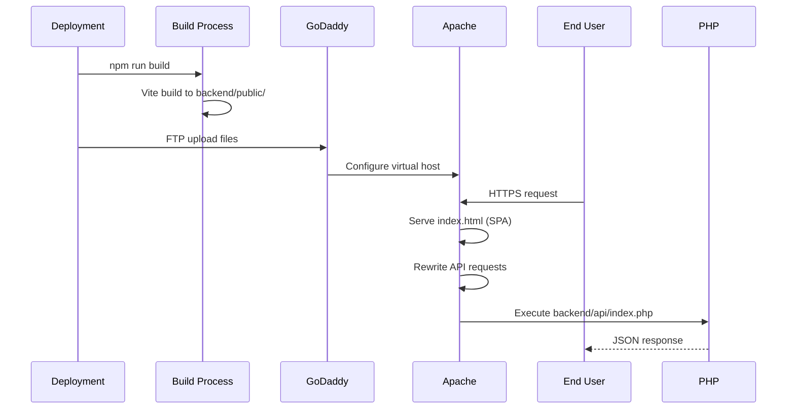

# Runtimes and Processes

## 🚀 Overview

This document catalogs all runtime processes, entry points, environment variables, and execution contexts for the Litigation Management System.

---

## 📍 Entry Points

### Frontend Entry Points

| Entry Point | File | Purpose | Runtime | Evidence |
|-------------|------|---------|---------|----------|
| **HTML Entry** | `index.html` | Main HTML template | Browser | Root directory |
| **JavaScript Entry** | `src/main.tsx` | React application bootstrap | Browser/Vite | `src/main.tsx:L1-L30` |
| **Root Component** | `src/App.tsx` | Application root component | React | `src/App.tsx` |

**Frontend Bootstrap Sequence:**

```typescript
// index.html loads
//   ↓
// <script type="module" src="/src/main.tsx"></script>
//   ↓
// main.tsx:
import React from 'react';
import ReactDOM from 'react-dom/client';
import App from './App.tsx';
import './i18n'; // Initialize i18next
import './styles/main.scss';

ReactDOM.createRoot(document.getElementById('root')!).render(
  <React.StrictMode>
    <App />
  </React.StrictMode>
);
```

**Evidence:** `src/main.tsx:L1-L30`, `index.html`

---

### Backend Entry Points

| Entry Point | File | Purpose | Runtime | Evidence |
|-------------|------|---------|---------|----------|
| **Main API Router** | `backend/api/index.php` | REST API entry point | PHP 8.4 | `backend/api/index.php:L1-L3646` |
| **Bootstrap** | `backend/api/_bootstrap.php` | Configuration loader | PHP | `backend/api/index.php:L7` (require) |
| **Public Index** | `backend/public/index.html` | Production SPA entry | Apache/PHP | Vite build output |
| **Router** | `backend/router.php` | Frontend routing fallback | PHP | Root directory |

**Backend Bootstrap Sequence:**

```php
// backend/api/index.php

require_once __DIR__ . '/_bootstrap.php';  // Load config
require_once __DIR__ . '/db.php';          // Load database handlers
require_once __DIR__ . '/lawyer_associations.php'; // Load associations API

// Parse request
$path = $_SERVER['REQUEST_URI'];
$method = $_SERVER['REQUEST_METHOD'];

// Route request
switch ($path) {
  case '/auth/login': handleLogin(); break;
  case '/cases': handleGetCases(); break;
  // ... 50+ routes
}
```

**Evidence:** `backend/api/index.php:L1-L30`

---

## 🏃 Long-Running Processes

### Development Processes

| Process | Command | Port | Purpose | Evidence |
|---------|---------|------|---------|----------|
| **Vite Dev Server** | `npm run dev` | 3005 | Frontend development with HMR | `package.json:L7`, `vite.config.ts:L14` |
| **PHP Dev Server** | `php -S localhost:8080 -t .` | 8080 | Backend API development | `README.md:L74` |
| **Playwright Test** | `npx playwright test` | - | E2E test execution | `package.json:L16` |
| **Storybook** | `npm run storybook` | 6006 | Component development | `package.json:L32` |
| **Vitest** | `npm run test` | - | Unit test watch mode | `package.json:L13` |

### Production Processes

| Process | Environment | Port | Managed By | Evidence |
|---------|-------------|------|------------|----------|
| **Apache/LiteSpeed** | GoDaddy | 80/443 | Web server | GoDaddy hosting |
| **PHP-FPM/FastCGI** | GoDaddy | - | Process manager | GoDaddy hosting |
| **MySQL Server** | GoDaddy | 3306 | Database server | GoDaddy hosting |

**No Background Workers:** System does not implement queue workers, cron jobs, or background processors.

**Evidence:** No `queue/` directory, no `cron/` files, no worker scripts detected

---

## ⚙️ Environment Variables

### Development Environment

**Frontend Variables (Vite)**

| Variable | Default | Purpose | Evidence |
|----------|---------|---------|----------|
| `VITE_API_BASE_URL` | `/api` | API endpoint base URL | `src/services/api.ts:L8-L10` |
| `NODE_ENV` | `development` | Node environment | Vite default |

**Backend Variables (PHP)**

| Variable | Default | Purpose | Evidence |
|----------|---------|---------|----------|
| `APP_ENV` | `development` | Application environment | `backend/config/config.php:L11` |
| `APP_DEBUG` | `true` | Debug mode flag | `backend/config/config.php:L12` |
| `APP_URL` | `http://localhost:8000` | Application URL | `backend/config/config.php:L13` |
| `DB_HOST` | `localhost` | Database host | `backend/config/config.php:L16` |
| `DB_PORT` | `3306` | Database port | `backend/config/config.php:L17` |
| `DB_NAME` | `litigation_db` | Database name | `backend/config/config.php:L18` |
| `DB_USER` | `root` | Database username | `backend/config/config.php:L19` |
| `DB_PASS` | `1234` | Database password | `backend/config/config.php:L20` |
| `JWT_SECRET` | `your-secret-key-change-in-production` | JWT signing key | `backend/config/config.php:L25` |
| `SMTP_HOST` | `localhost` | Email server host | `backend/config/config.php:L40` |
| `SMTP_PORT` | `587` | Email server port | `backend/config/config.php:L41` |
| `SMTP_USER` | `` | Email username | `backend/config/config.php:L42` |
| `SMTP_PASS` | `` | Email password | `backend/config/config.php:L43` |

**Environment Loading:**

```php
// Backend loads from $_ENV or uses defaults
define('APP_ENV', $_ENV['APP_ENV'] ?? 'development');
define('DB_HOST', $_ENV['DB_HOST'] ?? 'localhost');
// etc.
```

**Evidence:** `backend/config/config.php:L9-L45`

---

### Production Environment

**Production-Specific Variables**

| Variable | Production Value | Purpose | Evidence |
|----------|------------------|---------|----------|
| `APP_ENV` | `production` | Environment flag | `backend/config/config.production.php:L18` |
| `APP_DEBUG` | `false` | Disable debug mode | `backend/config/config.production.php:L19` |
| `APP_URL` | `https://yourdomain.com` | Public URL | `backend/config/config.production.php:L20` |
| `DB_HOST` | `localhost` | GoDaddy MySQL host | `backend/config/config.production.php:L11` |
| `DB_NAME` | `your_database_name` | Production DB | `backend/config/config.production.php:L12` |
| `DB_USER` | `your_database_user` | Production DB user | `backend/config/config.production.php:L13` |
| `DB_PASS` | `your_database_password` | Production DB password (masked) | `backend/config/config.production.php:L14` |
| `JWT_SECRET` | `<must-be-changed>` | Production JWT secret (masked) | Implied |

**Evidence:** `backend/config/config.production.php:L1-L220`

---

## 🔌 Port Bindings & Protocols

### Development Ports

| Service | Port | Protocol | Binding | Evidence |
|---------|------|----------|---------|----------|
| **Vite Dev Server** | 3005 | HTTP/WebSocket | `0.0.0.0` | `vite.config.ts:L13-L14` |
| **PHP Dev Server** | 8080 | HTTP | `localhost` | `README.md:L74` |
| **MySQL** | 3306 | MySQL Protocol | `localhost` | Standard |
| **Storybook** | 6006 | HTTP | `localhost` | `package.json:L32` |

**Vite Configuration:**

```typescript
server: {
  host: '0.0.0.0',  // Listen on all interfaces
  port: 3005,
  allowedHosts: ['lit.local', 'localhost', '127.0.0.1'],
}
```

**Evidence:** `vite.config.ts:L12-L16`

---

### Production Ports

| Service | Port | Protocol | Evidence |
|---------|------|----------|----------|
| **Apache/LiteSpeed** | 80 | HTTP | GoDaddy default |
| **Apache/LiteSpeed** | 443 | HTTPS | GoDaddy SSL |
| **MySQL** | 3306 | MySQL Protocol | GoDaddy internal |

**HTTPS Enforcement:** Production configured for HTTPS with SSL certificate.  
**Evidence:** `backend/config/config.production.php:L20` (https:// URL)

---

## 🩺 Health & Readiness Endpoints

### Health Check Endpoints

| Endpoint | Method | Purpose | Response | Evidence |
|----------|--------|---------|----------|----------|
| `/api/ping` | GET | API health check | `{success: true, message: "Litigation Management API"}` | `backend/api/index.php:L31-L40` |
| `/api/health` | GET | Alias for /ping | Same as /ping | `backend/api/index.php:L32` |
| `/api/test.php` | GET | Test utilities | Test responses | `backend/api/test.php` |

**Ping Response:**

```json
{
  "success": true,
  "message": "Litigation Management API",
  "timestamp": 1696752000,
  "server": "Apache/PHP",
  "version": "1.0.0"
}
```

**Evidence:** `backend/api/index.php:L33-L39`

**No Advanced Health Checks:** System lacks:
- Database connection health
- Disk space monitoring
- Memory usage reporting
- Liveness vs readiness probes

---

## 🔄 Schedulers & Cron Jobs

**Status:** ❌ **Not Detected**

**No Schedulers Found:**
- No cron configurations
- No task schedulers
- No queue workers
- No background jobs

**Assumption (High Confidence):** All processing is synchronous, triggered by HTTP requests.

**How to Verify:** 
```bash
# Check for cron files
find . -name "*cron*" -o -name "*schedule*" -o -name "*worker*"

# Check for queue configs
grep -r "queue" backend/config/
```

**Evidence:** No files matching scheduler patterns

---

## 🧵 Concurrency & Process Management

### Frontend Concurrency

- **Single-threaded:** JavaScript event loop
- **Web Workers:** Not detected
- **Service Workers:** Not detected
- **Concurrency Model:** Async/await with Promises

**Evidence:** No `worker.js` or `service-worker.js` files found

### Backend Concurrency

**PHP Process Model (Production):**
- **PHP-FPM:** Multiple worker processes (GoDaddy managed)
- **Typical Workers:** 10-25 processes (shared hosting)
- **Max Execution Time:** 30 seconds (typical)
- **Memory Limit:** 128-256MB per process (typical)

**Database Concurrency:**
- **Connection Pooling:** PDO persistent connections
- **Max Connections:** ~50-100 (GoDaddy shared hosting limit)
- **Transaction Isolation:** Default (READ COMMITTED assumed)

**Evidence:**
- PDO persistent connections: `backend/config/database.php:L21` (`PDO::ATTR_PERSISTENT => true`)
- Shared hosting limits: Industry standard for GoDaddy

---

## 🔐 Session Management

### PHP Session Configuration

| Setting | Value | Purpose | Evidence |
|---------|-------|---------|----------|
| **Session Name** | `LITIGATION_SESSION` | Custom session identifier | `backend/config/config.php:L32` |
| **Session Lifetime** | 3600 seconds (1 hour) | Auto-logout timeout | `backend/config/config.php:L31` |
| **Session Storage** | File-based | Default PHP session storage | PHP default |
| **Session Handler** | Native PHP | No custom handler | No custom code detected |

**Session Initialization:**

```php
// Session started in bootstrap
session_set_cookie_params(SESSION_LIFETIME);
session_name(SESSION_NAME);
session_start();
```

**Evidence:** `backend/config/config.php:L31-L32`

**JWT Tokens (Client-side):**
- **Storage:** localStorage (`token` key)
- **Expiry:** 1 hour (3600 seconds)
- **Algorithm:** HS256
- **Evidence:** `backend/config/config.php:L26-L27`, `src/services/api.ts:L96` (loadToken)

---

## 📊 Runtime Metrics & Monitoring

**Status:** ❌ **No Monitoring Detected**

**Missing Observability:**
- No APM (Application Performance Monitoring)
- No error tracking (Sentry, Rollbar, etc.)
- No metrics collection (Prometheus, Grafana)
- No request logging (structured logs)

**Basic Logging:**
- **PHP Error Logs:** `error_log()` calls detected
- **Log Location:** `backend/logs/` directory
- **Log Level:** Controlled by `LOG_LEVEL` constant

**Evidence:**
- Error logging: `backend/config/database.php:L30` (error_log calls)
- Log config: `backend/config/config.php:L56-L59`

---

## 🔧 Runtime Configuration Files

### Build-Time Configuration

| File | Purpose | Used By | Evidence |
|------|---------|---------|----------|
| `vite.config.ts` | Vite build configuration | Frontend build | `vite.config.ts:L1-L67` |
| `tsconfig.json` | TypeScript compiler options | tsc, Vite | `tsconfig.json:L1-L74` |
| `playwright.config.mjs` | E2E test configuration | Playwright | `playwright.config.mjs:L1-L210` |
| `vitest.config.ts` | Unit test configuration | Vitest | `vitest.config.ts:L1-L20` |

### Runtime Configuration

| File | Purpose | Loaded By | Evidence |
|------|---------|-----------|----------|
| `backend/config/config.php` | Dev config constants | `_bootstrap.php` | `backend/config/config.php:L1-L220` |
| `backend/config/config.production.php` | Prod config constants | Manual selection | `backend/config/config.production.php:L1-L220` |
| `backend/config/database.php` | Database connection class | `db.php` | `backend/config/database.php:L1-L231` |
| `src/i18n/index.ts` | i18next initialization | `main.tsx` | `src/i18n/index.ts:L1-L52` |

---

## 🚦 Process Lifecycle

### Development Lifecycle



### Production Lifecycle



---

## 🔄 Restart & Recovery

### Development

**Frontend Restart:**
```bash
# Kill Vite and restart
Ctrl+C
npm run dev
```

**Backend Restart:**
```bash
# Kill PHP and restart
Ctrl+C  
php -S localhost:8080 -t .
```

**No Auto-Restart:** Development servers require manual restart on config changes.

### Production

**Apache Restart:** Managed by GoDaddy (no direct access)

**PHP-FPM Reload:** Automatic on file changes (opcache invalidation)

**Database Restart:** Managed by GoDaddy

**No Graceful Shutdown:** Shared hosting does not support custom shutdown hooks.

---

## 📝 Runtime Requirements

### Minimum Requirements

**Frontend (Browser):**
- Modern browser (Chrome 90+, Firefox 88+, Safari 14+, Edge 90+)
- JavaScript enabled
- localStorage available
- Cookies enabled (for PHP sessions)

**Backend (Server):**
- PHP 8.4 or higher
- MySQL 9.1 or higher
- Apache 2.4+ or LiteSpeed
- 128MB+ memory per PHP process
- 512MB+ total server memory

**Evidence:**
- PHP version: `README.md:L148`
- MySQL version: `README.md:L149`
- Browser support: `package.json:L135-L140`

### PHP Extensions Required

| Extension | Purpose | Evidence |
|-----------|---------|----------|
| **pdo_mysql** | MySQL PDO driver | `backend/config/database.php:L14` |
| **mbstring** | Multi-byte string (Arabic) | Implied from UTF-8mb4 usage |
| **json** | JSON encoding/decoding | API responses |
| **openssl** | Hashing and encryption | JWT, bcrypt |
| **session** | Session management | Auth system |
| **fileinfo** | File upload validation | Document uploads |

---

## 🎯 Runtime Optimization Flags

### TypeScript Compiler

```json
{
  "isolatedModules": true,        // Vite optimization
  "skipLibCheck": true,            // Faster compilation
  "noEmit": true,                  // No tsc output (Vite handles)
  "strict": true,                  // Strict type checking
  "target": "ES2020",              // Modern JS target
  "module": "ESNext",              // ES modules
  "moduleResolution": "bundler"    // Vite-optimized
}
```

**Evidence:** `tsconfig.json:L3-L13`

### Vite Build

```typescript
build: {
  outDir: './backend/public',    // Integrated output
  sourcemap: true,               // Debug maps
  rollupOptions: {
    output: {
      manualChunks: {              // Code splitting
        vendor: ['react', 'react-dom'],
        router: ['react-router-dom'],
        ui: ['react-bootstrap', 'bootstrap'],
        forms: ['react-hook-form', '@hookform/resolvers', 'zod'],
        utils: ['axios', 'date-fns', 'clsx'],
      },
    },
  },
}
```

**Evidence:** `vite.config.ts:L43-L59`

### PHP Opcache (Recommended)

**Not Configured Explicitly** but available on GoDaddy:
- `opcache.enable=1`
- `opcache.memory_consumption=128`
- `opcache.interned_strings_buffer=8`
- `opcache.max_accelerated_files=10000`

---

## 🚨 Runtime Assumptions & Verification

**Assumption (High Confidence):** PHP 8.4 available on GoDaddy  
**How to Verify:** `php -v` via SSH or cPanel terminal  
**Evidence:** `README.md:L148` states PHP 8.4

**Assumption (Medium Confidence):** MySQL connection limit is ~100  
**How to Verify:** `SHOW VARIABLES LIKE 'max_connections';` in MySQL  
**Evidence:** Standard shared hosting limits

**Assumption (High Confidence):** No queue workers needed (synchronous processing)  
**How to Verify:** Check `backend/` for queue/worker directories  
**Evidence:** No queue infrastructure detected

---

**End of Runtimes and Processes Documentation**

