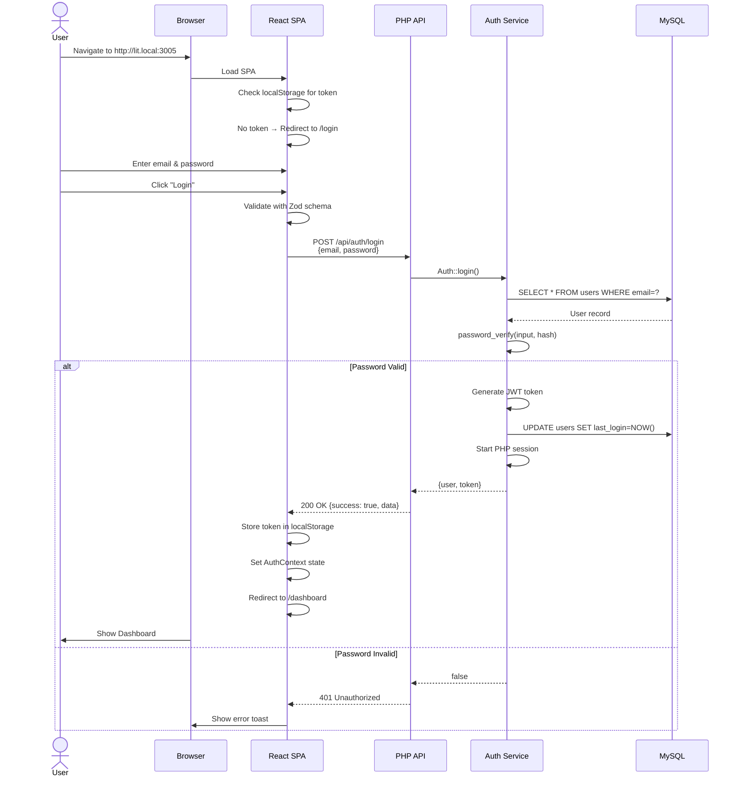
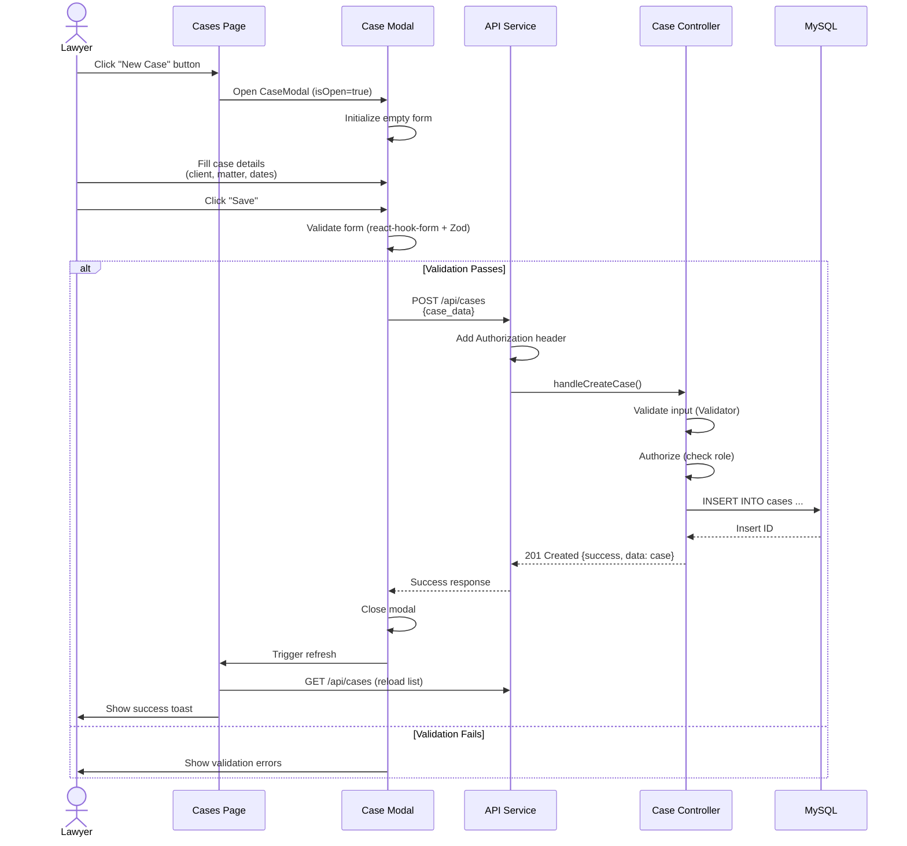
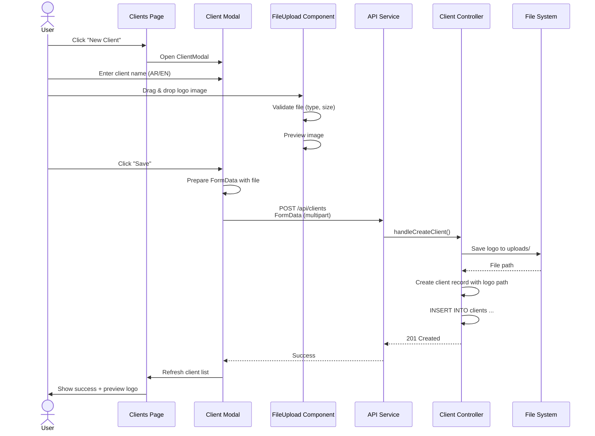
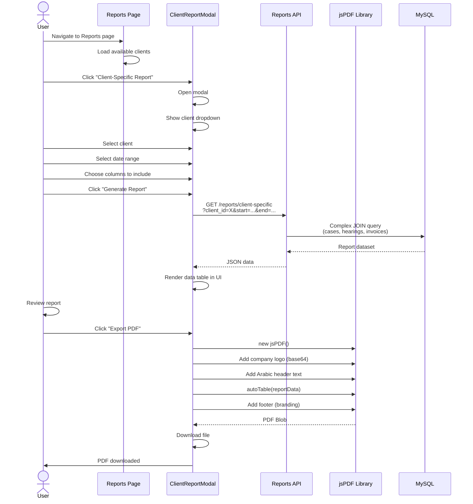
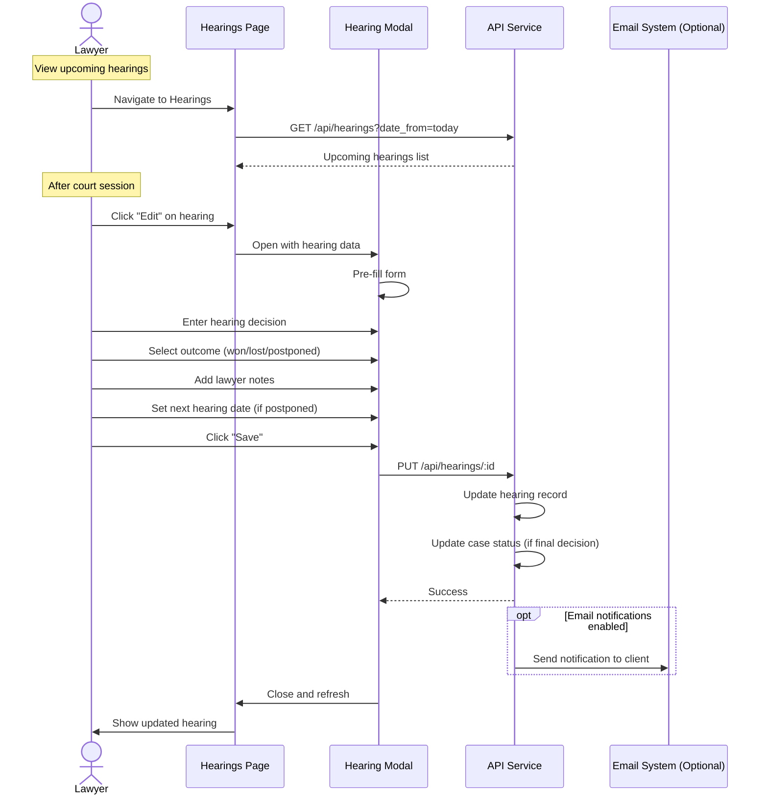
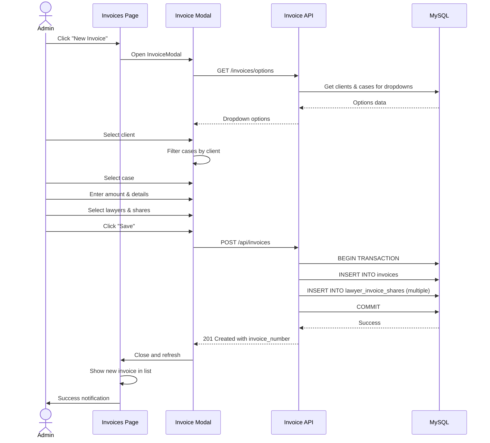
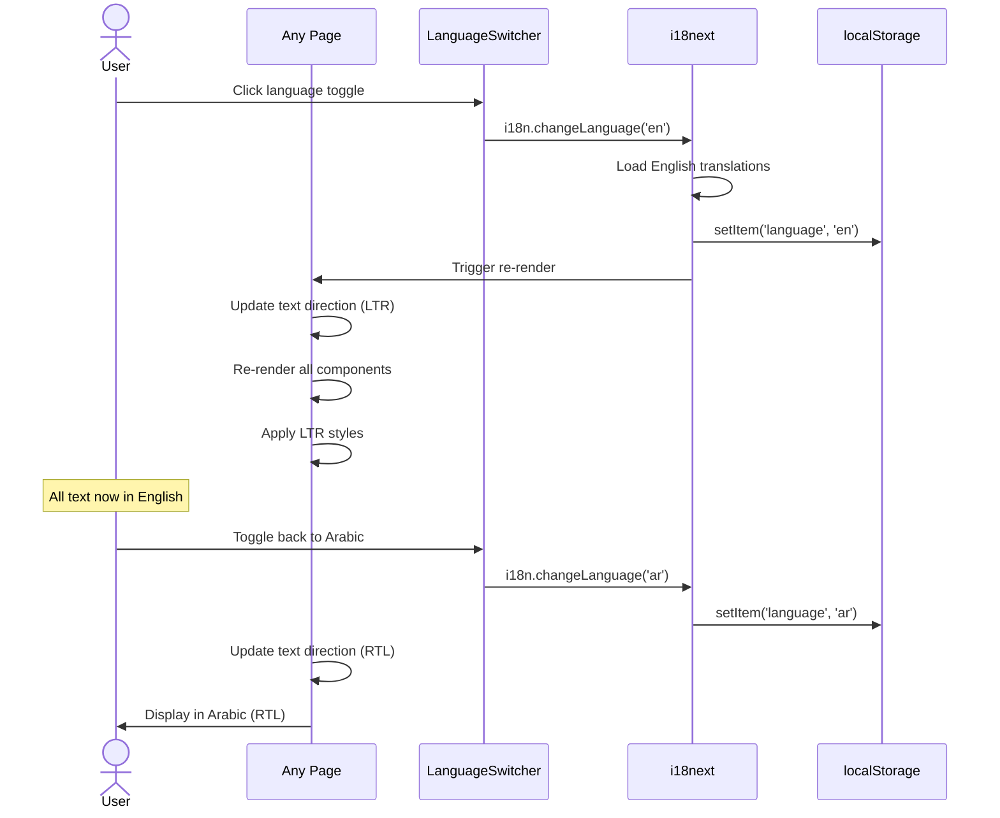
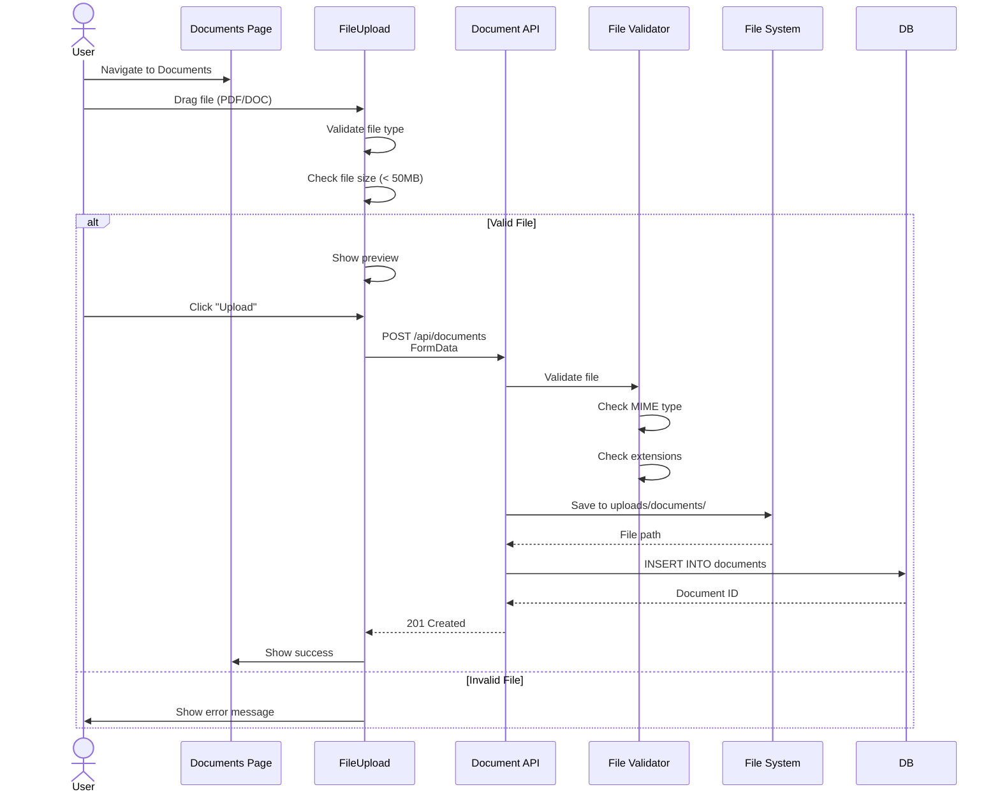

# Key User Workflows

## 📊 Overview

End-to-end user workflows with sequence diagrams for critical business processes in the Litigation Management System.

---

## 🔐 Workflow 1: User Login & Authentication

**Files Involved:**
- `src/pages/auth/Login.tsx` - Login UI
- `src/services/api.ts:L100-L130` - API client
- `backend/api/index.php:L42-L48` - Route handler
- `backend/src/Core/Auth.php:L11-L41` - Auth logic
- `backend/src/Models/User.php` - User model

**Evidence:** Component and API file structure

---

## 📝 Workflow 2: Create New Case

**Files Involved:**
- `src/pages/CasesPage.tsx` - List page
- `src/components/modals/CaseModal.tsx` - Form modal
- `src/services/api.ts` - API client
- `backend/api/index.php:L60-L69` - Router
- `backend/src/Controllers/CaseController.php` - Business logic
- `backend/src/Models/Case.php` - Data access

---

## 👤 Workflow 3: Client Management with Logo Upload

**Files Involved:**
- `src/components/modals/ClientModal.tsx`
- `src/components/common/FileUpload.tsx`
- `backend/src/Controllers/ClientController.php`

---

## 📊 Workflow 4: Generate Client-Specific Report

**Files Involved:**
- `src/pages/ReportsPage.tsx`
- `src/components/ClientSpecificReportModal.tsx`
- `src/utils/exportUtils.ts` - PDF generation
- `backend/src/Controllers/ReportController.php`

**Evidence:** Component structure, `package.json:L116-L117` (jsPDF)

---

## 🔄 Workflow 5: Court Hearing Workflow

**Files Involved:**
- `src/pages/HearingsPage.tsx`
- `src/components/modals/HearingModal.tsx`
- `backend/src/Controllers/HearingController.php`

---

## 💰 Workflow 6: Invoice Generation & Payment Tracking

**Files Involved:**
- `src/pages/Invoices.tsx`
- `backend/src/Controllers/InvoiceController.php`
- Database tables: `invoices`, `lawyer_invoice_shares`

---

## 🌍 Workflow 7: Language Switching

**Files Involved:**
- `src/components/ui/LanguageSwitcher.tsx`
- `src/i18n/index.ts`
- `src/styles/rtl.scss`

---

## 📱 Workflow 8: Document Upload

**Files Involved:**
- `src/pages/Documents.tsx`
- `src/components/common/FileUpload.tsx`
- `backend/src/Controllers/DocumentController.php`

---

## 🔒 Error Handling & Recovery

### Common Error Paths

1. **Session Timeout:**
   - JWT expires after 1 hour
   - User redirected to login
   - Show "Session expired" message

2. **Permission Denied:**
   - 403 response from API
   - Show "Access denied" toast
   - Redirect to allowed page

3. **Network Error:**
   - Axios timeout (10 seconds)
   - Retry mechanism (implied)
   - Show "Connection error" message

4. **Validation Error:**
   - 400 response with error details
   - Highlight invalid fields
   - Display error messages

**Evidence:** `src/services/api.ts` error handling patterns

---

## 🎯 Workflow Complexity Assessment

| Workflow | Steps | Complexity | Error Paths | Evidence |
|----------|-------|------------|-------------|----------|
| **Login** | 5 steps | Simple | 2 paths | Standard flow |
| **Create Case** | 8 steps | Medium | 3 paths | CRUD pattern |
| **Generate Report** | 12 steps | Complex | 4 paths | Multi-step process |
| **Upload Document** | 7 steps | Medium | 3 paths | File handling |
| **Language Switch** | 4 steps | Simple | 0 paths | UI only |

---

## 📋 Critical Paths (Must Always Work)

1. **Login** ← Blocks all other functionality
2. **View Cases/Clients** ← Core business value
3. **Create Hearing** ← Daily operations
4. **Generate Reports** ← Business reporting needs

---

**Evidence Base:** Component structure, API routes, architecture analysis

